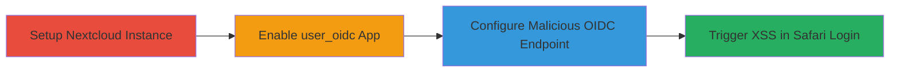

# Safari-Specific Stored XSS in Nextcloud user_oidc via Malicious OIDC Discovery Endpoint

Multi-stage attack chain demonstrating a complete attack workflow exploiting a stored XSS in Nextcloud's user_oidc app, where a malicious OpenID Connect discovery endpoint injects HTML/JS into the authorization_endpoint field, leading to payload execution in the login page on Safari browsers only. The vulnerability stems from unescaped URL insertion in a meta refresh tag in LoginController.php, though a restrictive CSP limits JS to basic alerts or HTML rendering.

## Chain Metrics Dashboard

| Metric | Value |
|--------|-------|
| Chain Status | Unverified |
| Total Steps | 4 |
| Execution Time | ~15 minutes |
| Skill Level | Intermediate |
| Complexity | Medium |
| Impact Level | Low |

## Attack Flow Visualization



## Prerequisites & Requirements

### Required Tools

- [[tools/Docker]]
- [[tools/Safari-Browser]]

### Target Environment

- Nextcloud instance (version with vulnerable user_oidc app)
- Required services/ports: HTTP on ports 80 (container) and 8081 (host)
- Network access requirements: Localhost access for setup and testing

### Initial Access Requirements

- Administrative access to Nextcloud for app enabling and configuration
- Control over a web server to host the malicious OIDC discovery endpoint (e.g., https://lhq.at/poc_jkhfdasgfdaskjlfadskhfdas.php)
- Safari browser for triggering the user agent-specific flaw

## Detailed Attack Procedures

### Step 1: Setup Nextcloud Instance
procedure: [[procedures/Setup-Nextcloud-Instance-with-Docker]]

**Objective**: Deploy a local Nextcloud instance using Docker to serve as the vulnerable target environment.

**Instructions**: Use [[commands/docker-run-nextcloud-setup]] to start the container:

```bash
docker run -p 8081:80 nextcloud:latest
```

Access the instance at http://localhost:8081 to complete initial setup if needed (create admin account).

**Expected Output**: Nextcloud web interface accessible at http://localhost:8081, with Docker logs showing the server starting on port 80 inside the container.

**Success Indicators**:
- Docker container running without errors
- Web page loads at http://localhost:8081

### Step 2: Enable user_oidc App
procedure: [[procedures/Enable-user_oidc-App-in-Nextcloud]]

**Objective**: Activate the user_oidc app in Nextcloud to expose the vulnerable OpenID Connect integration.

**Instructions**: Log in as admin at http://localhost:8081, navigate to Apps > Active apps, search for "user_oidc", and enable it. Alternatively, access the apps integration settings page directly.

**Expected Output**: The user_oidc app appears in the enabled apps list, with OIDC settings available in admin configuration.

**Success Indicators**:
- App enabled without errors
- OIDC provider configuration section visible in admin settings

### Step 3: Configure Malicious OIDC Discovery Endpoint
procedure: [[procedures/Configure-Malicious-OIDC-Discovery-Endpoint]]

**Objective**: Set up the user_oidc provider with a controlled discovery endpoint that injects a malicious payload into the authorization_endpoint field.

**Instructions**: In Nextcloud admin settings for user_oidc, add a new provider: use an arbitrary identifier (e.g., "test-provider"), set client_id and client_secret to dummy values (e.g., "test"), and configure the discovery endpoint to https://lhq.at/poc_jkhfdasgfdaskjlfadskhfdas.php. This endpoint must return a JSON response like: {"issuer":"http:\/\/idp.local:3000", "authorization_endpoint":"'\" http-equiv=><svg\/onload=alert(document.domain)>", ...} to inject the payload.

**Expected Output**: Provider saved successfully, with Nextcloud fetching and storing the discovery document containing the injected payload in the database.

**Success Indicators**:
- Provider configuration saved
- No validation errors on endpoint URL

### Step 4: Trigger Stored XSS via Safari Login
procedure: [[procedures/Trigger-Stored-XSS-via-Safari-Login]]

**Objective**: Initiate the login flow in Safari to trigger the user agent detection, generating an unescaped meta refresh tag with the injected payload, resulting in XSS execution.

**Instructions**: Open Safari and navigate to http://localhost:8081/login. Select the malicious OIDC provider to start the login flow. Nextcloud detects the Safari user agent (/Safari/ but not /Chrome/), responds with a DataDisplayResponse containing: <meta http-equiv="refresh" content="0; url='" http-equiv=><svg/onload=alert(document.domain)>?client_id=..." />, injecting the SVG onload payload.

**Expected Output**: Injected HTML renders in the login page, potentially showing an alert (document.domain) if CSP allows, though default-src 'self' blocks full JS; HTML injection visible in page source.

**Success Indicators**:
- Malicious HTML attributes/tags appear in the meta refresh
- Alert pops (limited) or SVG renders on page load

## Attack Chain Summary

### Key Achievements

1. Successful setup of vulnerable Nextcloud environment
2. Configuration of stored malicious OIDC endpoint leading to payload persistence
3. Triggering of Safari-specific XSS injection in login response
4. Demonstration of HTML/JS injection despite CSP limitations, enabling potential phishing or session risks

## Technique & Tactic Coverage

### MITRE ATT&CK Techniques

- [[JavaScript]]

### MITRE ATT&CK Tactics

- [[Execution]]

---
*Last updated: 2023-10-01T00:00:00Z*
