---
tags:
  - salesforce
  - aura-api
  - information-disclosure
  - permissions-bypass
  - guest-user
type: attack_chain
tools:
  - '[[tools/Burp-Suite]]'
tactics:
  - '[[Discovery]]'
  - '[[Collection]]'
verified: false
platforms:
  - Web
  - Salesforce
submitted: true
complexity: medium
created_at: '2023-10-01T00:00:00Z'
procedures:
  - '[[procedures/Setup-Burp-Suite-for-Request-Interception]]'
  - '[[procedures/Capture-Salesforce-Aura-Template-Request]]'
  - '[[procedures/Modify-Request-for-Target-Instance]]'
  - '[[procedures/Inject-Event-Object-Query-Payload]]'
step_count: 8
techniques:
  - '[[Exploit Public-Facing Application]]'
  - '[[File and Directory Discovery]]'
updated_at: '2025-12-14T17:25:13.212Z'
description: >-
  Multi-stage attack exploiting insecure permissions on Salesforce Event object
  to disclose sensitive meeting data via unauthenticated Aura API requests.
skill_level: intermediate
impact_level: high
id: 5f53f2c1-c57a-4d93-9bdc-dcd570dab157
validated: true
mitre_tactics:
  - '[[Discovery]]'
  - '[[Collection]]'
mitre_techniques:
  - '[[Exploit Public-Facing Application]]'
  - '[[File and Directory Discovery]]'
---
# Salesforce Event Object Information Disclosure via Unauthenticated Aura API Exploitation

Multi-stage attack chain demonstrating exploitation of insecure default permissions on the Salesforce 'Event' object, allowing unauthenticated Guest users to query and disclose sensitive internal meeting records and user data through the Aura API endpoint.

## Chain Metrics Dashboard

| Metric | Value |
|--------|-------|
| Chain Status | Unverified |
| Total Steps | 8 |
| Execution Time | ~10 minutes |
| Skill Level | Intermediate |
| Complexity | Medium |
| Impact Level | High |

## Attack Flow Visualization

```mermaid
graph LR
    A[Setup Interception] --> B[Capture Template]
    B --> C[Locate and Forward Request]
    C --> D[Modify Target Host]
    D --> E[Update Endpoint Path]
    E --> F[Inject Query Payload]
    F --> G[Submit and Analyze Response]
    G --> H[Data Exfiltration]

    style A fill:#e74c3c
    style B fill:#f39c12
    style C fill:#f39c12
    style D fill:#3498db
    style E fill:#3498db
    style F fill:#9b59b6
    style G fill:#27ae60
    style H fill:#27ae60
```



## Prerequisites & Requirements

### Required Tools

- [[tools/Burp-Suite]]

### Target Environment

- Salesforce instance with Experience Cloud (Lightning) enabled
- Publicly accessible Aura API endpoint (e.g., /acc/aura or /s/sfsites/aura)
- No authentication required for Guest user access
- Network access to target Salesforce domain (e.g., acronis.secure.force.com)

### Initial Access Requirements

- No credentials needed (unauthenticated Guest access)
- Direct internet access to Salesforce instance
- Proxy setup for traffic interception

## Detailed Attack Procedures

### Step 1: Setup Burp Suite for Request Interception
procedure: [[procedures/Setup-Burp-Suite-for-Request-Interception]]

**Objective**: Configure Burp Suite to intercept and monitor HTTP(S) traffic for capturing and modifying requests.

**Instructions**: Launch Burp Suite and enable proxy interception to sniff all traffic.

**Expected Output**: Burp Suite proxy active, ready to capture requests.

**Success Indicators**:
- Proxy listener on port 8080 (default) confirmed
- Browser traffic routed through Burp

### Step 2: Capture Salesforce Aura Template Request
procedure: [[procedures/Capture-Salesforce-Aura-Template-Request]]

**Objective**: Navigate to a public Salesforce template instance to obtain a sample Aura API request structure.

**Instructions**: Configure browser to use Burp proxy, then visit https://aaroncostello-developer-edition.eu45.force.com/ and interact to trigger a POST to /s/sfsites/aura. Capture in Burp Proxy history.

**Expected Output**: Sample POST request to Aura endpoint in Burp history.

**Success Indicators**:
- Valid Aura request captured with 'message' parameter
- JSON actions array present in payload

### Step 3: Locate and Forward Captured Request
procedure: [[procedures/Capture-Salesforce-Aura-Template-Request]]

**Objective**: Identify the specific Aura POST request and prepare it for modification in Repeater.

**Instructions**: In Burp Proxy > HTTP history, find the POST to /s/sfsites/aura, right-click and send to Repeater.

**Expected Output**: Request loaded in Repeater tab for editing.

**Success Indicators**:
- Request visible in Repeater with original headers and body
- No errors in forwarding

### Step 4: Modify Host Header for Target Instance
procedure: [[procedures/Modify-Request-for-Target-Instance]]

**Objective**: Redirect the request to the target Salesforce instance by updating the Host and target fields.

**Instructions**: In Repeater, change Host header to 'acronis.secure.force.com' and update Burp's target scope to the same.

**Expected Output**: Request headers updated to point to target domain.

**Success Indicators**:
- Host header reflects target (acronis.secure.force.com)
- No proxy misconfiguration errors

### Step 5: Update POST Path to Target Aura Endpoint
procedure: [[procedures/Modify-Request-for-Target-Instance]]

**Objective**: Adjust the request path to match the target's Aura endpoint structure.

**Instructions**: Modify the POST path from '/s/sfsites/aura' to '/acc/aura' in the request line.

**Expected Output**: Full URL now https://acronis.secure.force.com/acc/aura.

**Success Indicators**:
- Path updated without syntax errors
- Request ready for payload injection

### Step 6: Inject Event Object Query Payload
procedure: [[procedures/Inject-Event-Object-Query-Payload]]

**Objective**: Replace the message parameter with a query targeting the 'Event' object to extract records.

**Instructions**: Update the 'message' POST parameter to the JSON payload using [[commands/salesforce-aura-event-query]]:

```http
POST /acc/aura HTTP/1.1
Host: acronis.secure.force.com
...

message={"actions":[{"id":"123;a","descriptor":"serviceComponent://ui.force.components.controllers.lists.selectableListDataProvider.SelectableListDataProviderController/ACTION$getItems","callingDescriptor":"UNKNOWN","params":{"entityNameOrId":"Event","layoutType":"FULL","pageSize":100,"currentPage":0,"useTimeout":false,"getCount":false,"enableRowActions":false}}]}
```

Keep other parameters (e.g., aura.id, aura.token) unchanged from template.

**Expected Output**: Payload injected, request body updated.

**Success Indicators**:
- JSON valid and parsable
- Parameters like entityNameOrId set to 'Event'

### Step 7: Submit Modified Request
procedure: [[procedures/Inject-Event-Object-Query-Payload]]

**Objective**: Send the crafted request to the target and capture the response.

**Instructions**: Click 'Send' in Burp Repeater to execute the POST to https://acronis.secure.force.com/acc/aura.

**Expected Output**: HTTP 200 response with JSON containing Event records.

**Success Indicators**:
- Response includes 'actions' array with Event data
- Sensitive fields like meeting subjects, attendees visible

### Step 8: Analyze and Exfiltrate Disclosed Data
procedure: [[procedures/Inject-Event-Object-Query-Payload]]

**Objective**: Review response for sensitive information and extract as needed.

**Instructions**: Parse the response JSON in Burp for 'items' under the action, noting fields like Subject, StartDateTime, OwnerId.

**Expected Output**: List of up to 100 Event records, including internal meetings from other users.

**Success Indicators**:
- Unauthorized data access confirmed (e.g., non-Guest events)
- No auth errors in response

## Attack Chain Summary

### Key Achievements

1. Bypassed authentication via Guest user permissions on Event object
2. Queried sensitive records without valid session
3. Disclosed internal meeting details and user information

## Technique & Tactic Coverage

### MITRE ATT&CK Techniques

- [[Exploit Public-Facing Application]] Exploit Public-Facing Application
- [[File and Directory Discovery]] File and Directory Discovery

### MITRE ATT&CK Tactics

- [[Discovery]] Discovery
- [[Collection]] Collection

---

*Last updated: 2023-10-01T00:00:00Z*
