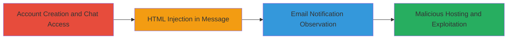

# Second-Order Stored XSS via Chat Message HTML Injection for Email Phishing

Multi-stage attack chain demonstrating a complete workflow for exploiting a second-order stored XSS vulnerability in a chat messaging system, where malicious HTML injected into chat messages is unsanitized in email notifications, allowing link alteration to phishing sites.

## Chain Metrics Dashboard

| Metric | Value |
|--------|-------|
| Chain Status | Unverified |
| Total Steps | 4 |
| Execution Time | ~10 minutes |
| Skill Level | Intermediate |
| Complexity | Medium |
| Impact Level | High |

## Attack Flow Visualization

## Prerequisites & Requirements

### Required Tools

- Web browser for account creation and interaction
- Email client to receive notifications
- Web server (e.g., Apache or Nginx) for hosting malicious content

### Target Environment

- Web-based chat platform (e.g., ServiceNow-like system with sysparm_channelID)
- Email notification service (e.g., Air University Service Desk mail server)
- No specific ports required beyond standard HTTPS (443)

### Initial Access Requirements

- No prior credentials needed; create a new account
- Attacker must control a domain (e.g., un4.gi) for redirection
- Recipient account with associated email for testing

## Detailed Attack Procedures

### Step 1: Create Account and Access Chat Interface
procedure: [[procedures/Create-Account-and-Access-Chat-Interface]]

**Objective**: Establish a foothold by creating an account and navigating to the vulnerable chat endpoint to initiate the attack.

**Instructions**: Register a new account on the target platform and browse to the chat interface. No specific commands are needed; use the web interface.

**Expected Output**: Successful login and access to the chat creation page.

**Success Indicators**:
- Account created without errors
- Chat endpoint (e.g., ██████) loaded in browser

### Step 2: Inject Malicious HTML in Chat Message
procedure: [[procedures/Inject-Malicious-HTML-in-Chat-Message]]

**Objective**: Send a chat message containing unsanitized HTML payload to trigger the second-order XSS in email notifications.

**Instructions**: Create a new conversation and input the payload `<base href=//un4.gi>` as the message content, then send it to a test recipient.

**Expected Output**: Message sent successfully; no immediate errors in the chat UI.

**Success Indicators**:
- Message appears in chat history
- Recipient receives an email notification (check in next step)

### Step 3: Observe Email Notification Redirection
procedure: [[procedures/Observe-Email-Notification-Redirection]]

**Objective**: Verify the vulnerability by checking how the email notification renders the payload, altering links to the attacker's domain.

**Instructions**: Log into the recipient's email account and open the notification. Inspect the 'new message' link, which should now point to `https://un4.gi/███████sysparm_channelID=████` instead of the legitimate domain.

**Expected Output**: Email received with modified hyperlink src attribute due to the base href injection.

**Success Indicators**:
- Link in email redirects to attacker domain when hovered/clicked
- ChannelID parameter preserved in the altered URL

### Step 4: Host Malicious Content for Exploitation
procedure: [[procedures/Host-Malicious-Content-for-Exploitation]]

**Objective**: Set up attacker-controlled content to phish victims or execute further attacks when they click the redirected link.

**Instructions**: On the attacker's server (e.g., at un4.gi), host a phishing page or malicious script at the path matching the redirected URL, incorporating the sysparm_channelID from the original chat (e.g., /███████sysparm_channelID=<channelIDhere>).

**Expected Output**: Victim clicking the email link lands on the attacker's site, enabling data theft or code execution in webmail clients.

**Success Indicators**:
- Test click from email redirects to hosted content
- Potential browser execution if viewed in webmail (e.g., JavaScript alert or form capture)

## Attack Chain Summary

### Key Achievements

1. Successful injection of HTML payload into chat without UI sanitization
2. Alteration of email notification links to attacker domain
3. Enablement of phishing attacks or client-side code execution via redirected links
4. Demonstration of second-order stored XSS impact on official email server

## Technique & Tactic Coverage

### MITRE ATT&CK Techniques

- [[JavaScript]] JavaScript (for potential XSS execution in webmail)
- [[T1566.001]] Phishing: Spearphishing Link (via altered email hyperlinks)

### MITRE ATT&CK Tactics

- [[Execution]] Execution (client-side script via XSS)
- [[Initial Access]] Initial Access (phishing to gain victim interaction)

---

*Last updated: 2023-10-01T12:00:00Z*
