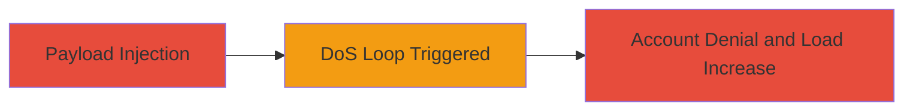

---
tags:
  - dos
  - input-validation
  - websocket
  - api
  - resource-exhaustion
type: attack_chain
tools: []
tactics:
  - '[[Impact]]'
verified: false
platforms:
  - Web
submitted: true
complexity: low
created_at: '2023-10-01T00:00:00Z'
procedures:
  - >-
    [[procedures/Trigger-DoS-Loop-via-Invalid-to-Parameter-in-IRCCloud-Say-Endpoint]]
step_count: 1
techniques:
  - '[[Endpoint Denial of Service]]'
updated_at: '2025-12-14T17:32:01.803Z'
description: >-
  Attack chain exploiting inadequate input validation in IRCCloud's 'say' API
  endpoint to trigger a self-DoS loop via websocket, preventing account access
  and increasing system load.
skill_level: intermediate
impact_level: high
id: b9350596-c578-45fd-ad88-5ced0d0e2f80
validated: true
mitre_tactics:
  - '[[Impact]]'
mitre_techniques:
  - '[[Endpoint Denial of Service]]'
---
# Self-Denial of Service via Malicious JSON Payload in IRCCloud Say Endpoint

Multi-stage attack chain demonstrating a complete attack workflow targeting IRCCloud's websocket API.

## Chain Metrics Dashboard

| Metric | Value |
|--------|-------|
| Chain Status | Unverified |
| Total Steps | 1 |
| Execution Time | ~1 minute |
| Skill Level | Intermediate |
| Complexity | Low |
| Impact Level | High |

## Attack Flow Visualization



## Prerequisites & Requirements

### Required Tools

- Web browser with developer tools or websocket client (e.g., browser console)

### Target Environment

- IRCCloud web application
- Active user session with websocket connection
- No specific ports required beyond standard HTTPS (443)

### Initial Access Requirements

- Valid IRCCloud account credentials
- Authenticated session in the web interface
- Network access to IRCCloud services

## Detailed Attack Procedures

### Step 1: Inject Malicious Payload
procedure: [[procedures/Trigger-DoS-Loop-via-Invalid-to-Parameter-in-IRCCloud-Say-Endpoint]]

**Objective**: Send a malformed JSON payload to the 'say' API endpoint via websocket to trigger an infinite error handling loop, resulting in self-denial of service and elevated system load.

**Instructions**: Authenticate into IRCCloud web interface and open developer tools (F12). Locate the websocket connection in the Network tab or use the console to send the payload directly. Craft the JSON payload {"to": [""]} and transmit it to the 'say' endpoint as per IRCCloud's API structure.

In the browser console, if the websocket object is accessible (e.g., via window.ws or similar), send:

```javascript
ws.send(JSON.stringify({"method": "say", "params": {"to": [""], "message": "test"}}));
```

Replace 'ws' with the actual websocket instance. Alternatively, use a websocket client tool to connect to wss://irccloud.com and authenticate first before sending the payload.

**Expected Output**: The client enters a looping error state, freezing the interface and preventing further interactions. Server-side logs may show repeated errors, increasing CPU load.

**Success Indicators**:
- User interface becomes unresponsive
- Account access is blocked until session reset
- Potential observable increase in system resource usage on the client

## Attack Chain Summary

### Key Achievements

1. Successful injection of invalid 'to' parameter as empty string array
2. Triggered self-DoS preventing account usage
3. Demonstrated potential for broader system impact via unchecked load

## Technique & Tactic Coverage

### MITRE ATT&CK Techniques

- [[Endpoint Denial of Service]]

### MITRE ATT&CK Tactics

- [[Impact]]

---
*Last updated: 2023-10-01T00:00:00Z*
