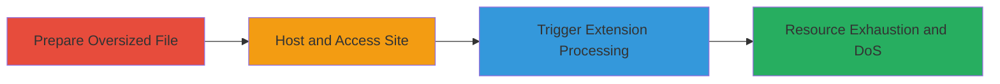

# Self-DoS in Chrome Extension via Oversized Security.txt File Processing

Multi-stage attack chain demonstrating a self-denial of service vulnerability in a Chrome extension that fetches and processes security.txt files without resource limits, causing the extension, tab, or browser to hang or crash when handling a 1-2 GB file.

## Chain Metrics Dashboard

| Metric | Value |
|--------|-------|
| Chain Status | Unverified |
| Total Steps | 3 |
| Execution Time | ~5 minutes |
| Skill Level | Novice |
| Complexity | Low |
| Impact Level | Low |

## Attack Flow Visualization



## Prerequisites & Requirements

### Required Tools

- Text editor or script to generate large files (e.g., Python or dd command)
- Local web server (e.g., Python's http.server)
- Chrome browser with the vulnerable extension installed

### Target Environment

- Chrome browser on any OS (Windows, macOS, Linux)
- Vulnerable Chrome extension that fetches security.txt via AJAX in getSecuritytxt function
- Local or remote host to serve the large file

### Initial Access Requirements

- No credentials needed
- Local network access to host the file
- Extension must be enabled in Chrome

## Detailed Attack Procedures

### Step 1: Prepare Oversized Security.txt File
procedure: [[procedures/Create-Large-Security-txt-File]]

**Objective**: Generate a 1-2 GB security.txt file to simulate an oversized response that will exhaust resources during processing.

**Instructions**: Use a tool or script to create a large file filled with dummy security.txt content, such as repeated Contact and Preferred-Languages directives. For example, in a terminal:

```bash
# Using dd to create a large file (adjust size as needed)
dd if=/dev/zero of=large-security.txt bs=1M count=2048
# Then append valid security.txt headers if needed, but zero-fill simulates bloat
echo "Contact: https://example.com/security" > large-security.txt
# Append junk data to reach 1-2 GB
```

**Expected Output**: A file named large-security.txt approximately 1-2 GB in size, verifiable with `ls -lh large-security.txt` showing ~1.0G to ~2.0G.

**Success Indicators**:
- File created successfully without errors
- File size confirmed to be 1-2 GB

### Step 2: Host and Access the Site
procedure: [[procedures/Navigate-to-Site-Hosting-Large-File]]

**Objective**: Serve the large file via a web server and navigate to it in Chrome to set up the trigger for the extension's fetch.

**Instructions**: Start a local web server to host the file, then open the URL in a Chrome tab. For example, place the file in a directory and run:

```bash
# Navigate to the directory containing large-security.txt
cd /path/to/file
# Start Python HTTP server (Python 3)
python3 -m http.server 8000
# In Chrome, navigate to http://localhost:8000/large-security.txt
```

**Expected Output**: The browser begins loading the file, showing increased CPU and network usage during pre-flight checks, but the page may hang due to size.

**Success Indicators**:
- Local server running without errors
- Chrome tab opens the URL and starts fetching
- Network traffic spikes observable in browser dev tools

### Step 3: Trigger Extension Processing
procedure: [[procedures/Activate-Chrome-Extension-to-Trigger-DoS]]

**Objective**: Activate the extension to invoke the getSecuritytxt function, causing it to fetch and process the entire large file via AJAX without timeouts, leading to resource exhaustion.

**Instructions**: With the tab open to the site serving the large security.txt, click the extension icon or trigger its functionality to scan or fetch the file. No specific command needed; it's a UI interaction.

**Expected Output**: The extension hangs, browser tab becomes unresponsive, or the tab crashes due to high CPU/memory usage from processing the full 1-2 GB file.

**Success Indicators**:
- Extension UI freezes or shows loading indefinitely
- Browser task manager shows spiked CPU/RAM for the tab
- Tab crashes with error like "Aw, Snap!" page

## Attack Chain Summary

### Key Achievements

1. Successful creation and hosting of a 1-2 GB security.txt file
2. Triggering of AJAX fetch in the extension without limits
3. Achievement of self-DoS impacting the extension and current tab

## Technique & Tactic Coverage

### MITRE ATT&CK Techniques

- [[Endpoint Denial of Service]]

### MITRE ATT&CK Tactics

- [[Impact]]

---
*Last updated: 2023-10-01T12:00:00Z*
