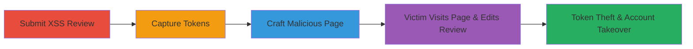

# Self-Stored XSS Chained with Login/Logout CSRF for Account Takeover

Multi-stage attack chain exploiting a self-stored XSS in Zomato's review submission, CSRF vulnerabilities on login and logout, and a WAF bypass to steal OAuth tokens for account takeover. The attacker submits a review with an XSS payload in the 'with_tags_data' parameter, which executes when edited. This is chained with a malicious page that uses CSRF to log out the victim, log in the attacker's account, and redirect to the XSS review, allowing token theft upon edit.

## Chain Metrics Dashboard

| Metric | Value |
|--------|-------|
| Chain Status | Unverified |
| Total Steps | 5 |
| Execution Time | ~10 minutes |
| Skill Level | Intermediate |
| Complexity | Medium |
| Impact Level | High |

## Attack Flow Visualization



## Prerequisites & Requirements

### Required Tools

- [[tools/Facebook-JavaScript-SDK]]
- [[tools/Burp-Suite]]

### Target Environment

- Web platform (Zomato-like review site)
- Required services: Facebook OAuth, PHP backend
- Network access: Public internet to target endpoints

### Initial Access Requirements

- Attacker account on target site
- Victim interaction (e.g., phishing link to malicious page)
- No prior credentials needed beyond attacker's own

## Detailed Attack Procedures

### Step 1: Submit Review with Stored XSS Payload
procedure: [[procedures/Submit-Review-with-Stored-XSS-Payload]]

**Objective**: Store an XSS payload in the review's 'with_tags_data' parameter to execute JavaScript when the review is edited later.

**Instructions**: Use [[commands/submit-review-xss]] to POST a review with the payload to the submission endpoint:

```bash
curl -X POST https://www.zomato.com/php/submitReview \
  -d "review=140 characters long review" \
  -d "review_db=140 characters long review" \
  -d "with_tags_data=<script>prompt(0,document.domain)</script>" \
  -d "res_id=19132208" \
  -d "city_id=11333" \
  -d "rating=5" \
  -d "is_edit=0" \
  -d "review_id=0" \
  -d "save_image=1" \
  -d "instagram_images_to_update=[]" \
  -d "instagram_json_data={\"data\":[]}" \
  -d "uploaded_images_json=[]" \
  -d "share_to_fb=false" \
  -d "share_to_tw=false" \
  -d "snippet=restaurant-review" \
  -d "web_source=default" \
  -d "csrf_token=2acad4ba08d4000000000007923a25d" \
  -d "external_url="
```

For advanced payload, incorporate [[commands/xss-payload-fb-token-steal]] inline in 'with_tags_data'.

**Expected Output**: Review submitted successfully; no immediate alert, but payload stored.

**Success Indicators**:
- HTTP 200 response with review confirmation
- Payload verifiable in database or via review view source

### Step 2: Trigger XSS via Review Edit
procedure: [[procedures/Trigger-XSS-via-Review-Edit]]

**Objective**: Execute the stored XSS payload by editing the review, demonstrating arbitrary JavaScript execution.

**Instructions**: Navigate to the review page and click 'Edit'. The payload in 'with_tags_data' executes automatically. Test with simple prompt using the submission from Step 1, or advanced token steal with [[commands/xss-payload-fb-token-steal]].

**Expected Output**: JavaScript alert or token POST to attacker's server upon edit.

**Success Indicators**:
- Prompt box appears or network request to attacker server
- Console logs confirm JS execution

### Step 3: Capture Login Tokens via Proxy
procedure: [[procedures/Capture-Login-Tokens-via-Proxy]]

**Objective**: Intercept Facebook OAuth tokens during login to use in CSRF later.

**Instructions**: Configure [[tools/Burp-Suite]] as a proxy. Perform Facebook login to https://www.zomato.com/php/asyncLogin.php?access_token=..., capturing authResponse parameters like accessToken, userID, signedRequest.

**Expected Output**: Captured tokens in proxy history.

**Success Indicators**:
- authResponse object visible in POST body
- Tokens valid for reuse

### Step 4: Craft Malicious Auto-Login Page
procedure: [[procedures/Craft-Malicious-Auto-Login-Page]]

**Objective**: Create an HTML page that uses CSRF to log out the victim, log in the attacker, and redirect to the XSS review.

**Instructions**: Build the page using [[commands/malicious-csrf-page]] as the base HTML. Host on attacker's server and generate a phishing link.

**Expected Output**: Page loads, auto-submits form after logout.

**Success Indicators**:
- Victim session logs out
- Attacker account logs in on victim's browser

### Step 5: Execute Account Takeover via Victim Interaction
procedure: [[procedures/Execute-Account-Takeover-via-Victim-Interaction]]

**Objective**: Trick victim into visiting the page and editing the review to steal their fresh tokens.

**Instructions**: Send phishing link to victim. Upon visit: CSRF logout via img src, login form submit after 1.5s, redirect to review after 4s. Victim edits review, triggering XSS from Step 1 to steal tokens via [[commands/xss-payload-fb-token-steal]].

**Expected Output**: Tokens POSTed to attacker's server; attacker uses them for victim account access.

**Success Indicators**:
- Attacker receives victim's accessToken and signedRequest
- Attacker can access victim's profile or actions

## Attack Chain Summary

### Key Achievements

1. Stored XSS execution via WAF bypass in 'with_tags_data'
2. CSRF-forced session manipulation (logout/login)
3. OAuth token theft leading to full account takeover

## Technique & Tactic Coverage

### MITRE ATT&CK Techniques

- [[JavaScript]]
- [[Drive-by Compromise]]
- [[Credentials In Files]]

### MITRE ATT&CK Tactics

- [[Initial Access]]
- [[Execution]]
- [[Credential Access]]

---
*Last updated: 2023-10-01T00:00:00Z*
