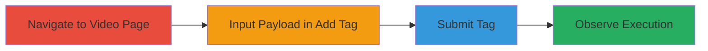

---
tags:
  - xss
  - self-xss
  - stored-xss
  - web-vulnerability
type: attack_chain
tools: []
tactics:
  - '[[Execution]]'
verified: false
platforms:
  - Web
submitted: true
complexity: low
created_at: '2023-10-01T00:00:00Z'
procedures:
  - '[[procedures/Navigate-to-XVIDEOS-Video-Page]]'
  - '[[procedures/Input-XSS-Payload-in-Add-Tag-Dialog]]'
  - '[[procedures/Submit-Tag-to-Trigger-XSS]]'
  - '[[procedures/Observe-JavaScript-Execution]]'
step_count: 4
techniques:
  - '[[JavaScript]]'
updated_at: '2025-12-14T03:47:12.849Z'
description: >-
  A multi-step process to demonstrate and exploit a self-stored XSS
  vulnerability in the add tag dialog on XVIDEOS video pages, resulting in
  JavaScript execution limited to the attacker's own browser.
skill_level: beginner
impact_level: low
id: c2ed116d-8901-430d-83ba-0af08fefafa2
validated: true
mitre_tactics:
  - '[[Execution]]'
mitre_techniques:
  - '[[JavaScript]]'
---
# Self-Stored XSS via Add Tag Functionality on XVIDEOS Video Pages

Multi-stage attack chain demonstrating a complete workflow for exploiting a self-stored XSS vulnerability in the tag suggestion dialog on XVIDEOS video pages. This vulnerability allows arbitrary JavaScript execution in the user's own browser upon submitting a malicious tag, but has no impact on other users due to its self-contained nature.

## Chain Metrics Dashboard

| Metric | Value |
|--------|-------|
| Chain Status | Unverified |
| Total Steps | 4 |
| Execution Time | ~1 minute |
| Skill Level | Beginner |
| Complexity | Low |
| Impact Level | Low |

## Attack Flow Visualization

## Prerequisites & Requirements

### Required Tools

- Web browser (e.g., Chrome, Firefox)

### Target Environment

- Web platform
- Access to XVIDEOS video pages (no authentication required)
- No specific services or ports needed

### Initial Access Requirements

- Public internet access
- No credentials or prior access required

## Detailed Attack Procedures

### Step 1: Navigate to Video Page
procedure: [[procedures/Navigate-to-XVIDEOS-Video-Page]]

**Objective**: Access a target video page on XVIDEOS to reach the add tag functionality.

**Instructions**: Open a web browser and navigate to a specific video URL, such as https://www.xvideos.com/video53284603/b. No login is required.

**Expected Output**: The video page loads, displaying the video player and associated metadata, including tag suggestions.

**Success Indicators**:
- Video page fully loads without errors
- Tag section or suggestion dialog is visible

### Step 2: Input XSS Payload in Add Tag Dialog
procedure: [[procedures/Input-XSS-Payload-in-Add-Tag-Dialog]]

**Objective**: Locate the add tag feature and insert a JavaScript payload to test for XSS reflection.

**Instructions**: On the video page, find the tag suggestion or add tag dialog box. Click to open it and enter the payload `` into the input field.

**Expected Output**: The payload is accepted in the dialog without immediate errors or sanitization warnings.

**Success Indicators**:
- Payload is entered successfully
- Dialog remains open and functional

### Step 3: Submit Tag to Trigger XSS
procedure: [[procedures/Submit-Tag-to-Trigger-XSS]]

**Objective**: Submit the malicious tag to store and reflect the payload, initiating the XSS execution.

**Instructions**: Click the add or submit button in the dialog to process the tag input.

**Expected Output**: The tag is submitted, and the payload is stored and reflected in the page's response within the dialog.

**Success Indicators**:
- Submission completes without server-side rejection
- Page updates to include the new tag

### Step 4: Observe JavaScript Execution
procedure: [[procedures/Observe-JavaScript-Execution]]

**Objective**: Verify the XSS by observing the execution of the injected JavaScript in the browser.

**Instructions**: After submission, monitor the browser for the alert popup triggered by the payload.

**Expected Output**: A JavaScript alert box appears displaying "1", confirming execution in the current browser session.

**Success Indicators**:
- Alert popup triggers
- No execution in other tabs or sessions

## Attack Chain Summary

### Key Achievements

1. Successful navigation to vulnerable video page
2. Injection and storage of XSS payload in add tag dialog
3. Triggering of self-contained JavaScript execution
4. Confirmation of low-impact self-XSS with no cross-user effects

## Technique & Tactic Coverage

### MITRE ATT&CK Techniques

- [[JavaScript]]

### MITRE ATT&CK Tactics

- [[Execution]]

---
*Last updated: 2023-10-01T00:00:00Z*
