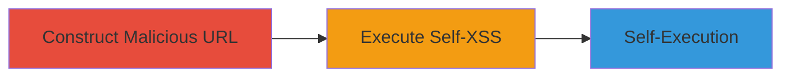

---
tags:
  - xss
  - self-xss
  - javascript-url
type: attack_chain
tools:
  - '[[tools/Chrome-Browser]]'
tactics:
  - '[[Execution]]'
verified: false
platforms:
  - Web
submitted: true
complexity: low
created_at: '2023-10-01T00:00:00Z'
procedures:
  - '[[procedures/Execute-Self-XSS-via-Javascript-URL]]'
step_count: 2
techniques:
  - '[[JavaScript]]'
updated_at: '2025-12-14T03:16:25.039Z'
description: >-
  Demonstrates a self-XSS attack using a javascript: URL pasted into the browser
  address bar on a Quora profile page, executing JavaScript in the user's own
  session.
skill_level: beginner
impact_level: low
id: d060f491-005d-40c2-99ac-ca708bf48b15
validated: true
mitre_tactics:
  - '[[Execution]]'
mitre_techniques:
  - '[[JavaScript]]'
---
# Self-XSS Execution via Javascript URL on Quora Profile Page

Multi-stage attack chain demonstrating a complete self-XSS workflow on Quora's profile page.

## Chain Metrics Dashboard

| Metric | Value |
|--------|-------|
| Chain Status | Unverified |
| Total Steps | 2 |
| Execution Time | ~1 minute |
| Skill Level | Beginner |
| Complexity | Low |
| Impact Level | Low |

## Attack Flow Visualization



## Prerequisites & Requirements

### Required Tools

- [[tools/Chrome-Browser]]

### Target Environment

- Web platform
- Access to Quora profile page (https://www.quora.com/profile/Username/)
- No special services or ports required

### Initial Access Requirements

- Valid browser session on the target profile page
- No credentials or prior access needed beyond normal site navigation

## Detailed Attack Procedures

### Step 1: Construct Malicious URL
procedure: [[procedures/Execute-Self-XSS-via-Javascript-URL]]

**Objective**: Build the javascript: URL payload that includes the alert and appends the profile URL as a comment to demonstrate self-XSS.

**Instructions**: Use the browser to copy the payload [[commands/javascript-alert-document-domain]]:

```javascript
javascript:alert(document.domain)// https://www.quora.com/profile/Username/
```

Position the browser on the Quora profile page before proceeding.

**Expected Output**: The URL is ready for pasting into the address bar.

**Success Indicators**:
- URL constructed without syntax errors
- Browser remains on the profile page

### Step 2: Trigger Self-XSS Payload
procedure: [[procedures/Execute-Self-XSS-via-Javascript-URL]]

**Objective**: Paste the URL into the address bar to execute the JavaScript in the current page context, triggering a self-XSS alert.

**Instructions**: With the profile page loaded, paste and navigate to the [[commands/javascript-alert-document-domain]] payload in the address bar:

```javascript
javascript:alert(document.domain)// https://www.quora.com/profile/Username/
```

The browser's javascript: protocol handler will execute the code.

**Expected Output**: An alert popup displays 'www.quora.com'.

**Success Indicators**:
- Alert box appears showing the document domain
- No errors in browser console; execution limited to current session

## Attack Chain Summary

### Key Achievements

1. Successful construction of a javascript: URL for self-XSS demonstration
2. Execution of arbitrary JavaScript in the user's browser context on the Quora profile page
3. Confirmation of self-XSS behavior relying on browser protocol handling

## Technique & Tactic Coverage

### MITRE ATT&CK Techniques

- [[JavaScript]]

### MITRE ATT&CK Tactics

- [[Execution]]

---
*Last updated: 2023-10-01T00:00:00Z*
