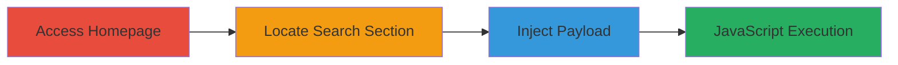

---
tags:
  - xss
  - self-xss
  - javascript-injection
type: attack_chain
tools: []
tactics:
  - '[[Execution]]'
verified: false
platforms:
  - Web
submitted: true
created_at: '2023-10-01T00:00:00Z'
procedures:
  - '[[procedures/Navigate-to-Jetpack-me-Homepage]]'
  - '[[procedures/Locate-Search-Box-in-Every-Feature-Section]]'
  - '[[procedures/Inject-XSS-Payload-in-Search-Box]]'
step_count: 3
techniques:
  - '[[JavaScript]]'
updated_at: '2025-12-14T03:15:36.155Z'
description: >-
  A simple attack chain demonstrating the exploitation of a self-XSS
  vulnerability in the search box on the Jetpack.me front page, leading to
  arbitrary JavaScript execution in the attacker's own browser session.
id: f505e2eb-aade-49e6-b61d-fc9c1bb85980
validated: true
mitre_tactics:
  - '[[Execution]]'
mitre_techniques:
  - '[[JavaScript]]'
---
# Self-XSS Exploitation in Jetpack.me Search Functionality

Multi-stage attack chain demonstrating a complete attack workflow for exploiting a self-XSS vulnerability in the Jetpack.me search functionality.

## Chain Metrics Dashboard

| Metric | Value |
|--------|-------|
| Chain Status | Unverified |
| Total Steps | 3 |
| Execution Time | ~1 minute |
| Skill Level | Beginner |
| Complexity | Low |
| Impact Level | Low |

## Attack Flow Visualization

## Prerequisites & Requirements

### Required Tools

- Web browser (e.g., Chrome, Firefox)

### Target Environment

- Web platform
- Internet access to http://jetpack.me/
- No specific services or ports required beyond standard HTTP/80

### Initial Access Requirements

- No credentials needed
- Direct public access to the website
- No prior access required

## Detailed Attack Procedures

### Step 1: Access Homepage
procedure: [[procedures/Navigate-to-Jetpack-me-Homepage]]

**Objective**: Gain initial access to the target website's front page to begin the exploitation process.

**Instructions**: Open a web browser and navigate directly to the Jetpack.me homepage.

**Expected Output**: The front page loads, displaying promotional content including the 'Every feature!' section.

**Success Indicators**:
- Page loads without errors
- URL confirms http://jetpack.me/

### Step 2: Locate Search Section
procedure: [[procedures/Locate-Search-Box-in-Every-Feature-Section]]

**Objective**: Identify the vulnerable search input field within the page layout.

**Instructions**: Scroll down the page to find the 'Every feature!' section, which contains the search box for querying features.

**Expected Output**: The search box is visible and accessible for input.

**Success Indicators**:
- 'Every feature!' section is located
- Search input field is present and interactive

### Step 3: Inject Payload
procedure: [[procedures/Inject-XSS-Payload-in-Search-Box]]

**Objective**: Inject a malicious JavaScript payload into the search box to trigger self-XSS execution.

**Instructions**: Enter the payload `` into the search field and submit or trigger the reflection.

**Expected Output**: The input is reflected unsanitized on the page, executing the onerror handler and displaying an alert box with '1'.

**Success Indicators**:
- Alert dialog appears in the browser
- JavaScript executes confirming the vulnerability

## Attack Chain Summary

### Key Achievements

1. Successful navigation to the vulnerable page
2. Identification of the unsanitized search input
3. Execution of arbitrary JavaScript in the user's session, demonstrating self-XSS

## Technique & Tactic Coverage

### MITRE ATT&CK Techniques

- [[JavaScript]]

### MITRE ATT&CK Tactics

- [[Execution]]

---
*Last updated: 2023-10-01T00:00:00Z*
