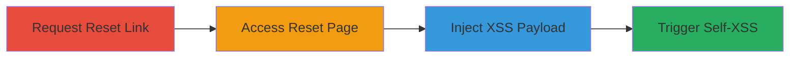

---
tags:
  - xss
  - self-xss
  - uber
  - password-reset
  - web
type: attack_chain
tools: []
tactics:
  - '[[Execution]]'
verified: false
platforms:
  - Web
submitted: true
complexity: low
created_at: '2023-10-01T00:00:00Z'
procedures:
  - '[[procedures/Request-Uber-Password-Reset-Link]]'
  - '[[procedures/Access-Uber-Password-Reset-Page]]'
  - '[[procedures/Inject-XSS-Payload-in-Uber-Password-Field]]'
  - '[[procedures/Trigger-Self-XSS-via-Uber-Show-Password]]'
step_count: 4
techniques:
  - '[[JavaScript]]'
updated_at: '2025-12-14T03:15:47.289Z'
description: >-
  A multi-step attack demonstrating self-XSS in Uber's password reset form by
  injecting an XSS payload into the password field and triggering it with the
  'show password' feature, limited to the attacker's browser.
skill_level: beginner
impact_level: low
id: a8fd9b0a-9475-4537-b863-4b56b2c2e46e
validated: true
mitre_tactics:
  - '[[Execution]]'
mitre_techniques:
  - '[[JavaScript]]'
---
# Self-XSS Exploitation in Uber Password Reset Form via Unsanitized Show Password

Multi-stage attack chain demonstrating a complete self-XSS workflow in Uber's partner portal password reset feature.

## Chain Metrics Dashboard

| Metric | Value |
|--------|-------|
| Chain Status | Unverified |
| Total Steps | 4 |
| Execution Time | ~2 minutes |
| Skill Level | Beginner |
| Complexity | Low |
| Impact Level | Low |

## Attack Flow Visualization

## Prerequisites & Requirements

### Required Tools

- Web browser (e.g., Chrome, Firefox)

### Target Environment

- Uber partner portal at https://partners.uber.com/
- Access to an Uber account email

### Initial Access Requirements

- Valid Uber account credentials (email)
- No special network access required; standard internet connection

## Detailed Attack Procedures

### Step 1: Request Password Reset
procedure: [[procedures/Request-Uber-Password-Reset-Link]]

**Objective**: Initiate the password reset process to receive a reset link via email.

**Instructions**: Navigate to the Uber login page and request a password reset for the target account.

**Expected Output**: Email containing the password reset URL.

**Success Indicators**:
- Reset email received
- Valid reset link present in email

### Step 2: Access Password Reset Page
procedure: [[procedures/Access-Uber-Password-Reset-Page]]

**Objective**: Open the password reset form using the provided link.

**Instructions**: Click the reset link from the email to load the form.

**Expected Output**: Password reset form loaded in the browser.

**Success Indicators**:
- Form fields visible (new password input)
- 'Show password' toggle available

### Step 3: Inject XSS Payload
procedure: [[procedures/Inject-XSS-Payload-in-Uber-Password-Field]]

**Objective**: Enter a malicious XSS payload into the new password field.

**Instructions**: Type the payload into the password input field.

**Expected Output**: Payload entered without immediate errors.

**Success Indicators**:
- Payload visible in the input field (if show password is toggled temporarily)
- Form allows continuation

### Step 4: Trigger Self-XSS
procedure: [[procedures/Trigger-Self-XSS-via-Uber-Show-Password]]

**Objective**: Submit the form and use the 'show password' feature to execute the XSS payload in the attacker's browser.

**Instructions**: Proceed with the form and hover over the revealed password to trigger the payload.

**Expected Output**: JavaScript alert or prompt displaying the document domain.

**Success Indicators**:
- XSS payload executes (e.g., prompt appears on mouseover)
- JavaScript runs only in the attacker's session

## Attack Chain Summary

### Key Achievements

1. Successful injection of XSS payload into password field
2. Triggering of self-XSS via unsanitized 'show password' feature
3. Confirmation of limited impact to self-browser execution

## Technique & Tactic Coverage

### MITRE ATT&CK Techniques

- [[JavaScript]]

### MITRE ATT&CK Tactics

- [[Execution]]

---
*Last updated: 2023-10-01T00:00:00Z*
