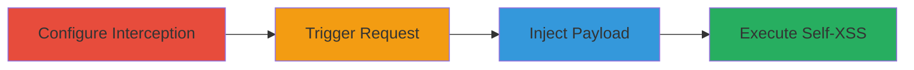

# Self-XSS Exploitation on Nextcloud About Page via URL Parameter Injection

Multi-stage attack chain demonstrating the exploitation of a self-XSS vulnerability on the Nextcloud about page at https://nextcloud.com/about/. The attack involves intercepting an HTTP request with Burp Suite, injecting a JavaScript payload into the URL, and forwarding the request to trigger payload execution in the attacker's browser. This self-XSS has limited impact, affecting only the attacker's session, but can potentially be chained with social engineering tools like XSSJacking for escalation.

## Chain Metrics Dashboard

| Metric | Value |
|--------|-------|
| Chain Status | Unverified |
| Total Steps | 4 |
| Execution Time | ~5 minutes |
| Skill Level | Intermediate |
| Complexity | Medium |
| Impact Level | Low |

## Attack Flow Visualization

## Prerequisites & Requirements

### Required Tools

- [[tools/Burp-Suite]]

### Target Environment

- Web platform
- Access to https://nextcloud.com/about/
- No specific ports or services required beyond standard HTTP/HTTPS

### Initial Access Requirements

- Direct browser access to the target URL
- Burp Suite proxy configured in the browser (e.g., via FoxyProxy or system proxy settings)
- No credentials or prior access needed

## Detailed Attack Procedures

### Step 1: Configure Burp Suite for Request Interception
procedure: [[procedures/Configure-Burp-Suite-for-Request-Interception]]

**Objective**: Set up Burp Suite to intercept HTTP traffic from the browser to capture requests to the target page.

**Instructions**: Launch Burp Suite, navigate to the Proxy tab, and enable intercept mode. Configure your browser to route traffic through Burp's proxy (typically localhost:8080).

**Expected Output**: Burp Suite is ready to capture requests, with the Intercept button active.

**Success Indicators**:
- Proxy listener active on port 8080
- Browser traffic routed through Burp

### Step 2: Trigger HTTP Request Interception
procedure: [[procedures/Trigger-HTTP-Request-Interception]]

**Objective**: Generate an HTTP request to the target page that gets intercepted by Burp Suite.

**Instructions**: Open the target URL https://nextcloud.com/about/ in the browser and refresh the page to send a new GET request.

**Expected Output**: The request appears in Burp's Intercept tab, paused for inspection.

**Success Indicators**:
- Intercepted request visible in Burp
- Page load halted until forwarded

### Step 3: Inject XSS Payload into Intercepted Request
procedure: [[procedures/Inject-XSS-Payload-into-Intercepted-Request]]

**Objective**: Modify the intercepted URL by appending a malicious JavaScript payload to exploit the reflection vulnerability.

**Instructions**: In the intercepted request, edit the URL path or parameter to include the payload `</title>">'"><marquee><h1>nextcloud.com</h1></marquee>'`.

**Expected Output**: Modified request ready for forwarding, with the payload integrated into the URL.

**Success Indicators**:
- Payload successfully appended without syntax errors
- Request structure intact

### Step 4: Forward Modified Request to Execute Payload
procedure: [[procedures/Forward-Modified-Request-to-Execute-Payload]]

**Objective**: Release the modified request to the server, triggering the self-XSS execution upon page rendering.

**Instructions**: Disable intercept mode in Burp Suite and forward the request. Observe the page refresh and JavaScript alert.

**Expected Output**: Browser displays an alert box with '205' and potentially a marquee element, confirming payload execution.

**Success Indicators**:
- JavaScript alert(205) pops up
- Malicious HTML elements rendered on the page

## Attack Chain Summary

### Key Achievements

1. Successful interception and modification of HTTP requests using Burp Suite
2. Injection and execution of a self-XSS payload on the Nextcloud about page
3. Demonstration of limited impact with potential for chaining via tools like XSSJacking

## Technique & Tactic Coverage

### MITRE ATT&CK Techniques

- [[Exploit Public-Facing Application]]
- [[JavaScript]]

### MITRE ATT&CK Tactics

- [[Initial Access]]
- [[Execution]]

---
*Last updated: 2023-10-01T00:00:00Z*
