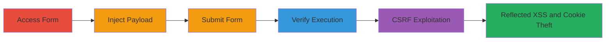

---
tags:
  - xss
  - csrf
  - self-xss
  - reflected-xss
  - web-vulnerability
type: attack_chain
tools: []
tactics:
  - '[[Initial Access]]'
  - '[[Execution]]'
  - '[[Collection]]'
verified: false
platforms:
  - Web
submitted: true
created_at: '2024-10-01T00:00:00Z'
procedures:
  - '[[procedures/Access-Vulnerable-Web-Form]]'
  - '[[procedures/Inject-XSS-Payload-in-First-Name-Field]]'
  - '[[procedures/Submit-Form-to-Trigger-Self-XSS]]'
  - '[[procedures/Verify-XSS-Execution]]'
  - '[[procedures/Craft-CSRF-Attack-for-Reflected-XSS]]'
step_count: 5
techniques:
  - '[[Drive-by Compromise]]'
  - '[[JavaScript]]'
  - '[[Steal Web Session Cookie]]'
updated_at: '2025-12-14T17:27:15.892Z'
description: >-
  A multi-stage attack exploiting self-XSS in a web form combined with CSRF to
  achieve reflected XSS, enabling JavaScript execution for cookie theft in an
  authenticated user's browser.
id: af70f292-422c-421d-aeae-a243c516f208
validated: true
mitre_tactics:
  - '[[Initial Access]]'
  - '[[Execution]]'
  - '[[Collection]]'
mitre_techniques:
  - '[[Drive-by Compromise]]'
  - '[[JavaScript]]'
  - '[[Steal Web Session Cookie]]'
---
# Self-XSS and CSRF Chaining to Reflected XSS in Web Form

Multi-stage attack chain demonstrating a complete attack workflow exploiting insufficient input sanitization and lack of CSRF protection in a web form to achieve reflected XSS for arbitrary JavaScript execution, such as stealing session cookies from authenticated users.

## Chain Metrics Dashboard

| Metric | Value |
|--------|-------|
| Chain Status | Unverified |
| Total Steps | 5 |
| Execution Time | ~5 minutes |
| Skill Level | Intermediate |
| Complexity | Medium |
| Impact Level | High |

## Attack Flow Visualization

## Prerequisites & Requirements

### Required Tools

- Browser with developer tools (e.g., Chrome DevTools for payload testing)
- Text editor for crafting malicious HTML

### Target Environment

- Web application with vulnerable form at https://███████/
- Authenticated user session required for form access
- No specific ports; standard HTTPS (443)

### Initial Access Requirements

- Valid credentials to access the form as an authenticated user
- Ability to host or send a malicious HTML page (e.g., via email or phishing site)
- Network access to the target domain

## Detailed Attack Procedures

### Step 1: Access Vulnerable Web Form
procedure: [[procedures/Access-Vulnerable-Web-Form]]

**Objective**: Load the target form page to prepare for payload injection and identify input fields.

**Instructions**: Navigate to the form endpoint using a web browser while authenticated to the application.

**Expected Output**: The form page loads, displaying input fields including 'first_name'.

**Success Indicators**:
- Form page accessible without errors
- Input fields visible and editable

### Step 2: Inject XSS Payload in First Name Field
procedure: [[procedures/Inject-XSS-Payload-in-First-Name-Field]]

**Objective**: Test for self-XSS by inserting a JavaScript payload into the 'first_name' parameter.

**Instructions**: Enter the payload `test"; ` directly into the 'first_name' input field using the browser's form interface.

**Expected Output**: Payload entered without sanitization errors.

**Success Indicators**:
- Payload accepted in the field
- No immediate validation blocking the input

### Step 3: Submit Form to Trigger Self-XSS
procedure: [[procedures/Submit-Form-to-Trigger-Self-XSS]]

**Objective**: Submit the form to reflect the payload and confirm self-XSS execution in the submitter's browser.

**Instructions**: Complete other required fields (e.g., middle_name, last_name) with benign data and submit the form via POST to https://██████████/.

**Expected Output**: Form submits successfully, and the page reflects the input.

**Success Indicators**:
- Form submission completes without server errors
- Payload is reflected in the response

### Step 4: Verify XSS Execution
procedure: [[procedures/Verify-XSS-Execution]]

**Objective**: Observe the execution of the injected JavaScript to validate the self-XSS vulnerability.

**Instructions**: After submission, monitor the browser for JavaScript execution, such as an alert dialog displaying the document.cookie value.

**Expected Output**: Alert popup shows session cookies.

**Success Indicators**:
- JavaScript alert triggers
- Cookie data visible in alert

### Step 5: Craft CSRF Attack for Reflected XSS
procedure: [[procedures/Craft-CSRF-Attack-for-Reflected-XSS]]

**Objective**: Combine self-XSS with CSRF to force an authenticated victim to execute the payload remotely.

**Instructions**: Create a malicious HTML page with a hidden auto-submitting form targeting the vulnerable endpoint. Include the encoded payload `test&quot;; &lt;/script&gt;&lt;script&gt;alert(&quot;HACKED BY Sleep NOt Found&quot;)&lt;/script&gt;` in the 'first_name' field, along with other required fields. Host the page and trick the victim into loading it (e.g., via phishing link).

**Expected Output**: Victim's browser auto-submits the form, triggering the alert with the custom message.

**Success Indicators**:
- Victim loads the page without suspicion
- Reflected XSS executes in victim's session
- Potential for further exploitation like cookie exfiltration to attacker-controlled server

## Attack Chain Summary

### Key Achievements

1. Confirmed self-XSS in form input due to lack of sanitization
2. Verified absence of CSRF protections allowing external form submissions
3. Demonstrated reflected XSS via CSRF, enabling session hijacking

## Technique & Tactic Coverage

### MITRE ATT&CK Techniques

- [[Drive-by Compromise]]
- [[JavaScript]]
- [[Steal Web Session Cookie]]

### MITRE ATT&CK Tactics

- [[Initial Access]]
- [[Execution]]
- [[Collection]]

---
*Last updated: 2024-10-01T00:00:00Z*
