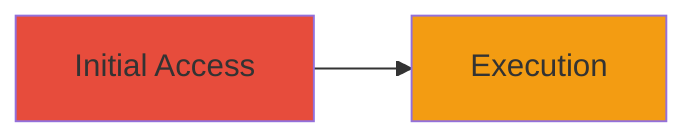

# Self-XSS in Acronis Cyber Protect Console Backup Plan Name

Multi-stage attack chain demonstrating a complete attack workflow.

## Chain Metrics Dashboard

| Metric | Value |
|--------|-------|
| Chain Status | Unverified |
| Total Steps | 1 |
| Execution Time | ~1 minute |
| Skill Level | Beginner |
| Complexity | Low |
| Impact Level | Low |

## Attack Flow Visualization

## Prerequisites & Requirements

### Required Tools

- Web browser (e.g., Chrome Developer Tools for payload testing)

### Target Environment

- Acronis Cyber Protect Console web application
- Authenticated user session

### Initial Access Requirements

- Valid credentials for an Acronis Cyber Protect Console account
- Direct access to the web interface
- No prior access needed beyond authentication

## Detailed Attack Procedures

### Step 1: Inject XSS Payload
procedure: [[procedures/Exploit-Self-XSS-in-Backup-Plan-Name-Field]]

**Objective**: Inject a malicious JavaScript payload into the backup plan name field to execute arbitrary code in the user's own browser session.

**Instructions**: Log in to the Acronis Cyber Protect Console. Navigate to the backup plans section and create or edit a backup plan. In the 'Name' field, enter a payload such as ``. Save the plan, then view the plan details to trigger execution.

**Expected Output**: An alert box or console log appears in the browser, confirming JavaScript execution.

**Success Indicators**:
- JavaScript payload executes without errors
- No impact on other users or the server

## Attack Chain Summary

### Key Achievements

1. Successful injection and execution of JavaScript in the victim's browser
2. Demonstration of insufficient input sanitization in the backup plan name field
3. Limited impact confirming self-XSS nature

## Technique & Tactic Coverage

### MITRE ATT&CK Techniques

- [[JavaScript]]

### MITRE ATT&CK Tactics

- [[Execution]]

---
*Last updated: 2023-10-01T00:00:00Z*
