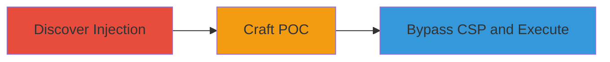

---
tags:
  - xss
  - self-xss
  - html-injection
  - csp-bypass
  - github
  - csrf
type: attack_chain
tools: []
tactics:
  - '[[Execution]]'
verified: false
platforms:
  - Web
  - GitHub Enterprise Server
submitted: true
created_at: '2024-01-01T00:00:00Z'
procedures:
  - '[[procedures/Discover-HTML-Injection-in-Tag-Name-Pattern]]'
  - '[[procedures/Craft-POC-for-Self-XSS-Exploitation]]'
  - '[[procedures/Bypass-CSP-and-Perform-Sensitive-Actions]]'
step_count: 3
techniques:
  - '[[JavaScript]]'
updated_at: '2025-12-13T23:55:06.399Z'
description: >-
  A multi-stage attack exploiting a self-XSS vulnerability in GitHub's tag
  protection settings through unsanitized HTML injection, enabling CSP bypass
  and unauthorized account modifications.
id: eab1fa2a-ee86-4c33-a223-43b226455600
validated: true
mitre_tactics:
  - '[[Execution]]'
mitre_techniques:
  - '[[JavaScript]]'
---
# Self XSS in GitHub Tag Protection via HTML Injection Leading to Account Takeover

Multi-stage attack chain demonstrating a complete attack workflow exploiting a self-XSS vulnerability in GitHub's tag protection settings.

## Chain Metrics Dashboard

| Metric | Value |
|--------|-------|
| Chain Status | Unverified |
| Total Steps | 3 |
| Execution Time | ~5 minutes |
| Skill Level | Intermediate |
| Complexity | Medium |
| Impact Level | High |

## Attack Flow Visualization

## Prerequisites & Requirements

### Required Tools

- Browser developer tools for inspecting and injecting payloads
- No external tools required; relies on GitHub's web interface

### Target Environment

- GitHub Enterprise Server or GitHub.com
- Access to a repository settings page: /<username>/<reponame>/settings/tag_protection/new
- Authenticated user session

### Initial Access Requirements

- Valid GitHub account with repository access
- No special privileges needed; self-XSS requires user interaction

## Detailed Attack Procedures

### Step 1: Discover HTML Injection
procedure: [[procedures/Discover-HTML-Injection-in-Tag-Name-Pattern]]

**Objective**: Identify the unsanitized HTML injection point in the tag name pattern field via the check_pattern endpoint.

**Instructions**: Navigate to the tag protection settings page (/<username>/<reponame>/settings/tag_protection/new). Enter a test payload like `` in the tag name pattern field and trigger the validation by attempting to save or checking the pattern. Use browser developer tools to inspect the error response from the check_pattern endpoint, which injects the response directly into the DOM using innerHTML without sanitization.

**Expected Output**: Malicious HTML from the error message renders in the DOM, confirming injection.

**Success Indicators**:
- Alert or HTML elements appear on the page
- DOM inspection shows unsanitized innerHTML insertion

### Step 2: Craft POC for Self XSS Exploitation
procedure: [[procedures/Craft-POC-for-Self-XSS-Exploitation]]

**Objective**: Create a draggable payload that triggers the self-XSS when dropped into the injection point, requiring user interaction.

**Instructions**: Prepare a payload file containing HTML like `` or similar gadget. Drag and drop this payload into the tag name pattern textbox on the settings page. This simulates social engineering where the victim drags the malicious content, triggering the injection during error handling.

**Expected Output**: The dropped payload injects and executes JavaScript in the context of the GitHub page.

**Success Indicators**:
- JavaScript execution confirmed via console logs or alerts
- Self-XSS payload renders without external sources

### Step 3: Bypass CSP and Perform Sensitive Actions
procedure: [[procedures/Bypass-CSP-and-Perform-Sensitive-Actions]]

**Objective**: Use on-site script gadgets to evade CSP and forge CSRF tokens for account modifications.

**Instructions**: Leverage injected self-XSS to access existing on-page scripts (e.g., GitHub's inline gadgets). Extract or generate a CSRF token using JavaScript like `document.querySelector('meta[name="csrf-token"]').content`. Then, construct and submit a form or fetch request to sensitive endpoints, such as changing email or permissions, e.g., `fetch('/settings/emails', {method: 'POST', headers: {'X-CSRF-Token': token}, body: new FormData() with malicious data})`. This bypasses CSP by staying within the same origin.

**Expected Output**: Successful API calls modifying account details without direct CSP violations.

**Success Indicators**:
- Account changes applied (e.g., email updated)
- No CSP errors in console; actions complete

## Attack Chain Summary

### Key Achievements

1. Identified and exploited HTML injection for self-XSS
2. Demonstrated user-interaction based payload delivery via drag-and-drop
3. Achieved CSP bypass using on-site gadgets to enable account takeover actions

## Technique & Tactic Coverage

### MITRE ATT&CK Techniques

- [[JavaScript]]

### MITRE ATT&CK Tactics

- [[Execution]]

---
*Last updated: 2024-01-01T00:00:00Z*
