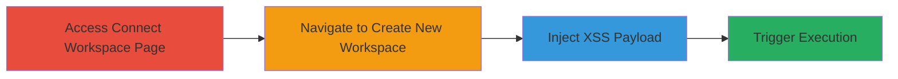

---
tags:
  - xss
  - self-xss
  - mattermost
type: attack_chain
tools: []
tactics:
  - '[[Execution]]'
verified: false
platforms:
  - Web
submitted: true
complexity: low
created_at: '2024-01-01T00:00:00Z'
procedures:
  - '[[procedures/Access-Mattermost-Connect-Workspace-Page]]'
  - '[[procedures/Navigate-to-Create-New-Workspace]]'
  - '[[procedures/Inject-XSS-Payload-into-Workspace-Name]]'
  - '[[procedures/Submit-Form-to-Trigger-Self-XSS]]'
step_count: 4
techniques:
  - '[[JavaScript]]'
updated_at: '2025-12-13T23:52:39.149Z'
description: >-
  Demonstrates a self-XSS vulnerability in the Mattermost customer portal where
  unsanitized input in the workspace name field allows JavaScript execution in
  the attacker's browser session.
skill_level: beginner
impact_level: low
id: ce6327f1-2eaa-4f26-8457-e368722a938c
validated: true
mitre_tactics:
  - '[[Execution]]'
mitre_techniques:
  - '[[JavaScript]]'
---
# Self-XSS in Mattermost Create New Workspace Screen

Multi-stage attack chain demonstrating a self-XSS vulnerability in the Mattermost customer portal's Create New Workspace screen, where the workspace name input lacks proper sanitization, allowing injected JavaScript to execute in the user's own browser session. This can lead to the theft of the user's own session cookies but has limited impact as it is self-inflicted.

## Chain Metrics Dashboard

| Metric | Value |
|--------|-------|
| Chain Status | Unverified |
| Total Steps | 4 |
| Execution Time | ~2 minutes |
| Skill Level | Beginner |
| Complexity | Low |
| Impact Level | Low |

## Attack Flow Visualization

## Prerequisites & Requirements

### Required Tools

- Web browser (e.g., Chrome, Firefox)

### Target Environment

- Web platform
- Access to https://customers.mattermost.com/cloud/connect-workspace
- No special services or ports required

### Initial Access Requirements

- Public internet access
- No credentials needed for initial navigation
- User must be able to interact with the customer portal

## Detailed Attack Procedures

### Step 1: Access Connect Workspace Page
procedure: [[procedures/Access-Mattermost-Connect-Workspace-Page]]

**Objective**: Reach the starting point of the customer portal where workspace creation is accessible.

**Instructions**: Open a web browser and navigate to the Mattermost customer portal's connect-workspace page.

**Expected Output**: The page loads, displaying options related to workspace connection or creation.

**Success Indicators**:
- Page title or URL confirms https://customers.mattermost.com/cloud/connect-workspace
- No errors or redirects preventing access

### Step 2: Navigate to Create New Workspace
procedure: [[procedures/Navigate-to-Create-New-Workspace]]

**Objective**: Locate and select the option to create a new workspace, exposing the vulnerable input field.

**Instructions**: On the connect-workspace page, look for and click the button or link to create a new workspace.

**Expected Output**: The Create New Workspace screen appears with input fields, including the workspace name.

**Success Indicators**:
- Form for workspace creation is visible
- Workspace name input field is present and editable

### Step 3: Inject XSS Payload into Workspace Name
procedure: [[procedures/Inject-XSS-Payload-into-Workspace-Name]]

**Objective**: Insert a malicious payload into the unsanitized workspace name field to prepare for JavaScript execution.

**Instructions**: In the workspace name input field, enter the payload: `` (note: the extraction uses '/>', but core payload is the img tag for simplicity).

**Expected Output**: The payload is accepted in the field without immediate validation errors.

**Success Indicators**:
- Input field accepts the script without stripping or blocking
- No client-side sanitization prevents entry

### Step 4: Submit Form to Trigger Self-XSS
procedure: [[procedures/Submit-Form-to-Trigger-Self-XSS]]

**Objective**: Submit the form to render the injected payload, executing the JavaScript in the browser.

**Instructions**: Complete any other required fields if necessary and submit the form.

**Expected Output**: An alert dialog pops up displaying the document's cookies, confirming JavaScript execution in the user's session.

**Success Indicators**:
- Alert box appears with cookie data
- JavaScript executes without errors, proving the self-XSS

## Attack Chain Summary

### Key Achievements

1. Successful navigation to the vulnerable Create New Workspace screen
2. Injection of arbitrary JavaScript via the workspace name field
3. Execution of the payload, demonstrating self-XSS capability

## Technique & Tactic Coverage

### MITRE ATT&CK Techniques

- [[JavaScript]]

### MITRE ATT&CK Tactics

- [[Execution]]

---
*Last updated: 2024-01-01T00:00:00Z*
