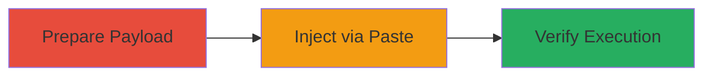

---
tags:
  - xss
  - self-xss
  - nextcloud
  - html-injection
type: attack_chain
tools: []
tactics:
  - '[[Execution]]'
commands: []
platforms:
  - Web
complexity: low
procedures:
  - '[[procedures/Prepare-Malicious-HTML-Payload]]'
  - '[[procedures/Inject-HTML-via-Ctrl-Shift-V-Paste]]'
  - '[[procedures/Verify-HTML-Rendering-and-XSS]]'
step_count: 3
techniques:
  - '[[JavaScript]]'
description: >-
  A self-XSS vulnerability in Nextcloud's Text app allows HTML injection by
  pasting content with Ctrl+Shift+V, which uses innerHTML instead of plaintext
  insertion, enabling potential XSS execution if a user is tricked into pasting
  malicious HTML.
skill_level: low
impact_level: medium
id: 79635d79-249c-4744-bda0-161ae5c50f29
created_at: '2025-12-14T00:11:09.531Z'
updated_at: '2025-12-14T00:11:09.531Z'
verified: false
validated: true
submitted: true
mitre_tactics:
  - '[[Execution]]'
mitre_techniques:
  - '[[JavaScript]]'
---
# Self-XSS in Nextcloud Text App via HTML Paste Injection

Multi-stage attack chain demonstrating a complete attack workflow for exploiting a self-XSS vulnerability in Nextcloud's Text app.

## Chain Metrics Dashboard

| Metric | Value |
|--------|-------|
| Chain Status | Unverified |
| Total Steps | 3 |
| Execution Time | ~1 minute |
| Skill Level | Low |
| Complexity | Low |
| Impact Level | Medium |

## Attack Flow Visualization

## Prerequisites & Requirements

### Required Tools

- None (manual browser actions)

### Target Environment

- Nextcloud instance with Text app enabled
- Web browser access to Nextcloud
- Markdown file open in Text app

### Initial Access Requirements

- Authenticated user access to Nextcloud
- No special privileges needed
- Direct browser interaction

## Detailed Attack Procedures

### Step 1: Prepare Malicious HTML Payload
procedure: [[procedures/Prepare-Malicious-HTML-Payload]]

**Objective**: Create and copy a simple HTML payload to the clipboard for injection.

**Instructions**: Manually copy the following HTML string to your clipboard: `<h1>html</h1>`. This payload will be used to test HTML rendering.

**Expected Output**: Payload in clipboard, ready for pasting.

**Success Indicators**:
- Payload confirmed in clipboard (e.g., paste into a text editor to verify)

### Step 2: Inject HTML via Ctrl+Shift+V Paste
procedure: [[procedures/Inject-HTML-via-Ctrl-Shift-V-Paste]]

**Objective**: Paste the payload into a Markdown file using the special paste shortcut, exploiting the innerHTML insertion.

**Instructions**: Open a Markdown (.md) file in the Nextcloud Text app. Position the cursor in the editor and press Ctrl+Shift+V to paste the clipboard content.

**Expected Output**: The pasted content appears in the editor without visible changes initially.

**Success Indicators**:
- Content pasted successfully into the editor
- No immediate error messages

### Step 3: Verify HTML Rendering and XSS
procedure: [[procedures/Verify-HTML-Rendering-and-XSS]]

**Objective**: Observe the rendering of the injected HTML, confirming the self-XSS vulnerability.

**Instructions**: After pasting, view the editor's preview or rendered output. The HTML should render as a heading instead of plaintext.

**Expected Output**: The text "html" displays as a large heading (<h1> style) in the editor's DOM.

**Success Indicators**:
- HTML renders as structured elements (e.g., heading)
- Inspect DOM to confirm innerHTML insertion (potential for JS execution with malicious payload)

## Attack Chain Summary

### Key Achievements

1. Successful preparation of HTML payload
2. Injection via vulnerable paste mechanism
3. Confirmation of HTML rendering, enabling self-XSS

## Technique & Tactic Coverage

### MITRE ATT&CK Techniques

- [[JavaScript]]

### MITRE ATT&CK Tactics

- [[Execution]]

---
*Last updated: 2023-10-01*
