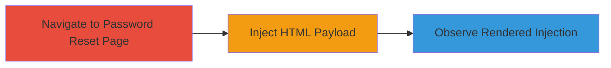

---
tags:
  - xss
  - self-xss
  - shopify
  - web-vulnerability
type: attack_chain
tools: []
tactics:
  - '[[Execution]]'
commands: []
platforms:
  - Web
complexity: low
procedures:
  - '[[procedures/Inject-HTML-Payload-into-Email-Field]]'
step_count: 3
techniques:
  - '[[Exploit Public-Facing Application]]'
  - '[[JavaScript]]'
description: >-
  A simple attack chain demonstrating a self-reflected XSS vulnerability in the
  email input field of Shopify's password reset page, allowing HTML injection
  but limited to self-execution.
skill_level: beginner
impact_level: low
id: bf693ab3-d37b-4712-9fca-228ef60a0f63
created_at: '2025-12-14T17:28:28.491Z'
updated_at: '2025-12-14T17:28:28.491Z'
verified: false
validated: true
submitted: true
mitre_tactics:
  - '[[Execution]]'
mitre_techniques:
  - '[[Exploit Public-Facing Application]]'
  - '[[JavaScript]]'
---
# Self-XSS in Shopify Password Reset Email Field

## Overview

This attack chain exploits a reflected cross-site scripting (XSS) vulnerability classified as self-XSS in Shopify's password reset functionality at https://accounts.shopify.com/password-reset/new. The vulnerability arises from insufficient input sanitization in the email address field, allowing an attacker to inject and render HTML payloads directly in their own browser session. Due to its self-XSS nature, it requires the victim to manually copy and paste a crafted payload, limiting its impact to the individual user with no risk to others. Shopify acknowledged the issue, fixed it promptly, and awarded a $500 bounty. The chain illustrates the discovery and execution of this low-severity flaw (CVSS 3.8).

## Chain Metrics Dashboard

| Metric | Value |
|--------|-------|
| Chain Status | Unverified |
| Total Steps | 3 |
| Execution Time | ~1 minute |
| Skill Level | Beginner |
| Complexity | Low |
| Impact Level | Low |

## Attack Flow Visualization

## Prerequisites & Requirements

### Required Tools

- Web browser (e.g., Chrome, Firefox)

### Target Environment

- Web platform
- Access to Shopify's public-facing password reset page
- No special services or ports required

### Initial Access Requirements

- Public internet access
- No credentials needed
- Direct browser navigation

## Detailed Attack Procedures

### Step 1: Navigate to Password Reset Page
procedure: [[procedures/Inject-HTML-Payload-into-Email-Field]]

**Objective**: Access the vulnerable input field on the target page to prepare for payload injection.

**Instructions**: Open a web browser and directly navigate to the Shopify password reset URL. This positions the attacker at the email input form where the vulnerability exists.

**Expected Output**: The password reset page loads, displaying the email address input field.

**Success Indicators**:
- Page loads without errors
- Email input field is visible and interactive

### Step 2: Inject HTML Payload
procedure: [[procedures/Inject-HTML-Payload-into-Email-Field]]

**Objective**: Submit an HTML payload into the email field to test for reflection and rendering.

**Instructions**: In the email address input field, enter a test payload such as `<h1 style="color:blue;">█████</h1>`. Submit the form or trigger the reflection (e.g., by attempting to reset the password). The payload will be reflected back in the page response.

**Expected Output**: The injected HTML renders on the page, displaying blue-colored text.

**Success Indicators**:
- Payload text appears with applied styling (e.g., blue color)
- No sanitization errors or blocking

### Step 3: Observe Rendered Injection
procedure: [[procedures/Inject-HTML-Payload-into-Email-Field]]

**Objective**: Verify the execution of the injected content and assess potential for further exploitation.

**Instructions**: Inspect the page source or visually confirm the rendering. Note that more complex payloads, such as those including `<form>` tags or JavaScript, could be tested, but self-XSS limits execution to the user's own session.

**Expected Output**: Injected elements execute as intended in the browser DOM.

**Success Indicators**:
- HTML tags render correctly
- Potential for script execution confirmed (though self-limited)

## Attack Chain Summary

### Key Achievements

1. Successful navigation to the vulnerable page
2. Injection and rendering of HTML payload in the email field
3. Confirmation of self-XSS capability with minimal risk

## Technique & Tactic Coverage

### MITRE ATT&CK Techniques

- [[Exploit Public-Facing Application]]
- [[JavaScript]]

### MITRE ATT&CK Tactics

- [[Execution]]

---
*Last updated: 2023-10-01*
