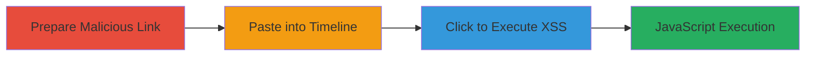

---
tags:
  - xss
  - self-xss
  - shopify
  - javascript
  - safari
type: attack_chain
tools:
  - '[[tools/Safari-Browser]]'
tactics:
  - '[[Execution]]'
verified: false
platforms:
  - Web
  - macOS
  - iOS
submitted: true
complexity: low
created_at: '2023-10-01T00:00:00Z'
procedures:
  - '[[procedures/Trigger-Self-XSS-in-Shopify-Timeline]]'
step_count: 3
techniques:
  - '[[JavaScript]]'
updated_at: '2025-12-14T03:47:13.151Z'
description: >-
  A self-XSS vulnerability in Shopify's Timeline feature allowing execution of
  JavaScript via pasted javascript: URLs, primarily exploitable in Safari
  browsers, with potential for social engineering chaining.
skill_level: beginner
impact_level: low
id: f6c3807e-7264-40b8-9d52-3ff062addbc1
validated: true
mitre_tactics:
  - '[[Execution]]'
mitre_techniques:
  - '[[JavaScript]]'
---
# Self-XSS in Shopify Timeline via Malicious Javascript URLs

Multi-stage attack chain demonstrating a complete attack workflow for exploiting a self-XSS vulnerability in Shopify's Timeline feature.

## Chain Metrics Dashboard

| Metric | Value |
|--------|-------|
| Chain Status | Unverified |
| Total Steps | 3 |
| Execution Time | ~2 minutes |
| Skill Level | Beginner |
| Complexity | Low |
| Impact Level | Low |

## Attack Flow Visualization

## Prerequisites & Requirements

### Required Tools

- [[tools/Safari-Browser]]

### Target Environment

- Shopify platform (Web application)
- Safari browser on macOS or iOS 13.4.1+
- Access to a Shopify account with Timeline feature enabled

### Initial Access Requirements

- Valid Shopify user credentials
- No special network access required (standard web access)
- No prior access needed beyond user login

## Detailed Attack Procedures

### Step 1: Prepare Malicious Javascript Link
procedure: [[procedures/Trigger-Self-XSS-in-Shopify-Timeline]]

**Objective**: Create or copy a malicious javascript: URL that will execute arbitrary JavaScript when clicked.

**Instructions**: Manually craft or copy a link such as `javascript:alert(123)` or `javascript:alert(123);//http://google.com` to disguise it. Right-click on a webpage element and select 'Copy Link' if sourcing from elsewhere, or type directly.

**Expected Output**: A copied or typed javascript: URL ready for pasting.

**Success Indicators**:
- Malicious payload is prepared without errors
- Payload includes executable JavaScript like alert(123)

### Step 2: Paste and Post to Timeline
procedure: [[procedures/Trigger-Self-XSS-in-Shopify-Timeline]]

**Objective**: Insert the malicious link into the Shopify Timeline feature to render it as a clickable element.

**Instructions**: Navigate to the Timeline input field in Shopify, paste the malicious link, and submit the post. For disguised payloads, post the content first, then copy and paste it into a new Timeline entry to ensure rendering.

**Expected Output**: The link appears in the Timeline post as a clickable hyperlink, especially in Safari where sanitization fails.

**Success Indicators**:
- Post is successfully submitted without rejection
- Link renders as clickable in the browser view

### Step 3: Trigger XSS by Clicking Link
procedure: [[procedures/Trigger-Self-XSS-in-Shopify-Timeline]]

**Objective**: Execute the JavaScript payload in the user's browser context by interacting with the rendered link.

**Instructions**: In the Timeline view, click on the pasted malicious link. This triggers the javascript: protocol execution in Safari's rendering context.

**Expected Output**: JavaScript alert or other payload executes, such as an alert box displaying '123'.

**Success Indicators**:
- JavaScript code runs in the current browser session
- No errors or blocks from browser security features

## Attack Chain Summary

### Key Achievements

1. Successful pasting of unsanitized javascript: URLs into Shopify Timeline
2. Rendering of clickable malicious links in Safari browsers
3. Execution of self-XSS payload, demonstrating vulnerability

## Technique & Tactic Coverage

### MITRE ATT&CK Techniques

- [[JavaScript]]

### MITRE ATT&CK Tactics

- [[Execution]]

---

*Last updated: 2023-10-01T00:00:00Z*
