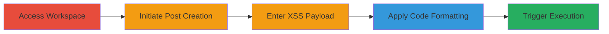

---
tags:
  - xss
  - self-xss
  - slack
  - web
type: attack_chain
tools:
  - '[[tools/Slack-Self-XSS-Demonstration-Video]]'
tactics:
  - '[[Execution]]'
verified: false
platforms:
  - Web
submitted: true
created_at: '2023-10-01T00:00:00Z'
procedures:
  - '[[procedures/Access-Slack-Workspace]]'
  - '[[procedures/Initiate-Slack-Post-Creation]]'
  - '[[procedures/Enter-XSS-Payload-in-Slack-Post]]'
  - '[[procedures/Apply-Code-Formatting-to-Payload-in-Slack]]'
  - '[[procedures/Trigger-Self-XSS-Execution-in-Slack]]'
step_count: 5
techniques:
  - '[[JavaScript]]'
updated_at: '2025-12-14T03:15:31.819Z'
description: >-
  Demonstrates a self-XSS vulnerability in Slack's post creation feature where
  code-formatted HTML payloads execute JavaScript in the user's browser.
id: 0de1c108-f924-4450-ad88-72a4a31eb047
validated: true
mitre_tactics:
  - '[[Execution]]'
mitre_techniques:
  - '[[JavaScript]]'
---
# Self-XSS in Slack Post Creation via Code Formatting

Multi-stage attack chain demonstrating a complete attack workflow for exploiting a self-XSS vulnerability in Slack's post creation feature. The attack relies on insufficient sanitization of HTML content when formatted as code, allowing JavaScript execution solely in the attacker's browser.

## Chain Metrics Dashboard

| Metric | Value |
|--------|-------|
| Chain Status | Unverified |
| Total Steps | 5 |
| Execution Time | ~1 minute |
| Skill Level | Beginner |
| Complexity | Low |
| Impact Level | Low |

## Attack Flow Visualization

## Prerequisites & Requirements

### Required Tools

- [[tools/Slack-Self-XSS-Demonstration-Video]]

### Target Environment

- Web browser (primarily Firefox)
- Slack workspace access

### Initial Access Requirements

- Valid Slack account credentials
- Direct access to the workspace URL
- No prior network compromise needed

## Detailed Attack Procedures

### Step 1: Access Slack Workspace
procedure: [[procedures/Access-Slack-Workspace]]

**Objective**: Gain entry to the target Slack workspace to begin post creation.

**Instructions**: Open a web browser and navigate to the Slack workspace URL, such as `accountname.slack.com`. Log in with valid credentials if prompted.

**Expected Output**: Successful login and display of the Slack workspace interface.

**Success Indicators**:
- Workspace dashboard loads
- Channel list is visible

### Step 2: Initiate Post Creation
procedure: [[procedures/Initiate-Slack-Post-Creation]]

**Objective**: Start the post creation process to access the editor where the payload will be entered.

**Instructions**: In the Slack workspace, locate the plus (+) icon below the workspace name and click it. From the dropdown menu, select 'Create Post'.

**Expected Output**: The post creation editor opens with a text area for input.

**Success Indicators**:
- Post editor interface appears
- Formatting toolbar is available

### Step 3: Enter XSS Payload
procedure: [[procedures/Enter-XSS-Payload-in-Slack-Post]]

**Objective**: Insert the malicious HTML payload into the post editor.

**Instructions**: In the post creation text area, type the following payload: `<svg onload=alert(domain)>`.

**Expected Output**: The payload text is visible in the editor without immediate execution.

**Success Indicators**:
- Payload text is entered correctly
- No errors in the editor

### Step 4: Apply Code Formatting
procedure: [[procedures/Apply-Code-Formatting-to-Payload-in-Slack]]

**Objective**: Format the payload as code to bypass sanitization and enable execution upon rendering.

**Instructions**: Highlight the entire payload text in the editor. Click the code formatting symbol (<>) in the left-side toolbar to apply inline code formatting.

**Expected Output**: The payload is wrapped in code formatting, appearing as monospaced text.

**Success Indicators**:
- Text is highlighted and formatted as code
- Preview shows formatted content

### Step 5: Trigger Self-XSS Execution
procedure: [[procedures/Trigger-Self-XSS-Execution-in-Slack]]

**Objective**: Render the post to execute the JavaScript payload in the user's browser.

**Instructions**: Allow the post to render in the editor or preview mode. The formatted payload will execute automatically upon rendering.

**Expected Output**: An alert box pops up displaying the domain, confirming JavaScript execution.

**Success Indicators**:
- Alert dialog appears in the browser
- Execution observed in Firefox (may vary by browser)

## Attack Chain Summary

### Key Achievements

1. Successful access to Slack post creation feature
2. Injection and formatting of XSS payload without detection
3. Execution of JavaScript in the user's browser session

## Technique & Tactic Coverage

### MITRE ATT&CK Techniques

- [[JavaScript]]

### MITRE ATT&CK Tactics

- [[Execution]]

---
*Last updated: 2023-10-01T00:00:00Z*
