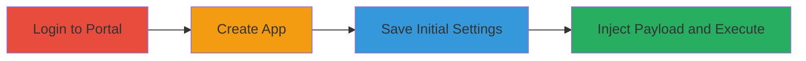

# Self-XSS in Twitter App Developer Portal via JavaScript URL Injection

Multi-stage attack chain demonstrating a self-XSS vulnerability in Twitter's (now X) app developer portal, where the website field allows injection of javascript: URLs after bypassing initial validation during app creation and editing.

## Chain Metrics Dashboard

| Metric | Value |
|--------|-------|
| Chain Status | Unverified |
| Total Steps | 4 |
| Execution Time | ~5 minutes |
| Skill Level | Beginner |
| Complexity | Low |
| Impact Level | Low |

## Attack Flow Visualization

## Prerequisites & Requirements

### Required Tools

- [[tools/Internet-Explorer-11]]
- [[tools/Google-Chrome]]

### Target Environment

- Web platform
- Access to Twitter account with developer permissions
- No specific services or ports required beyond standard HTTPS

### Initial Access Requirements

- Valid Twitter credentials
- Internet access
- No prior network position needed; public-facing portal

## Detailed Attack Procedures

### Step 1: Log In to Portal
procedure: [[procedures/Log-In-to-Twitter-App-Developer-Portal]]

**Objective**: Gain authenticated access to the Twitter app developer portal to enable app creation and editing.

**Instructions**: Navigate to the portal URL and authenticate using Twitter credentials.

**Expected Output**: Successful login redirect to the developer dashboard.

**Success Indicators**:
- Dashboard loads without errors
- App creation option visible

### Step 2: Create New App
procedure: [[procedures/Create-New-Twitter-App-with-Valid-Details]]

**Objective**: Establish a new app entry in the portal to set up the environment for subsequent settings manipulation.

**Instructions**: Click the 'new app' button and provide required valid details, including a legitimate website URL.

**Expected Output**: App created successfully with an assigned app ID.

**Success Indicators**:
- Confirmation message for app creation
- App listed in dashboard

### Step 3: Save Initial Settings
procedure: [[procedures/Save-Initial-App-Settings-with-Valid-Formats]]

**Objective**: Validate and save the app's initial configuration with proper formats to bypass creation-time checks.

**Instructions**: Access the settings page, fill all fields with valid data including a real website URL, and save.

**Expected Output**: Settings saved without validation errors.

**Success Indicators**:
- No error messages on save
- Settings page reloads with saved values

### Step 4: Inject XSS Payload
procedure: [[procedures/Inject-XSS-Payload-in-App-Website-Field]]

**Objective**: Exploit the lack of update-time validation to inject and trigger a javascript: XSS payload in the website field.

**Instructions**: Re-edit the settings, replace the website field with the payload `javascript:alert(8007)`, save, and view the page to trigger execution.

**Expected Output**: Alert dialog with '8007' appears in the browser (in vulnerable browsers like IE11).

**Success Indicators**:
- Payload saves without rejection
- JavaScript alert triggers on page view or save

## Attack Chain Summary

### Key Achievements

1. Bypassed initial validation by creating and saving a valid app first
2. Injected arbitrary JavaScript via javascript: URL in the website field
3. Achieved self-XSS execution in the app owner's browser context

## Technique & Tactic Coverage

### MITRE ATT&CK Techniques

- [[JavaScript]]
- [[Exploit Public-Facing Application]]

### MITRE ATT&CK Tactics

- [[Execution]]
- [[Initial Access]]

---

*Last updated: 2024-01-01T00:00:00Z*
