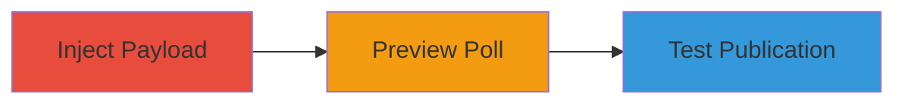

---
tags:
  - xss
  - self-xss
  - twitter
  - poll
  - injection
type: attack_chain
tools: []
tactics:
  - '[[Execution]]'
commands: []
platforms:
  - Web
complexity: low
procedures:
  - '[[procedures/Inject-Malicious-Payload-into-Poll-Option]]'
  - '[[procedures/Trigger-XSS-by-Previewing-Poll]]'
  - '[[procedures/Test-Poll-Publication-and-Server-Validation]]'
step_count: 3
techniques:
  - '[[JavaScript]]'
description: >-
  A multi-step process demonstrating self-XSS in Twitter's poll creation by
  injecting payloads into option fields, triggering execution during preview,
  and testing publication limits.
skill_level: beginner
impact_level: low
id: 7bad70b4-e176-46e4-a465-6efcd56a363c
created_at: '2025-12-14T03:16:14.485Z'
updated_at: '2025-12-14T03:16:14.485Z'
verified: false
validated: true
submitted: true
mitre_tactics:
  - '[[Execution]]'
mitre_techniques:
  - '[[JavaScript]]'
---
# Self-XSS in Twitter Poll Feature via Unsanitized Input

Multi-stage attack chain demonstrating a complete attack workflow for exploiting a self-XSS vulnerability in Twitter's poll creation interface.

## Chain Metrics Dashboard

| Metric | Value |
|--------|-------|
| Chain Status | Unverified |
| Total Steps | 3 |
| Execution Time | ~1 minutes |
| Skill Level | Beginner |
| Complexity | Low |
| Impact Level | Low |

## Attack Flow Visualization

## Prerequisites & Requirements

### Required Tools

- Web browser (e.g., Chrome, Firefox, or Internet Explorer 11 for full exploitability)

### Target Environment

- Twitter.com web platform
- Access to poll creation feature
- No specific services/ports required beyond standard HTTPS (443)

### Initial Access Requirements

- Valid Twitter account with permission to create polls
- Logged-in session
- No prior network access beyond internet connectivity

## Detailed Attack Procedures

### Step 1: Inject Payload into Poll Option
procedure: [[procedures/Inject-Malicious-Payload-into-Poll-Option]]

**Objective**: Introduce a malicious JavaScript payload into the poll option input field to test for lack of sanitization.

**Instructions**: Navigate to Twitter's poll creation interface and enter the payload `` into one of the poll option fields. This payload uses an invalid image source to trigger an onerror event that executes JavaScript.

**Expected Output**: The input field accepts the payload without immediate rejection, allowing it to be processed for preview.

**Success Indicators**:
- Payload entered successfully without client-side blocking
- No error messages during input

### Step 2: Trigger XSS by Previewing Poll
procedure: [[procedures/Trigger-XSS-by-Previewing-Poll]]

**Objective**: Execute the injected payload by activating the poll preview, confirming reflected XSS in the interface.

**Instructions**: After entering the payload, click the preview button to render the poll. In modern browsers, observe if CSP blocks execution; in Internet Explorer 11, the alert should pop up due to weak CSP support.

**Expected Output**: An alert box displaying '1' in vulnerable browsers, indicating JavaScript execution within the user's session.

**Success Indicators**:
- Alert popup in IE11
- Console errors or blocked execution in modern browsers due to CSP

### Step 3: Test Publication and Server Validation
procedure: [[procedures/Test-Poll-Publication-and-Server-Validation]]

**Objective**: Attempt to publish the poll to evaluate server-side protections and confirm self-XSS limitations.

**Instructions**: Submit the poll for publication with the malicious payload. Observe server responses for validation checks, and test with variations like `<x>` to see if non-obvious inputs are sanitized.

**Expected Output**: Server rejects obvious malicious inputs, creates a non-displayed 'card', and prevents feed publication; self-XSS remains isolated to preview.

**Success Indicators**:
- Publication blocked for malicious payloads
- No cross-user impact observed

## Attack Chain Summary

### Key Achievements

1. Successful injection and reflection of XSS payload in poll preview
2. Demonstration of browser-specific exploitability (IE11 vulnerable)
3. Confirmation of server-side mitigations limiting impact to self-XSS

## Technique & Tactic Coverage

### MITRE ATT&CK Techniques

- [[JavaScript]]

### MITRE ATT&CK Tactics

- [[Execution]]

---

*Last updated: 2023-10-01*
