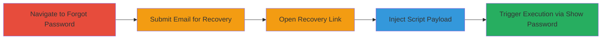

---
tags:
  - xss
  - self-xss
  - password-recovery
  - uber
  - web
type: attack_chain
tools: []
tactics:
  - '[[Initial Access]]'
  - '[[Execution]]'
verified: false
platforms:
  - Web
submitted: true
complexity: low
created_at: '2023-10-01T12:00:00Z'
procedures:
  - '[[procedures/Navigate-to-Uber-Forgot-Password-Page]]'
  - '[[procedures/Initiate-Uber-Password-Recovery-with-Email]]'
  - '[[procedures/Open-Uber-Password-Recovery-Link]]'
  - '[[procedures/Inject-Malicious-Script-as-New-Password]]'
  - '[[procedures/Trigger-XSS-by-Showing-Password]]'
step_count: 5
techniques:
  - '[[Exploit Public-Facing Application]]'
  - '[[JavaScript]]'
updated_at: '2025-12-14T03:15:47.282Z'
description: >-
  A multi-step process exploiting insufficient input sanitization in Uber's
  password recovery flow to inject and execute JavaScript, resulting in self-XSS
  limited to the attacker's browser.
skill_level: low
impact_level: low
id: 5d252809-d2c4-40ad-847e-373a49005953
validated: true
mitre_tactics:
  - '[[Initial Access]]'
  - '[[Execution]]'
mitre_techniques:
  - '[[Exploit Public-Facing Application]]'
  - '[[JavaScript]]'
---
# Self-XSS in Uber Password Recovery via Malicious Script Injection

Multi-stage attack chain demonstrating a complete self-XSS workflow in Uber's password recovery process.

## Chain Metrics Dashboard

| Metric | Value |
|--------|-------|
| Chain Status | Unverified |
| Total Steps | 5 |
| Execution Time | ~5 minutes |
| Skill Level | Low |
| Complexity | Low |
| Impact Level | Low |

## Attack Flow Visualization

## Prerequisites & Requirements

### Required Tools

- Web browser (e.g., Chrome, Firefox)

### Target Environment

- Uber web application
- Access to internet and email associated with an Uber account
- No special services or ports required

### Initial Access Requirements

- Valid Uber account email
- No prior credentials needed beyond email access
- Attacker must control the victim browser (self-XSS)

## Detailed Attack Procedures

### Step 1: Navigate to Forgot Password Page
procedure: [[procedures/Navigate-to-Uber-Forgot-Password-Page]]

**Objective**: Access the entry point for the password recovery flow.

**Instructions**: Open a web browser and directly navigate to the Uber forgot password URL.

**Expected Output**: The forgot password form loads, prompting for an email address.

**Success Indicators**:
- Forgot password page is displayed
- Form fields for email input are visible

### Step 2: Initiate Password Recovery with Email
procedure: [[procedures/Initiate-Uber-Password-Recovery-with-Email]]

**Objective**: Trigger the password reset process by submitting a valid email.

**Instructions**: Enter a valid email address associated with an Uber account into the form and submit it.

**Expected Output**: A confirmation message appears, and an email with a recovery link is sent.

**Success Indicators**:
- Email submission succeeds without errors
- Recovery email is received in the inbox

### Step 3: Open Password Recovery Link
procedure: [[procedures/Open-Uber-Password-Recovery-Link]]

**Objective**: Access the password reset interface via the emailed link.

**Instructions**: Check the email inbox for the recovery link from Uber and click to open it in the browser.

**Expected Output**: The password reset page loads, showing fields to set a new password.

**Success Indicators**:
- Recovery page is accessible
- 'Set password' form is presented

### Step 4: Inject Malicious Script as New Password
procedure: [[procedures/Inject-Malicious-Script-as-New-Password]]

**Objective**: Introduce a JavaScript payload into the password field to exploit lack of sanitization.

**Instructions**: In the 'Set password' field, enter the payload `` and submit the form.

**Expected Output**: The form submits, and the new password is set, but the script is stored unsanitized.

**Success Indicators**:
- Form submission completes without validation errors
- Account password is updated (though malicious)

### Step 5: Trigger XSS by Showing Password
procedure: [[procedures/Trigger-XSS-by-Showing-Password]]

**Objective**: Execute the injected script by rendering the password in a context that interprets HTML/JS.

**Instructions**: After submission, locate and click the 'Show password' button to reveal the stored password.

**Expected Output**: An alert box pops up displaying the document domain, confirming JavaScript execution.

**Success Indicators**:
- Alert dialog executes with `document.domain`
- XSS is confirmed in the browser console or visually

## Attack Chain Summary

### Key Achievements

1. Successful navigation and initiation of Uber's password recovery flow
2. Injection of arbitrary JavaScript via the password field without sanitization
3. Execution of self-XSS, demonstrating potential for session-specific impacts if combined with social engineering

## Technique & Tactic Coverage

### MITRE ATT&CK Techniques

- [[Exploit Public-Facing Application]]
- [[JavaScript]]

### MITRE ATT&CK Tactics

- [[Initial Access]]
- [[Execution]]

---
*Last updated: 2023-10-01T12:00:00Z*
