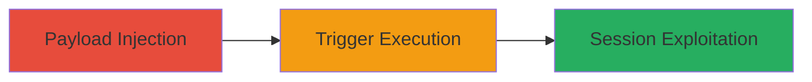

---
tags:
  - xss
  - self-xss
  - web-vulnerability
type: attack_chain
tools: []
tactics:
  - '[[Execution]]'
verified: false
platforms:
  - Web
submitted: true
complexity: low
created_at: '2023-10-01T00:00:00Z'
procedures:
  - '[[procedures/Inject-and-Trigger-Self-XSS-in-VK-Mentions]]'
step_count: 1
techniques:
  - '[[JavaScript]]'
updated_at: '2025-12-14T03:16:20.567Z'
description: >-
  A self-XSS vulnerability in VK.com's mentions feature allows users to inject
  and execute malicious JavaScript in their own browser context, potentially
  leading to session hijacking or unauthorized actions on their account.
skill_level: beginner
impact_level: low
id: 2bf8454d-ed53-436d-87ea-e7bd82c71730
validated: true
mitre_tactics:
  - '[[Execution]]'
mitre_techniques:
  - '[[JavaScript]]'
---
# Self-XSS in VK.com Mentions Feature for Session Cookie Theft

Multi-stage attack chain demonstrating a complete attack workflow exploiting a self-XSS vulnerability in VK.com's mentions system.

## Chain Metrics Dashboard

| Metric | Value |
|--------|-------|
| Chain Status | Unverified |
| Total Steps | 1 |
| Execution Time | ~1 minutes |
| Skill Level | Beginner |
| Complexity | Low |
| Impact Level | Low |

## Attack Flow Visualization

## Prerequisites & Requirements

### Required Tools

- Browser developer tools for payload crafting

### Target Environment

- VK.com web platform
- User account with mentions functionality access

### Initial Access Requirements

- Valid VK.com user session
- No special privileges required

## Detailed Attack Procedures

### Step 1: Inject and Trigger Self-XSS
procedure: [[procedures/Inject-and-Trigger-Self-XSS-in-VK-Mentions]]

**Objective**: Inject an XSS payload into a mention and trigger its execution in the user's own browser to perform actions like stealing session cookies.

**Instructions**: Log into VK.com and navigate to a section where mentions can be created, such as posting or commenting. Craft a mention with an XSS payload, e.g., using a script tag to alert or exfiltrate data. Save or post the content, then view it in a context where mentions are rendered, such as your profile or feed, to trigger the payload.

**Expected Output**: The injected script executes in the browser console, displaying an alert or sending data to an attacker-controlled server.

**Success Indicators**:
- Script execution confirmed via browser console or network requests
- Session cookies captured if payload includes exfiltration logic

## Attack Chain Summary

### Key Achievements

1. Successful payload injection into mentions without sanitization
2. Execution of JavaScript in the user's own session context
3. Potential for self-inflicted session hijacking or data theft

## Technique & Tactic Coverage

### MITRE ATT&CK Techniques

- [[JavaScript]]

### MITRE ATT&CK Tactics

- [[Execution]]

---
*Last updated: 2023-10-01T00:00:00Z*
