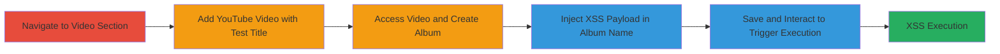

---
tags:
  - xss
  - self-xss
  - vk.com
  - video-album
type: attack_chain
tools:
  - '[[tools/Google-Chrome]]'
tactics:
  - '[[Execution]]'
verified: false
platforms:
  - Web
submitted: true
complexity: low
created_at: '2023-10-01T00:00:00Z'
procedures:
  - '[[procedures/Exploit-VK-Video-Album-XSS]]'
step_count: 10
techniques:
  - '[[JavaScript]]'
updated_at: '2025-12-14T03:15:35.589Z'
description: >-
  A multi-step process to exploit a self-XSS vulnerability in VK.com's video
  album creation by injecting a payload into the album name field, resulting in
  JavaScript execution upon interaction.
skill_level: beginner
impact_level: low
id: 5b2f09c8-bf8d-43d0-8861-53f63b39e332
validated: true
mitre_tactics:
  - '[[Execution]]'
mitre_techniques:
  - '[[JavaScript]]'
---
# Self-XSS in VK.com Video Album Naming Feature

Multi-stage attack chain demonstrating a self-XSS vulnerability in VK.com's video section, where an injected payload in the album name executes JavaScript when hovering or clicking the 'added' indicator. This is classified as self-XSS, affecting only the attacker's session with limited practical impact.

## Chain Metrics Dashboard

| Metric | Value |
|--------|-------|
| Chain Status | Unverified |
| Total Steps | 10 |
| Execution Time | ~5 minutes |
| Skill Level | Beginner |
| Complexity | Low |
| Impact Level | Low |

## Attack Flow Visualization

## Prerequisites & Requirements

### Required Tools

- [[tools/Google-Chrome]]

### Target Environment

- Web platform
- Access to VK.com video section
- No specific services or ports required

### Initial Access Requirements

- Valid VK.com user account
- Internet access
- No prior elevated privileges needed

## Detailed Attack Procedures

### Step 1: Navigate to Video Section
procedure: [[procedures/Exploit-VK-Video-Album-XSS]]

**Objective**: Access the VK.com video management area to begin the addition process.

**Instructions**: Open [[tools/Google-Chrome]] and go to the VK video page.

**Expected Output**: VK.com video list loads at https://vk.com/video.

**Success Indicators**:
- Video section is visible and accessible

### Step 2: Initiate Adding a Video
procedure: [[procedures/Exploit-VK-Video-Album-XSS]]

**Objective**: Start the process of adding an external video to set up for album creation.

**Instructions**: Click the 'Add a Video' button on the video page.

**Expected Output**: Video addition interface appears, allowing selection from sources like YouTube.

**Success Indicators**:
- Add video dialog opens

### Step 3: Add YouTube Video with Test Title
procedure: [[procedures/Exploit-VK-Video-Album-XSS]]

**Objective**: Add a video with a benign test title to prepare for album interaction.

**Instructions**: Select a YouTube video, enter 'TEST XSS' in the title field, and click save.

**Expected Output**: Video is queued for addition with the test title.

**Success Indicators**:
- Video addition completes without errors

### Step 4: Return to Video List and Observe Added Video
procedure: [[procedures/Exploit-VK-Video-Album-XSS]]

**Objective**: Verify the added video and access its details for album setup.

**Instructions**: Navigate back to https://vk.com/video and locate the video titled 'TEST XSS'.

**Expected Output**: Added video appears in the list with 'TEST XSS' title.

**Success Indicators**:
- Video is listed and clickable

### Step 5: Access Album View via Video Title
procedure: [[procedures/Exploit-VK-Video-Album-XSS]]

**Objective**: Enter the video's album context to enable album creation options.

**Instructions**: Click on the 'TEST XSS' title to view the video in album mode.

**Expected Output**: Page redirects to a URL like https://vk.com/video?z=video307088553_171482428%2Falbum307088553.

**Success Indicators**:
- Album-related UI elements load

### Step 6: Interact with 'Added' Indicator to Create Album
procedure: [[procedures/Exploit-VK-Video-Album-XSS]]

**Objective**: Trigger the album creation prompt by interacting with the addition indicator.

**Instructions**: Scroll to find the 'Added with a right' text, hover over it, and select the option to create a new album.

**Expected Output**: Album creation dialog opens with a folder name input field.

**Success Indicators**:
- Album name input field is available

### Step 7: Insert XSS Payload in Folder Name Field
procedure: [[procedures/Exploit-VK-Video-Album-XSS]]

**Objective**: Inject the malicious payload into the unsanitized album name field.

**Instructions**: In the folder name input, enter the payload: ">

**Expected Output**: Payload is accepted in the input field without validation errors.

**Success Indicators**:
- Input field accepts the HTML/JS payload

### Step 8: Save the Album
procedure: [[procedures/Exploit-VK-Video-Album-XSS]]

**Objective**: Persist the album with the injected payload.

**Instructions**: Click the save button to add the video to the new album.

**Expected Output**: Album is created, and the video is associated with it.

**Success Indicators**:
- Confirmation of album creation

### Step 9: Hover Over and Click the 'Added' Word
procedure: [[procedures/Exploit-VK-Video-Album-XSS]]

**Objective**: Trigger the payload execution through user interaction.

**Instructions**: Move the mouse over the 'added' indicator and click on it.

**Expected Output**: The page renders the injected HTML, preparing for script execution.

**Success Indicators**:
- 'Added' indicator responds to hover/click

### Step 10: Observe XSS Execution
procedure: [[procedures/Exploit-VK-Video-Album-XSS]]

**Objective**: Confirm JavaScript execution from the payload.

**Instructions**: Upon interaction, the onerror event fires.

**Expected Output**: A prompt(1) alert box appears, executing arbitrary JavaScript.

**Success Indicators**:
- Alert dialog with '1' displays, confirming self-XSS

## Attack Chain Summary

### Key Achievements

1. Successful injection of XSS payload into album name
2. Triggering of JavaScript execution via hover/click interaction
3. Demonstration of insufficient input sanitization in VK.com's video feature

## Technique & Tactic Coverage

### MITRE ATT&CK Techniques

- [[JavaScript]]

### MITRE ATT&CK Tactics

- [[Execution]]

---
*Last updated: 2023-10-01T00:00:00Z*
