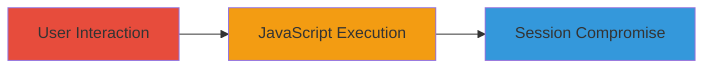

---
tags:
  - xss
  - self-xss
  - wordpress
  - javascript
  - session-hijacking
type: attack_chain
tools: []
tactics:
  - '[[Execution]]'
commands: []
platforms:
  - Web
complexity: low
procedures:
  - '[[procedures/Inject-JavaScript-via-WordPress-Link-Modal]]'
step_count: 1
techniques:
  - '[[JavaScript]]'
description: >-
  A self-XSS vulnerability in the WordPress editor's link modal allows users to
  inject and execute JavaScript in their own browser session, potentially
  enabling session hijacking or data theft through social engineering.
skill_level: beginner
impact_level: low
id: f7705658-ae38-4775-9e91-a4605da28902
created_at: '2025-12-14T03:16:30.702Z'
updated_at: '2025-12-14T03:16:30.702Z'
verified: false
validated: true
submitted: true
mitre_tactics:
  - '[[Execution]]'
mitre_techniques:
  - '[[JavaScript]]'
---
# Self-XSS in WordPress Editor Link Modal for Browser Session Compromise

Multi-stage attack chain demonstrating a complete attack workflow.

## Chain Metrics Dashboard

| Metric | Value |
|--------|-------|
| Chain Status | Unverified |
| Total Steps | 1 |
| Execution Time | ~1 minute |
| Skill Level | Beginner |
| Complexity | Low |
| Impact Level | Low |

## Attack Flow Visualization

## Prerequisites & Requirements

### Required Tools

- None (manual browser interaction)

### Target Environment

- WordPress version prior to 4.8.2
- Web browser with JavaScript enabled
- Administrative access to WordPress editor

### Initial Access Requirements

- Valid user account on the WordPress site
- Ability to access the post/page editor
- No prior network access needed beyond standard web access

## Detailed Attack Procedures

### Step 1: Inject and Execute Malicious JavaScript
procedure: [[procedures/Inject-JavaScript-via-WordPress-Link-Modal]]

**Objective**: Exploit the self-XSS vulnerability in the link modal to execute arbitrary JavaScript in the user's browser session, potentially stealing session data or performing other malicious actions.

**Instructions**: Log in to the WordPress admin dashboard, navigate to the editor for a post or page, and attempt to insert a link. In the link modal, paste a JavaScript payload such as `javascript:alert(document.cookie)` into the URL field. Save or apply the link to trigger execution.

**Expected Output**: The JavaScript payload executes in the browser, displaying an alert with session cookies or performing the intended action.

**Success Indicators**:
- Alert box or console output showing executed JavaScript
- Access to browser session data (e.g., cookies) via the payload

## Attack Chain Summary

### Key Achievements

1. Successful injection of JavaScript via the link modal without server-side validation.
2. Execution of arbitrary code in the victim's browser session.
3. Potential for session hijacking when combined with social engineering to trick users into self-injection.

## Technique & Tactic Coverage

### MITRE ATT&CK Techniques

- [[JavaScript]]

### MITRE ATT&CK Tactics

- [[Execution]]

---
*Last updated: 2023-10-01*
