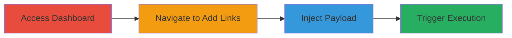

---
tags:
  - xss
  - self-xss
  - javascript-uri
  - linkpop
type: attack_chain
tools: []
tactics:
  - '[[Execution]]'
verified: false
platforms:
  - Web
submitted: true
complexity: low
created_at: '2023-10-01T00:00:00Z'
procedures:
  - '[[procedures/Inject-JavaScript-URI-for-Self-XSS-in-Linkpop]]'
step_count: 4
techniques:
  - '[[JavaScript]]'
updated_at: '2025-12-14T03:47:12.958Z'
description: >-
  Demonstrates a self-XSS vulnerability in the Linkpop dashboard where
  javascript: URIs can be injected into the URL field during link addition,
  leading to JavaScript execution in the attacker's browser upon preview
  interaction.
skill_level: beginner
impact_level: low
id: 9cdf4036-b0b9-412d-850e-d1f24b115e2f
validated: true
mitre_tactics:
  - '[[Execution]]'
mitre_techniques:
  - '[[JavaScript]]'
---
# Self-XSS via JavaScript URI in Linkpop Dashboard Add Links Feature

Multi-stage attack chain demonstrating a complete self-XSS workflow in the Linkpop dashboard.

## Chain Metrics Dashboard

| Metric | Value |
|--------|-------|
| Chain Status | Unverified |
| Total Steps | 4 |
| Execution Time | ~2 minutes |
| Skill Level | Beginner |
| Complexity | Low |
| Impact Level | Low |

## Attack Flow Visualization

## Prerequisites & Requirements

### Required Tools

- Web browser (e.g., Chrome, Firefox)

### Target Environment

- Web platform
- Access to Linkpop dashboard at https://linkpop.com/dashboard/admin
- Valid user account with add links permissions

### Initial Access Requirements

- Authenticated session in Linkpop dashboard
- No special network position required; standard internet access

## Detailed Attack Procedures

### Step 1: Access Dashboard
procedure: [[procedures/Inject-JavaScript-URI-for-Self-XSS-in-Linkpop]]

**Objective**: Gain access to the Linkpop admin dashboard to begin link management.

**Instructions**: Open a web browser and navigate to the dashboard URL. Ensure you are logged in with an account that has permissions to add links.

**Expected Output**: Successful login and display of the admin dashboard interface.

**Success Indicators**:
- Dashboard loads without errors
- Links management section is visible

### Step 2: Navigate to Add Links
procedure: [[procedures/Inject-JavaScript-URI-for-Self-XSS-in-Linkpop]]

**Objective**: Locate and initiate the process of adding a new link.

**Instructions**: In the dashboard, click on the "Links" section, then select the option to add a new link. This opens the add links form with URL input field.

**Expected Output**: Add links form appears, including URL input and preview area.

**Success Indicators**:
- Form fields are editable
- Phone image preview is present for link testing

### Step 3: Inject Payload
procedure: [[procedures/Inject-JavaScript-URI-for-Self-XSS-in-Linkpop]]

**Objective**: Enter a malicious javascript: URI into the URL field to prepare for self-execution.

**Instructions**: In the URL input field, enter the payload `javascript:alert(document.cookie)`. Do not enter any title or other details if not required; focus on the URL.

**Expected Output**: Payload is accepted without validation errors; form remains open.

**Success Indicators**:
- No input rejection or sanitization warning
- Preview generates with the injected link

### Step 4: Trigger Execution
procedure: [[procedures/Inject-JavaScript-URI-for-Self-XSS-in-Linkpop]]

**Objective**: Interact with the preview to execute the injected JavaScript in the current browser session.

**Instructions**: After entering the payload, observe the generated link preview on the phone image. Click on the link within the preview area to trigger the javascript: URI.

**Expected Output**: Alert dialog pops up displaying document cookies, confirming JavaScript execution.

**Success Indicators**:
- JavaScript alert executes
- No cross-origin or other restrictions block execution

## Attack Chain Summary

### Key Achievements

1. Successful injection of javascript: URI without validation
2. Generation of a preview link that executes client-side code
3. Demonstration of self-XSS impact, such as potential cookie access in the attacker's session

## Technique & Tactic Coverage

### MITRE ATT&CK Techniques

- [[JavaScript]]

### MITRE ATT&CK Tactics

- [[Execution]]

---
*Last updated: 2023-10-01T00:00:00Z*
