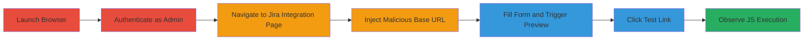

---
tags:
  - xss
  - self-xss
  - javascript-uri
  - hackerone
  - jira-integration
type: attack_chain
tools:
  - '[[tools/Internet-Explorer-11]]'
tactics:
  - '[[Initial Access]]'
  - '[[Execution]]'
verified: false
platforms:
  - Web
submitted: true
complexity: medium
created_at: '2023-10-01T00:00:00Z'
procedures:
  - '[[procedures/Exploit-Self-XSS-in-Jira-Integration-Base-URL]]'
step_count: 8
techniques:
  - '[[JavaScript]]'
  - '[[Exploit Public-Facing Application]]'
updated_at: '2025-12-13T23:52:39.211Z'
description: >-
  A multi-step attack demonstrating self-XSS exploitation in the Jira
  Integration configuration on HackerOne, allowing arbitrary JavaScript
  execution in a new window for the authenticated admin user in
  CSP-non-compliant browsers like IE 11.
skill_level: intermediate
impact_level: low
id: 5e5eee00-c44d-4937-8881-9662d8bad77a
validated: true
mitre_tactics:
  - '[[Initial Access]]'
  - '[[Execution]]'
mitre_techniques:
  - '[[JavaScript]]'
  - '[[Exploit Public-Facing Application]]'
---
# Self-XSS via Javascript URI Injection in HackerOne Jira Integration Base URL

Multi-stage attack chain demonstrating a self-XSS vulnerability in the HackerOne Jira Integration configuration page, where injecting a javascript: URI into the Base URL field bypasses validation during the AJAX preview, leading to JavaScript execution upon clicking the generated test link in browsers like IE 11 that ignore CSP.

## Chain Metrics Dashboard

| Metric | Value |
|--------|-------|
| Chain Status | Unverified |
| Total Steps | 8 |
| Execution Time | ~5 minutes |
| Skill Level | Intermediate |
| Complexity | Medium |
| Impact Level | Low |

## Attack Flow Visualization



## Prerequisites & Requirements

### Required Tools

- [[tools/Internet-Explorer-11]]

### Target Environment

- Web platform
- HackerOne instance with admin access to a program's integrations
- No specific ports or services beyond standard HTTPS

### Initial Access Requirements

- Valid HackerOne admin credentials for a program
- Direct network access to hackerone.com
- No prior access needed beyond authentication

## Detailed Attack Procedures

### Step 1: Launch IE 11 Browser
procedure: [[procedures/Exploit-Self-XSS-in-Jira-Integration-Base-URL]]

**Objective**: Prepare the environment using a CSP-non-compliant browser to enable javascript: URI execution.

**Instructions**: Open Internet Explorer 11, which does not enforce Content Security Policy, allowing the injected payload to run.

**Expected Output**: IE 11 browser window ready for navigation.

**Success Indicators**:
- Browser launched successfully
- CSP enforcement disabled by default in IE 11

### Step 2: Log into HackerOne as Admin
procedure: [[procedures/Exploit-Self-XSS-in-Jira-Integration-Base-URL]]

**Objective**: Gain authenticated access to the integration settings.

**Instructions**: Navigate to hackerone.com and log in with an account having admin privileges on a program.

**Expected Output**: Dashboard accessible with admin features.

**Success Indicators**:
- Successful login
- Access to program settings confirmed

### Step 3: Navigate to Jira Integration Page
procedure: [[procedures/Exploit-Self-XSS-in-Jira-Integration-Base-URL]]

**Objective**: Reach the vulnerable configuration page.

**Instructions**: Go to Automation > Integrations > Jira, e.g., https://hackerone.com/[program]/integrations/jira/edit.

**Expected Output**: Edit page loaded with Base URL input field.

**Success Indicators**:
- Page loads without errors
- Form fields visible

### Step 4: Inject Malicious Base URL
procedure: [[procedures/Exploit-Self-XSS-in-Jira-Integration-Base-URL]]

**Objective**: Introduce the javascript: payload into the Base URL.

**Instructions**: Enter `javascript://alert(document.domain);%2f%2f@` into the Base URL field.

**Expected Output**: Payload entered without immediate validation errors.

**Success Indicators**:
- Input accepted
- No form rejection

### Step 5: Fill Remaining Form Fields
procedure: [[procedures/Exploit-Self-XSS-in-Jira-Integration-Base-URL]]

**Objective**: Complete the form to enable preview functionality.

**Instructions**: Provide values for pid (e.g., 123), issue_type (e.g., 1), summary (e.g., {{title}}), description (e.g., {{details_truncated}} + {{1+1}} + #{1+1}), labels (e.g., HackerOne), assignee (empty), and custom fields (e.g., test=1).

**Expected Output**: All fields populated.

**Success Indicators**:
- Form ready for submission
- No validation errors on other fields

### Step 6: Trigger AJAX Preview Request
procedure: [[procedures/Exploit-Self-XSS-in-Jira-Integration-Base-URL]]

**Objective**: Generate the malicious test link via preview.

**Instructions**: Submit the form to trigger the POST to /jira_integrations/preview, using [[commands/hackerone-jira-preview-post]] to simulate if needed.

```bash
curl -X POST https://hackerone.com/[program]/jira_integrations/preview -d "pid=123&issue_type=1&base_url=javascript://alert(1)%3B@&summary={{title}}&description={{details_truncated}}+{{1+1}}+#{1+1}&labels=HackerOne&assignee=&custom=test=1"
```

**Expected Output**: JSON response with example_escalation_url containing the injected javascript: URI.

**Success Indicators**:
- Preview link generated
- URL includes payload

### Step 7: Click the Test Escalation URL
procedure: [[procedures/Exploit-Self-XSS-in-Jira-Integration-Base-URL]]

**Objective**: Execute the payload by interacting with the link.

**Instructions**: Click the 'Test escalation URL' link in the preview section, which opens in a new window.

**Expected Output**: New window opens with the link's href executed.

**Success Indicators**:
- Link clicked without errors
- New tab/window initiated

### Step 8: Observe JavaScript Execution
procedure: [[procedures/Exploit-Self-XSS-in-Jira-Integration-Base-URL]]

**Objective**: Confirm the self-XSS impact.

**Instructions**: Verify the alert pops up showing document.domain (hackerone.com).

**Expected Output**: Alert dialog with domain value.

**Success Indicators**:
- JavaScript alert displayed
- Payload executed in new window

## Attack Chain Summary

### Key Achievements

1. Bypassed URL validation in AJAX preview to inject javascript: URI
2. Generated a clickable link executing arbitrary JS in a new window
3. Demonstrated self-XSS limited to the authenticated admin in IE 11

## Technique & Tactic Coverage

### MITRE ATT&CK Techniques

- [[JavaScript]]
- [[Exploit Public-Facing Application]]

### MITRE ATT&CK Tactics

- [[Initial Access]]
- [[Execution]]

---

*Last updated: 2023-10-01T00:00:00Z*
