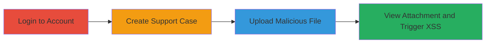

---
tags:
  - xss
  - self-xss
  - web
  - acronis
type: attack_chain
tools: []
tactics:
  - '[[Execution]]'
verified: false
platforms:
  - Web
submitted: true
complexity: low
created_at: '2023-10-01T00:00:00Z'
procedures:
  - '[[procedures/Login-to-Acornis-Account]]'
  - '[[procedures/Create-Support-Case]]'
  - '[[procedures/Upload-Malicious-Attachment-Filename]]'
step_count: 3
techniques:
  - '[[JavaScript]]'
updated_at: '2025-12-14T00:11:09.543Z'
description: >-
  Demonstrates a self-XSS vulnerability in the Acronis support request system by
  injecting a JavaScript payload into an uploaded file's filename, which
  executes only for the uploading user when viewing the attachment.
skill_level: beginner
impact_level: low
id: 9328d167-505c-4576-b253-b513522dfcea
validated: true
mitre_tactics:
  - '[[Execution]]'
mitre_techniques:
  - '[[JavaScript]]'
---
# Self XSS via Malicious Attachment Filename in Acronis Support System

Multi-stage attack chain demonstrating a complete attack workflow for exploiting a self-XSS vulnerability in Acronis's support request system.

## Chain Metrics Dashboard

| Metric | Value |
|--------|-------|
| Chain Status | Unverified |
| Total Steps | 3 |
| Execution Time | ~5 minutes |
| Skill Level | Beginner |
| Complexity | Low |
| Impact Level | Low |

## Attack Flow Visualization

## Prerequisites & Requirements

### Required Tools

- Web browser (e.g., Chrome or Firefox)

### Target Environment

- Web platform
- Access to account.acronis.com
- Valid Acronis account credentials

### Initial Access Requirements

- Valid user credentials for Acronis account
- Network access to account.acronis.com and www.acronis.com
- No prior access needed beyond authentication

## Detailed Attack Procedures

### Step 1: Login to Acronis Account
procedure: [[procedures/Login-to-Acornis-Account]]

**Objective**: Authenticate to the Acronis account portal to gain access to the support features.

**Instructions**: Navigate to the login page and enter credentials. No specific commands are required; use the web interface.

**Expected Output**: Successful login redirect to the account dashboard.

**Success Indicators**:
- Dashboard loads without errors
- User profile information visible

### Step 2: Create Support Case
procedure: [[procedures/Create-Support-Case]]

**Objective**: Initiate a new support request to access the attachment upload functionality.

**Instructions**: From the dashboard, navigate to the support requests section and fill out the form to create a new case. Provide basic details like subject and description.

**Expected Output**: New support case created with a unique case ID.

**Success Indicators**:
- Case ID generated and displayed
- Option to add comments or attachments available

### Step 3: Upload Malicious Attachment Filename
procedure: [[procedures/Upload-Malicious-Attachment-Filename]]

**Objective**: Inject an XSS payload into the filename of an uploaded file to trigger self-execution when viewed.

**Instructions**: In the support case, expand the attachments section, add a comment if needed, and upload a benign file (e.g., a PNG image) renamed with the payload `">.png`. Save the upload.

**Expected Output**: File uploaded successfully; no immediate alert.

**Success Indicators**:
- File appears in the attachment list
- Upon viewing the attachment in the iframe on www.acronis.com, an alert pops up showing the document domain

## Attack Chain Summary

### Key Achievements

1. Successful authentication and case creation in Acronis support system
2. Upload of file with unsanitized XSS payload in filename
3. Self-execution of JavaScript alert confirming the vulnerability, limited to the uploading user

## Technique & Tactic Coverage

### MITRE ATT&CK Techniques

- [[JavaScript]]

### MITRE ATT&CK Tactics

- [[Execution]]

---
*Last updated: 2023-10-01T00:00:00Z*
