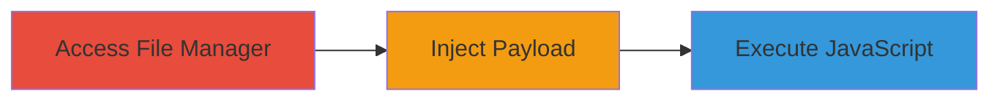

---
tags:
  - xss
  - self-xss
  - concrete-cms
  - web-vulnerability
type: attack_chain
tools: []
tactics:
  - '[[Execution]]'
verified: false
platforms:
  - Web
submitted: true
complexity: low
created_at: '2023-10-01T00:00:00Z'
procedures:
  - '[[procedures/Self-XSS-in-Concrete-CMS-File-Replace]]'
step_count: 1
techniques:
  - '[[JavaScript]]'
updated_at: '2025-12-14T03:15:27.038Z'
description: >-
  Demonstrates a self-XSS vulnerability in Concrete CMS's File manager when
  replacing files from remote sources, allowing JavaScript execution in the
  attacker's own browser session.
skill_level: low
impact_level: low
id: 5b46666f-50e2-44f4-bbe6-ec5e751ca535
validated: true
mitre_tactics:
  - '[[Execution]]'
mitre_techniques:
  - '[[JavaScript]]'
---
# Self-XSS via Malicious URL in Concrete CMS File Replace Feature

Multi-stage attack chain demonstrating a complete attack workflow.

## Chain Metrics Dashboard

| Metric | Value |
|--------|-------|
| Chain Status | Unverified |
| Total Steps | 1 |
| Execution Time | ~1 minute |
| Skill Level | Low |
| Complexity | Low |
| Impact Level | Low |

## Attack Flow Visualization

## Prerequisites & Requirements

### Required Tools

- Web browser (e.g., Chrome, Firefox)

### Target Environment

- Concrete CMS instance
- Authenticated user access to File manager
- No special services or ports required beyond standard web access

### Initial Access Requirements

- Valid user credentials for Concrete CMS
- Direct access to the admin dashboard
- No prior network position needed

## Detailed Attack Procedures

### Step 1: Inject Self-XSS Payload
procedure: [[procedures/Self-XSS-in-Concrete-CMS-File-Replace]]

**Objective**: Trigger the self-XSS by inputting a malicious URL payload into the remote files URL field, causing immediate JavaScript execution in the user's browser.

**Instructions**: Log in to the Concrete CMS dashboard as an authenticated user. Navigate to the File manager, select a file, choose the Replace option, and select 'Remote files' as the source. In the URL input box, enter the payload `http://example.com/"/>`. The payload will reflect and execute, displaying a confirmation dialog.

**Expected Output**: A browser alert or confirmation dialog pops up with 'XSS', confirming the vulnerability.

**Success Indicators**:
- JavaScript executes immediately upon payload entry
- No errors in the File manager interface
- Alert dialog appears in the browser

## Attack Chain Summary

### Key Achievements

1. Successful injection and execution of JavaScript payload
2. Confirmation of reflected XSS in the URL input field
3. Demonstration of self-XSS limited to the attacker's session

## Technique & Tactic Coverage

### MITRE ATT&CK Techniques

- [[JavaScript]]

### MITRE ATT&CK Tactics

- [[Execution]]

---
*Last updated: 2023-10-01T00:00:00Z*
