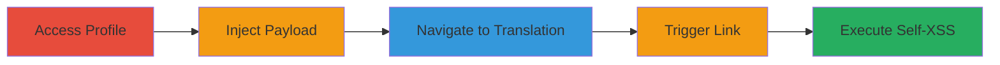

---
tags:
  - xss
  - self-xss
  - weblate
  - javascript-uri
type: attack_chain
tools: []
tactics:
  - '[[Execution]]'
  - '[[Collection]]'
verified: false
platforms:
  - Web
submitted: true
complexity: low
created_at: '2023-10-05T12:00:00Z'
procedures:
  - '[[procedures/Configure-Malicious-Editor-Link-in-Weblate-Profile]]'
  - '[[procedures/Trigger-Self-XSS-via-Translation-Page-Source-Link]]'
step_count: 5
techniques:
  - '[[JavaScript]]'
updated_at: '2025-12-14T03:15:41.290Z'
description: >-
  A multi-step attack chain exploiting a self-XSS vulnerability in Weblate's
  user profile Editor link field, allowing execution of JavaScript payloads in
  the attacker's browser to steal session cookies.
skill_level: beginner
impact_level: low
id: fbed639f-231f-4ca4-a2bb-a0a558507ccf
validated: true
mitre_tactics:
  - '[[Execution]]'
  - '[[Collection]]'
mitre_techniques:
  - '[[JavaScript]]'
---
# Self-XSS via Unsanitized Editor Link in Weblate User Profile

Multi-stage attack chain demonstrating a self-XSS vulnerability in Weblate, where unsanitized input in the user profile's Editor link field allows JavaScript URI payloads to be stored and executed when triggered via translation page source links, leading to client-side script execution in the attacker's browser.

## Chain Metrics Dashboard

| Metric | Value |
|--------|-------|
| Chain Status | Unverified |
| Total Steps | 5 |
| Execution Time | ~2 minutes |
| Skill Level | Beginner |
| Complexity | Low |
| Impact Level | Low |

## Attack Flow Visualization

## Prerequisites & Requirements

### Required Tools

- Web browser (e.g., Chrome, Firefox)

### Target Environment

- Weblate instance (e.g., demo.weblate.org)
- Authenticated user account with access to profile settings and translation pages

### Initial Access Requirements

- Valid user credentials for Weblate
- No special privileges required; affects any authenticated user

## Detailed Attack Procedures

### Step 1: Access User Profile Preferences
procedure: [[procedures/Access-Weblate-User-Profile]]

**Objective**: Navigate to the user profile to prepare for payload injection.

**Instructions**: Open a web browser and log in to the Weblate instance if not already authenticated. Then, directly access the profile preferences page.

**Expected Output**: Profile preferences form loads, showing fields like Editor link.

**Success Indicators**:
- Profile page accessible at https://demo.weblate.org/accounts/profile/#preferences
- Editor link field visible and editable

### Step 2: Inject Malicious Payload
procedure: [[procedures/Configure-Malicious-Editor-Link-in-Weblate-Profile]]

**Objective**: Set the Editor link field to a JavaScript URI payload and save it to store the unsanitized input.

**Instructions**: In the Editor link field, enter the payload `javaScript:alert(document.cookie);//confirm(1);` and click the Save button.

**Expected Output**: Profile saves successfully without errors; payload is stored in the user's preferences.

**Success Indicators**:
- No validation errors on save
- Profile updates confirm the change

### Step 3: Navigate to Translation Page
procedure: [[procedures/Access-Weblate-Translation-Page]]

**Objective**: Move to a translation page that contains source file links to set up the trigger.

**Instructions**: After saving the profile, navigate to a project translation page, such as the English translation for the 'hello' project.

**Expected Output**: Translation interface loads with source information section visible.

**Success Indicators**:
- Page loads at https://demo.weblate.org/translate/hello/master/en_GB/?type=all
- Source Information section present

### Step 4: Trigger via Source Link
procedure: [[procedures/Trigger-Self-XSS-via-Translation-Page-Source-Link]]

**Objective**: Click a source file link to invoke the Editor link, executing the stored payload.

**Instructions**: Locate the 'main.c' file link under the Source Information section and click it. This action uses the configured Editor link, triggering the JavaScript URI.

**Expected Output**: Browser executes the payload, showing an alert with document cookies and a confirmation dialog.

**Success Indicators**:
- Alert box displays user cookies
- Confirm dialog appears

### Step 5: Observe Execution

**Objective**: Verify self-XSS impact, such as cookie theft in the attacker's session.

**Instructions**: Note the alert contents; in a real attack, the payload could exfiltrate data to an attacker-controlled server.

**Expected Output**: JavaScript runs in the current browser context, limited to the user's session.

**Success Indicators**:
- Payload executes without affecting other users
- Cookies visible in alert (self-only impact)

## Attack Chain Summary

### Key Achievements

1. Successful storage of unsanitized JavaScript URI in user profile
2. Triggering of self-XSS via legitimate translation workflow
3. Client-side execution revealing session cookies

## Technique & Tactic Coverage

### MITRE ATT&CK Techniques

- [[JavaScript]]

### MITRE ATT&CK Tactics

- [[Execution]]
- [[Collection]]

---
*Last updated: 2023-10-05T12:00:00Z*
