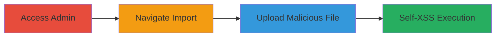

# Self-XSS via Unsanitized Filename in Shopify Import Settings

Multi-stage attack chain demonstrating a self-XSS vulnerability in Shopify's admin panel import feature. The attack exploits the lack of filename sanitization when an invalid CSV is uploaded, reflecting the filename in an error message and executing JavaScript only in the attacker's session.

## Chain Metrics Dashboard

| Metric | Value |
|--------|-------|
| Chain Status | Unverified |
| Total Steps | 3 |
| Execution Time | ~2 minutes |
| Skill Level | Beginner |
| Complexity | Low |
| Impact Level | Low |

## Attack Flow Visualization

## Prerequisites & Requirements

### Required Tools

- Web browser (e.g., Chrome, Firefox)

### Target Environment

- Shopify admin panel
- Web platform
- No specific ports or services required beyond standard HTTPS

### Initial Access Requirements

- Valid Shopify store admin credentials
- Direct access to the store URL

## Detailed Attack Procedures

### Step 1: Access Shopify Admin Panel
procedure: [[procedures/Access-Shopify-Admin-Panel]]

**Objective**: Gain entry to the Shopify store's admin interface to access settings.

**Instructions**: Open a web browser and navigate to the target Shopify store's admin URL.

**Expected Output**: Login page or dashboard if already authenticated.

**Success Indicators**:
- Admin dashboard loads successfully
- User is authenticated with necessary permissions

### Step 2: Navigate to Import Settings
procedure: [[procedures/Navigate-to-Import-Settings]]

**Objective**: Locate the file import functionality within the admin settings.

**Instructions**: From the admin dashboard, click on 'Settings' in the sidebar, then select 'Import' to access the CSV upload interface.

**Expected Output**: Import page with file upload form visible, including instructions for CSV format.

**Success Indicators**:
- Import section is accessible
- Upload form is displayed without errors

### Step 3: Upload Malicious Filename for Self-XSS
procedure: [[procedures/Upload-Malicious-Filename-for-Self-XSS]]

**Objective**: Trigger the self-XSS by uploading an invalid CSV with a payload in the filename, causing unsanitized reflection in the error message.

**Instructions**: Create or select an invalid CSV file (e.g., empty or malformed) and rename it to include a JavaScript payload, such as ">.csv". Use the upload form to submit the file. Upon validation failure, the error message will reflect the filename, executing the payload in your browser.

**Expected Output**: Error message displays the filename, triggering an alert box showing the document domain (e.g., 'yourstore.myshopify.com').

**Success Indicators**:
- JavaScript alert pops up in the browser
- No execution in other users' sessions (confirms self-XSS)

## Attack Chain Summary

### Key Achievements

1. Successful navigation to vulnerable import feature
2. Upload of payload-laden filename
3. Execution of arbitrary JavaScript in attacker's session

## Technique & Tactic Coverage

### MITRE ATT&CK Techniques

- [[JavaScript]]

### MITRE ATT&CK Tactics

- [[Execution]]

---
*Last updated: 2023-10-01T00:00:00Z*
