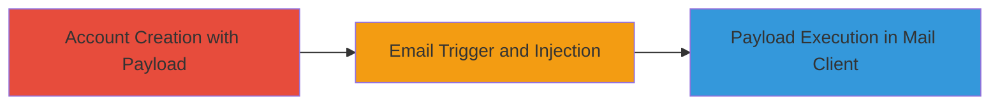

# Self-XSS via Unsanitized Username in ownCloud Welcome Emails

Multi-stage attack chain demonstrating a self-XSS vulnerability in ownCloud's email system, where user-supplied usernames are not sanitized before insertion into automated emails.

## Chain Metrics Dashboard

| Metric | Value |
|--------|-------|
| Chain Status | Unverified |
| Total Steps | 2 |
| Execution Time | ~5 minutes |
| Skill Level | Beginner |
| Complexity | Low |
| Impact Level | Low |

## Attack Flow Visualization

## Prerequisites & Requirements

### Required Tools

- Web browser for account registration
- Email client capable of JavaScript execution (e.g., certain webmail interfaces)

### Target Environment

- ownCloud web application
- Access to email service (e.g., smtp.hubapi.com via HubSpot)

### Initial Access Requirements

- No prior credentials needed; public registration endpoint
- Valid email address for receiving the welcome email

## Detailed Attack Procedures

### Step 1: Account Creation
procedure: [[procedures/Create-ownCloud-Account-with-XSS-Payload]]

**Objective**: Register an ownCloud account using a username containing an XSS payload to inject malicious JavaScript.

**Instructions**: Navigate to the ownCloud registration page and enter the payload in the username field during signup. Use a payload like "> to test for injection.

**Expected Output**: Successful account creation confirmation, with the payload stored unsanitized.

**Success Indicators**:
- Account registered without rejection of special characters
- Payload visible in account profile if inspectable

### Step 2: Email Trigger and Observation
procedure: [[procedures/Trigger-and-Observe-Self-XSS-in-Welcome-Email]]

**Objective**: Receive and inspect the automated welcome email to confirm payload injection and potential execution.

**Instructions**: After registration, check the inbox for the email from hello@owncloud.com. Open the email in a JavaScript-enabled mail client and observe if the payload executes (e.g., alert(1) pops up).

**Expected Output**: Email with subject 'ownCloud Security & Encryption 2.0; A Technical Overview' containing the injected greeting: 'Hi ">,' showing URL-encoded payload.

**Success Indicators**:
- Payload appears in email body without sanitization
- JavaScript executes if mail client supports it (e.g., alert dialog)

## Attack Chain Summary

### Key Achievements

1. Successful injection of XSS payload via username during self-registration
2. Confirmation of lack of sanitization in third-party email service (HubSpot)
3. Demonstration of self-XSS execution limited to the attacker's own email context

## Technique & Tactic Coverage

### MITRE ATT&CK Techniques

- [[JavaScript]]

### MITRE ATT&CK Tactics

- [[Execution]]

---
*Last updated: 2023-10-01T00:00:00Z*
