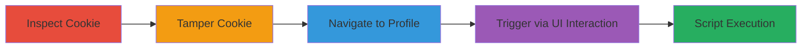

# Self-XSS via Yelp Location Cookie City Field

Multi-stage attack chain demonstrating a self-XSS vulnerability in Yelp's location cookie, where the 'city' field is tampered with to inject a script payload. The payload is reflected and executed only in the attacker's own browser upon interacting with specific UI elements, such as the profile location page or search bar. This has no cross-user impact but highlights insufficient input sanitization in cookie handling.

## Chain Metrics Dashboard

| Metric | Value |
|--------|-------|
| Chain Status | Unverified |
| Total Steps | 4 |
| Execution Time | ~5 minutes |
| Skill Level | Beginner |
| Complexity | Low |
| Impact Level | Low |

## Attack Flow Visualization

## Prerequisites & Requirements

### Required Tools

- [[tools/Chrome-Developer-Tools]]
- [[tools/Web-Browser-Chrome]]

### Target Environment

- Web platform
- Authenticated Yelp account
- Access to browser developer tools

### Initial Access Requirements

- Valid Yelp session cookies
- No special privileges required

## Detailed Attack Procedures

### Step 1: Inspect Location Cookie
procedure: [[procedures/Inspect-Yelp-Location-Cookie]]

**Objective**: Examine the structure of the location cookie to identify the 'city' field for tampering.

**Instructions**: Open the browser developer tools and navigate to the Application or Storage tab to view cookies for yelp.com. Locate the location cookie and decode its URL-encoded JSON value.

**Expected Output**: Decoded JSON like {"city": "San Francisco", "zip": "", "country": "US", ...}.

**Success Indicators**:
- Cookie structure observed with 'city' field visible
- JSON format confirmed

### Step 2: Tamper with Location Cookie
procedure: [[procedures/Tamper-Yelp-Location-Cookie]]

**Objective**: Modify the 'city' field in the cookie to inject a malicious script payload, ensuring proper URL encoding.

**Instructions**: In the developer tools, edit the cookie value by replacing the 'city' with a payload like '', then re-encode the entire JSON as URL-encoded string.

**Expected Output**: Updated cookie value like %7B%22city%22%3A%22%3Cscript%3Edebugger%3C/script%3E%22%2C...%7D.

**Success Indicators**:
- Cookie successfully modified without breaking session
- Payload encoded correctly

### Step 3: Navigate to Profile Location and Trigger XSS
procedure: [[procedures/Trigger-Self-XSS-on-Profile-Location]]

**Objective**: Access the profile location page and interact with the Address field to reflect and execute the injected payload.

**Instructions**: With the tampered cookie set, navigate to https://www.yelp.com/profile_location. Click on the Address field to trigger a request to /location_suggest/json?prefix=, which reflects the payload in the JSON response.

**Expected Output**: JSON response containing the payload as {"suggestions": [{"name": "\u003cscript\u003edebugger\u003c/script\u003e, CA", ...}]}, leading to script execution.

**Success Indicators**:
- Debugger triggers in the browser console
- Payload reflected in network response

### Step 4: Alternative Trigger via Search Bar
procedure: [[procedures/Trigger-Self-XSS-via-Search-Bar]]

**Objective**: Use the search bar's 'From' field as an alternative way to trigger the same payload reflection.

**Instructions**: Perform a search for restaurants and clear text from the 'From' field, which sends a request to the same /location_suggest/json endpoint using the tampered cookie.

**Expected Output**: Similar JSON reflection and script execution as in Step 3.

**Success Indicators**:
- Payload executes upon interaction
- No errors in console beyond intended debugger

## Attack Chain Summary

### Key Achievements

1. Successful inspection and tampering of user-controlled cookie
2. Reflection of unsanitized payload in JSON API response
3. Execution of arbitrary JavaScript in the attacker's browser

## Technique & Tactic Coverage

### MITRE ATT&CK Techniques

- [[JavaScript]]
- [[Exploit Public-Facing Application]]

### MITRE ATT&CK Tactics

- [[Execution]]

---

*Last updated: 2023-10-01T00:00:00Z*
