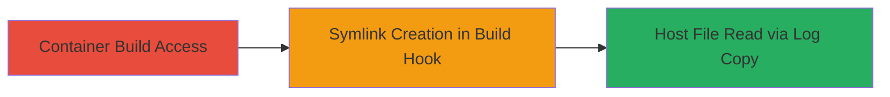

---
id: ac-uuid-694181
name: Semmle Worker Container Escape via Symlink Attack for Arbitrary Host File Read
type: attack_chain
description: Exploits lack of symlink protection in Semmle worker container build process to escape the container and read arbitrary files on the host machine by replacing a build log with a symlink.
verified: false
submitted: false
step_count: 1
created_at: 2023-10-01T00:00:00Z
updated_at: 2023-10-01T00:00:00Z
procedures: [[procedures/Exploit-Symlink-in-Semmle-Build-Log-for-Container-Escape]]
techniques: [[Escape to Host]], [[File and Directory Discovery]]
tactics: [[Execution]], [[Discovery]]
tags: container-escape, symlink-attack, arbitrary-file-read, privilege-escalation, docker
platforms: Linux, Docker
tools: []
---

# Semmle Worker Container Escape via Symlink Attack for Arbitrary Host File Read

Multi-stage attack chain demonstrating a complete attack workflow.

## Chain Metrics Dashboard

| Metric | Value |
|--------|-------|
| Chain Status | Unverified |
| Total Steps | 1 |
| Execution Time | ~5 minutes |
| Skill Level | Intermediate |
| Complexity | Medium |
| Impact Level | High |

## Attack Flow Visualization



## Prerequisites & Requirements

### Required Tools

- None (uses built-in shell commands)

### Target Environment

- Linux-based Docker worker containers in Semmle build system
- Access to build configuration hooks (e.g., after_prepare stage)
- Docker runtime on host machine

### Initial Access Requirements

- Ability to submit or control a build job in the Semmle system
- No special credentials beyond build submission access
- Network position within the build environment

## Detailed Attack Procedures

### Step 1: Exploit Symlink in Build Log
procedure: [[procedures/Exploit-Symlink-in-Semmle-Build-Log-for-Container-Escape]]

**Objective**: Replace the build log file inside the container with a symlink pointing to a sensitive host file, allowing the host's post-build copy operation to resolve the symlink and expose host filesystem contents.

**Instructions**: Configure the build job to execute the symlink creation command in the after_prepare hook. This hook runs inside the container before the build completes, modifying the output directory.

Use [[commands/create-symlink-to-host-file-in-build-log]] to remove the original log and create the symlink:

```bash
rm -rf /opt/out/snapshot/log/build.log && ln -s /etc/passwd /opt/out/snapshot/log/build.log
```

After execution, monitor the build completion. The host will copy the log file, following the symlink to read the target host file.

**Expected Output**: The build completes successfully, but the copied log on the host contains the contents of /etc/passwd (or the targeted file), such as user account listings and potentially private IP addresses.

**Success Indicators**:
- Symlink created without errors in container logs
- Host-side log file shows contents of sensitive host file (e.g., root:x:0:0:root:/root:/bin/bash for /etc/passwd)
- No build failure due to file operations

## Attack Chain Summary

### Key Achievements

1. Escaped container boundaries to access host filesystem
2. Read arbitrary sensitive files like /etc/passwd without direct host access
3. Exposed user accounts and network configuration details

## Technique & Tactic Coverage

### MITRE ATT&CK Techniques

- [[Escape to Host]] Escape to Host
- [[File and Directory Discovery]] File and Directory Discovery

### MITRE ATT&CK Tactics

- [[Execution]] Execution
- [[Discovery]] Discovery

---
*Last updated: 2023-10-01T00:00:00Z*
