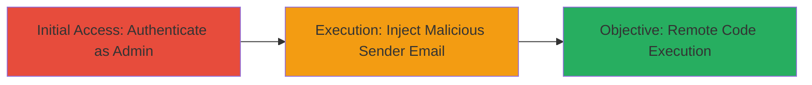

# Sendmail Command Injection RCE in Concrete5 Registration Notifications

Multi-stage attack chain demonstrating remote code execution in Concrete5 version 5.7.3.1 by injecting commands into the sender email field during registration notification emails sent via sendmail. This exploits improper input validation, allowing authenticated administrators to execute arbitrary shell commands on the server. Discovered by researcher egix, the attack requires admin privileges but can potentially be chained with CSRF for broader access.

## Chain Metrics Dashboard

| Metric | Value |
|--------|-------|
| Chain Status | Unverified |
| Total Steps | 2 |
| Execution Time | ~5 minutes |
| Skill Level | Intermediate |
| Complexity | Medium |
| Impact Level | High |

## Attack Flow Visualization

## Prerequisites & Requirements

### Required Tools

- Web browser for authentication and form submission
- Optional: Burp Suite for intercepting and modifying requests

### Target Environment

- Concrete5 CMS version 5.7.3.1 running on a PHP-enabled web server
- Sendmail service configured for email notifications
- Open ports: 80/443 (web), no specific ports for sendmail exposure

### Initial Access Requirements

- Valid administrator credentials for Concrete5
- Network access to the web application (direct or via CSRF if unauthenticated trigger possible)
- No prior access needed beyond authentication

## Detailed Attack Procedures

### Step 1: Authenticate as Administrator
procedure: [[procedures/Authenticate-as-Admin-in-Concrete5]]

**Objective**: Gain authenticated access to the Concrete5 admin dashboard to access registration notification features.

**Instructions**: Navigate to the Concrete5 login page and enter admin credentials. Upon successful login, access the system settings or user management section where registration notifications are configured.

**Expected Output**: Redirect to the admin dashboard with elevated privileges.

**Success Indicators**:
- Successful login confirmation
- Access to admin-only features like email settings

### Step 2: Trigger Command Injection via Sender Email
procedure: [[procedures/Inject-Command-via-Sender-Email-for-RCE]]

**Objective**: Exploit the unvalidated sender email field in the registration notification to inject and execute arbitrary commands via sendmail.

**Instructions**: In the admin panel, navigate to the registration notification email configuration. Set up or trigger a user registration that sends a notification email, modifying the sender email address to include a command injection payload, such as `; id #` to test execution. Submit the form to invoke sendmail with the tainted input.

**Expected Output**: Server-side command execution, visible via payload results like user ID output in email or logs.

**Success Indicators**:
- Command output reflected in email body or server response
- Evidence of shell access, e.g., file creation or process listing

## Attack Chain Summary

### Key Achievements

1. Authenticated access to vulnerable Concrete5 admin features
2. Successful command injection leading to arbitrary code execution on the server
3. Potential for full server compromise, including data exfiltration or persistence

## Technique & Tactic Coverage

### MITRE ATT&CK Techniques

- [[Exploit Public-Facing Application]] Exploit Public-Facing Application
- [[Unix Shell]] Unix Shell

### MITRE ATT&CK Tactics

- [[Initial Access]] Initial Access
- [[Execution]] Execution

---
*Last updated: 2023-10-01T00:00:00Z*
