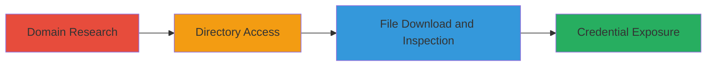

# Sensitive API Credentials Disclosure via Exposed Directory on Twitter Development Domain

Multi-stage attack chain demonstrating a complete reconnaissance and information disclosure workflow on a public-facing development server.

## Chain Metrics Dashboard

| Metric | Value |
|--------|-------|
| Chain Status | Unverified |
| Total Steps | 3 |
| Execution Time | ~5 minutes |
| Skill Level | Beginner |
| Complexity | Low |
| Impact Level | High |

## Attack Flow Visualization



## Prerequisites & Requirements

### Required Tools

- Web browser or [[curl]]

### Target Environment

- Publicly accessible web server on port 443 (HTTPS)
- Development domain (e.g., cards-dev.twitter.com)
- No authentication required for initial access

### Initial Access Requirements

- Internet access to the target domain
- No prior credentials needed
- Basic knowledge of URL navigation

## Detailed Attack Procedures

### Step 1: Domain Research
procedure: [[procedures/Research-Development-Domain-for-Vulnerabilities]]

**Objective**: Identify potential vulnerabilities by exploring the target development domain.

**Instructions**: Begin by researching the domain cards-dev.twitter.com using a web browser or command-line tools to scan for open endpoints. Manually navigate to the root or common paths to identify exposed resources.

**Expected Output**: Overview of the domain's structure and any visible directories or files.

**Success Indicators**:
- Domain resolves and loads without errors
- Identification of potential sensitive paths like /keys/

### Step 2: Access Exposed Directory
procedure: [[procedures/Access-Exposed-Web-Directory]]

**Objective**: Navigate to and access a publicly exposed directory that may contain sensitive files.

**Instructions**: Use a browser to visit https://cards-dev.twitter.com/keys/. Alternatively, use [[commands/curl-directory-list]] to probe the endpoint:

```bash
curl -k https://cards-dev.twitter.com/keys/
```

This should trigger a download or display of json.json if the directory is exposed.

**Expected Output**: Automatic download of json.json or direct file serving.

**Success Indicators**:
- File download initiates
- No 404 error; content is served

### Step 3: Download and Inspect Exposed File
procedure: [[procedures/Download-and-Inspect-Exposed-Sensitive-File]]

**Objective**: Retrieve and examine the exposed file to uncover sensitive credentials.

**Instructions**: Download the file using a browser or [[commands/curl-download-file]]:

```bash
curl -k -O https://cards-dev.twitter.com/keys/json.json
cat json.json
```

Inspect the contents for keys like customer_key, customer_secret, and jira_password.

**Expected Output**: JSON file containing unredacted credentials.

**Success Indicators**:
- Credentials visible in the file (e.g., API keys and passwords)
- Potential for unauthorized access to Twitter API or Jira confirmed

## Attack Chain Summary

### Key Achievements

1. Discovered exposed development directory without authentication
2. Downloaded sensitive JSON file revealing API credentials
3. Assessed impact on Twitter API and Jira services

## Technique & Tactic Coverage

### MITRE ATT&CK Techniques

- [[File and Directory Discovery]] File and Directory Discovery
- [[Gather Victim Host Information]] Gather Victim Host Information

### MITRE ATT&CK Tactics

- [[Discovery]] Discovery

---
*Last updated: 2023-10-01T00:00:00Z*
