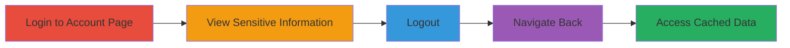

---
tags:
  - cache-control
  - browser-cache
  - sensitive-data-disclosure
  - nextcloud
  - privacy-violation
type: attack_chain
tools: []
tactics:
  - '[[Collection]]'
verified: false
platforms:
  - Web
submitted: true
complexity: low
created_at: '2024-01-01T00:00:00Z'
procedures:
  - '[[procedures/Access-Cached-Account-Information-Post-Logout]]'
step_count: 5
techniques:
  - '[[Data from Local System]]'
updated_at: '2025-12-14T17:25:18.206Z'
description: >-
  A multi-step process exploiting improper cache controls on the Nextcloud
  account page to access sensitive user information post-logout using the
  browser's back button.
skill_level: beginner
impact_level: medium
id: 7a70fbd3-eb0a-4468-9ad8-04c27e0262b7
validated: true
mitre_tactics:
  - '[[Collection]]'
mitre_techniques:
  - '[[Data from Local System]]'
---
# Sensitive Information Disclosure via Browser Cache After Logout on Nextcloud Account Page

Multi-stage attack chain demonstrating a complete attack workflow exploiting cache control misconfigurations.

## Chain Metrics Dashboard

| Metric | Value |
|--------|-------|
| Chain Status | Unverified |
| Total Steps | 5 |
| Execution Time | ~2 minutes |
| Skill Level | Beginner |
| Complexity | Low |
| Impact Level | Medium |

## Attack Flow Visualization

## Prerequisites & Requirements

### Required Tools

- Standard web browser (e.g., Chrome, Firefox)

### Target Environment

- Web platform
- Access to https://apps.nextcloud.com/account/
- No specific ports or services required beyond standard HTTPS (443)

### Initial Access Requirements

- Valid Nextcloud account credentials (username and password)
- Direct network access to the internet
- No prior access needed beyond legitimate login

## Detailed Attack Procedures

### Step 1: Authenticate to Account Page
procedure: [[procedures/Access-Cached-Account-Information-Post-Logout]]

**Objective**: Gain access to the account dashboard to load sensitive information into the browser cache.

**Instructions**: Open a web browser and navigate to the target URL. Enter valid credentials to log in.

**Expected Output**: Successful login redirecting to the account dashboard displaying user details.

**Success Indicators**:
- Account page loads with personal information visible
- No authentication errors

### Step 2: Observe Sensitive Information
procedure: [[procedures/Access-Cached-Account-Information-Post-Logout]]

**Objective**: Confirm that sensitive data is loaded and potentially cached by the browser.

**Instructions**: Review the displayed content on the account page, noting details like first name, last name, and email address.

**Expected Output**: Visible user profile information including name and email.

**Success Indicators**:
- Sensitive details (e.g., email, name) are clearly displayed
- Page is fully rendered without errors

### Step 3: Initiate Logout
procedure: [[procedures/Access-Cached-Account-Information-Post-Logout]]

**Objective**: End the authenticated session while leaving cached content intact due to improper headers.

**Instructions**: Locate and click the logout button on the account page to terminate the session.

**Expected Output**: Redirect to a logged-out state, such as the login page or home page.

**Success Indicators**:
- Session ends and user is redirected
- No immediate errors during logout

### Step 4: Navigate Back in Browser
procedure: [[procedures/Access-Cached-Account-Information-Post-Logout]]

**Objective**: Use browser navigation to retrieve the previously cached page without re-authentication.

**Instructions**: After logout, press the browser's back button to attempt returning to the account page.

**Expected Output**: The browser loads the cached version of the account page.

**Success Indicators**:
- Back button navigation succeeds without prompting for login
- Previous page attempts to load

### Step 5: Verify Cached Sensitive Information Access
procedure: [[procedures/Access-Cached-Account-Information-Post-Logout]]

**Objective**: Confirm unauthorized access to sensitive data from the cache.

**Instructions**: Inspect the loaded page content to see if sensitive information remains visible despite logout.

**Expected Output**: Display of first name, last name, email, and other details without requiring credentials.

**Success Indicators**:
- Sensitive data is accessible and unchanged
- No server-side re-authentication occurs

## Attack Chain Summary

### Key Achievements

1. Successful exploitation of cache control vulnerability to bypass logout protections
2. Disclosure of personal identifiable information (PII) like names and emails
3. Demonstration of privacy risks in shared or public browsing environments

## Technique & Tactic Coverage

### MITRE ATT&CK Techniques

- [[Data from Local System]]

### MITRE ATT&CK Tactics

- [[Collection]]

---
*Last updated: 2024-01-01T00:00:00Z*
