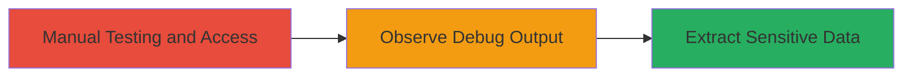

# Sensitive Information Disclosure via Enabled Debug Mode in Web Application

Multi-stage attack chain demonstrating a complete attack workflow.

## Chain Metrics Dashboard

| Metric | Value |
|--------|-------|
| Chain Status | Unverified |
| Total Steps | 1 |
| Execution Time | ~5 minutes |
| Skill Level | Beginner |
| Complexity | Low |
| Impact Level | High |

## Attack Flow Visualization

## Prerequisites & Requirements

### Required Tools

- None (manual testing)

### Target Environment

- Web application running in production
- Likely using a framework like Django with backend configuration
- Publicly accessible URL

### Initial Access Requirements

- No credentials required
- Direct network access to the web application
- No prior access needed

## Detailed Attack Procedures

### Step 1: Manual Testing for Debug Output
procedure: [[procedures/Detect-Debug-Mode-Information-Disclosure]]

**Objective**: Access the web application and trigger conditions to reveal debug information, exposing sensitive data like usernames, passwords, and API keys.

**Instructions**: Navigate to the web application's URL in a browser or using a manual request tool. Intentionally trigger an error, such as by submitting invalid input to a form or accessing a non-existent endpoint, to generate an error page. Observe the response for debug traces that include configuration details due to DEBUG=True setting.

For example, attempt to access a protected resource or cause a server error:

- Visit the main site and interact with features like login or search.
- Look for verbose error messages, stack traces, or configuration dumps in the output.

**Expected Output**: Error pages displaying internal details, such as:
- Usernames and hashed/ plain passwords.
- API keys and database connection strings.
- Framework-specific debug info (e.g., Django's DEBUG page).

**Success Indicators**:
- Presence of stack traces or config variables in responses.
- Exposure of credentials or keys that could be used for further access.

## Attack Chain Summary

### Key Achievements

1. Identified misconfiguration in production environment.
2. Extracted critical sensitive information without authentication or tools.
3. Demonstrated high-impact risk from simple manual testing.

## Technique & Tactic Coverage

### MITRE ATT&CK Techniques

- [[Unsecured Credentials]] Unsecured Credentials
- [[Gather Victim Host Information]] Gather Victim Host Information

### MITRE ATT&CK Tactics

- [[Collection]] Collection
- [[Discovery]] Discovery

---
*Last updated: 2023-10-01T00:00:00Z*
