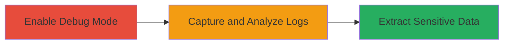

---
tags:
  - insecure-logging
  - sensitive-data-exposure
  - mobile
  - vk-api
type: attack_chain
tools:
  - '[[tools/adb-android-debug-bridge]]'
tactics:
  - '[[Collection]]'
verified: false
platforms:
  - Mobile App
  - Android
submitted: true
complexity: low
created_at: '2023-10-01T00:00:00Z'
procedures:
  - '[[procedures/Access-VK-API-Data-via-Clover-Debug-Logs]]'
step_count: 1
techniques:
  - '[[Unsecured Credentials]]'
updated_at: '2025-12-14T17:32:01.625Z'
description: >-
  A vulnerability in the Clover mobile application that logs VK API responses
  without sanitization, allowing exposure of sensitive user data when accessed
  in debug mode.
skill_level: beginner
impact_level: low
id: 6e4680a8-55ad-4e75-b86e-3114e01cd1ef
validated: true
mitre_tactics:
  - '[[Collection]]'
mitre_techniques:
  - '[[Unsecured Credentials]]'
---
# Sensitive VK API Data Exposure via Insecure Logging in Clover Mobile App

Multi-stage attack chain demonstrating a complete attack workflow.

## Chain Metrics Dashboard

| Metric | Value |
|--------|-------|
| Chain Status | Unverified |
| Total Steps | 1 |
| Execution Time | ~5 minutes |
| Skill Level | Beginner |
| Complexity | Low |
| Impact Level | Low |

## Attack Flow Visualization



## Prerequisites & Requirements

### Required Tools

- [[tools/adb-android-debug-bridge]]

### Target Environment

- Android mobile device with Clover app installed
- USB debugging enabled on the device
- ADB installed on the attacking machine

### Initial Access Requirements

- Physical or remote access to the target Android device
- Developer options enabled for USB debugging
- No prior credentials needed, but app must be installed and runnable

## Detailed Attack Procedures

### Step 1: Enable Debug and Capture Logs
procedure: [[procedures/Access-VK-API-Data-via-Clover-Debug-Logs]]

**Objective**: Enable debug mode in the Clover app, trigger API requests, and capture logs containing unsanitized VK API responses to expose sensitive user data.

**Instructions**: Connect the Android device to your machine via USB with debugging enabled. Use [[commands/adb-logcat-capture]] to start capturing logs while interacting with the app:

```bash
adb logcat -s Clover:V > clover_logs.txt
```

Launch the Clover app and perform actions that trigger VK API requests, such as logging in or viewing user profiles. Stop the capture with Ctrl+C after a few minutes.

**Expected Output**: A log file (clover_logs.txt) containing entries with VK API response JSON, including potential sensitive fields like user IDs, tokens, or personal data.

**Success Indicators**:
- Logs show API response payloads without redaction
- Sensitive data such as user identifiers or access tokens visible in plain text

## Attack Chain Summary

### Key Achievements

1. Successful access to debug logs revealing VK API responses
2. Identification of unsanitized sensitive information in logs
3. Low-effort exposure of user data due to improper logging practices

## Technique & Tactic Coverage

### MITRE ATT&CK Techniques

- [[Unsecured Credentials]]

### MITRE ATT&CK Tactics

- [[Collection]]

---
*Last updated: 2023-10-01T00:00:00Z*
