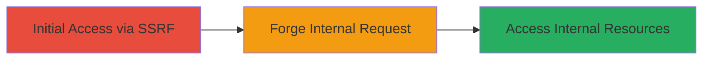

# Server-Side Request Forgery in Nextcloud Responsive Feature

Multi-stage attack chain demonstrating a complete attack workflow exploiting SSRF in Nextcloud.

## Chain Metrics Dashboard

| Metric | Value |
|--------|-------|
| Chain Status | Unverified |
| Total Steps | 1 |
| Execution Time | ~5 minutes |
| Skill Level | Intermediate |
| Complexity | Medium |
| Impact Level | Medium |

## Attack Flow Visualization



## Prerequisites & Requirements

### Required Tools

- Browser or [[tools/curl]]

### Target Environment

- Nextcloud instance with responsive feature enabled
- Web platform access
- No specific ports beyond standard HTTP/HTTPS (80/443)

### Initial Access Requirements

- Valid user access to Nextcloud (authenticated session)
- Ability to interact with responsive features (e.g., URL input fields)
- Network position allowing external requests

## Detailed Attack Procedures

### Step 1: Exploit SSRF in Responsive Feature
procedure: [[procedures/Exploit-SSRF-in-Nextcloud-Responsive]]

**Objective**: Forge a server-side request to access unauthorized internal resources via the vulnerable responsive feature.

**Instructions**: Authenticate to the Nextcloud instance and navigate to a feature allowing URL input (e.g., integration or preview). Submit a malicious URL pointing to an internal endpoint, such as `http://localhost:8080/admin` or `http://169.254.169.254/latest/meta-data/` for cloud metadata. Use [[commands/curl-ssrf-test]] to simulate the request:

```bash
curl -X POST 'https://nextcloud.example.com/responsive-endpoint' -H 'Cookie: session=your_session' -d 'url=http://169.254.169.254/latest/meta-data/' --insecure
```

Monitor the response for leaked internal data.

**Expected Output**: Server response containing internal resource data, such as AWS metadata or internal API responses.

**Success Indicators**:
- Unauthorized internal content returned in the response
- No client-side errors; server processes the forged request

## Attack Chain Summary

### Key Achievements

1. Successful SSRF exploitation leading to internal resource access
2. Potential data exfiltration from internal services
3. Demonstration of medium-severity impact (CVSS 4.3)

## Technique & Tactic Coverage

### MITRE ATT&CK Techniques

- [[Exploit Public-Facing Application]]

### MITRE ATT&CK Tactics

- [[Initial Access]]

---
*Last updated: 2023-10-01T00:00:00Z*
