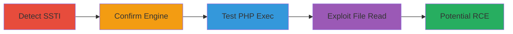

# Server-Side Template Injection in Smarty for Arbitrary PHP Execution and File Read

Multi-stage attack chain exploiting unsanitized user input in profile fields on Unikrn's website, leading to SSTI in Smarty templates used for email invitations. This allows detection of the vulnerability, confirmation of the engine, PHP code execution, and reading of system files, potentially escalating to full RCE.

## Chain Metrics Dashboard

| Metric | Value |
|--------|-------|
| Chain Status | Unverified |
| Total Steps | 4 |
| Execution Time | ~10 minutes |
| Skill Level | Intermediate |
| Complexity | Medium |
| Impact Level | High |

## Attack Flow Visualization



## Prerequisites & Requirements

### Required Tools

- [[tools/Burp-Suite]]

### Target Environment

- Web platform with PHP backend using Smarty templating
- Access to user profile editing (firstname, lastname, nickname fields)
- Ability to send email invitations

### Initial Access Requirements

- Valid user account on the target website
- No special privileges needed beyond profile modification

## Detailed Attack Procedures

### Step 1: Detect SSTI
procedure: [[procedures/Test-for-Smarty-SSTI-with-Math-Expression]]

**Objective**: Test for template injection vulnerability by injecting a math expression into profile fields to trigger a parsing error in the email template.

**Instructions**: Log in to the target website and navigate to user profile settings. Inject the payload into firstname, lastname, or nickname field using [[commands/smarty-math-test]]:

```smarty
{7*7}
```
Save the profile and send an email invitation to yourself or another user. Check the received email for errors.

**Expected Output**: Template parsing error in the email body, indicating SSTI presence.

**Success Indicators**:
- Error message related to template syntax in the email
- No normal rendering of the injected text

### Step 2: Confirm Templating Engine
procedure: [[procedures/Confirm-Smarty-Templating-Engine-Version]]

**Objective**: Verify the use of Smarty by extracting its version through the injection point.

**Instructions**: After confirming SSTI, inject the version check payload into the profile field using [[commands/smarty-version-check]]:

```smarty
{$smarty.version}
```
Save and trigger an email invitation. Inspect the email for the version disclosure.

**Expected Output**: Smarty version string (e.g., "Smarty-3.1.21") displayed in the email.

**Success Indicators**:
- Version information leaked in the email
- Confirms Smarty as the engine

### Step 3: Test Code Execution
procedure: [[procedures/Test-PHP-Execution-in-Smarty-Templates]]

**Objective**: Confirm arbitrary PHP code execution capability within Smarty templates.

**Instructions**: Inject a simple PHP print statement using [[commands/smarty-php-hello]] into the profile field:

```smarty
{php}print "Hello"{/php}
```
Save the profile, send the invitation email, and review the email content.

**Expected Output**: "Hello" executed and printed in the email body.

**Success Indicators**:
- Injected PHP code executes without errors
- Output from PHP appears in the email

### Step 4: Exploit for File Access
procedure: [[procedures/Exploit-SSTI-for-System-File-Read]]

**Objective**: Leverage PHP execution to read sensitive system files, demonstrating RCE impact.

**Instructions**: Inject the file read payload using [[commands/smarty-file-read-passwd]] into the profile field:

```smarty
{php}$s = file_get_contents('/etc/passwd',NULL, NULL, 0, 100); var_dump($s);{/php}
```
Save, trigger the email, and examine the email for the file contents.

**Expected Output**: Partial dump of /etc/passwd (first 100 bytes) via var_dump in the email.

**Success Indicators**:
- System file contents leaked in the email
- Confirms arbitrary file read capability

## Attack Chain Summary

### Key Achievements

1. Detected SSTI in user profile fields processed by Smarty email templates
2. Confirmed Smarty version and PHP execution support
3. Achieved arbitrary PHP code execution
4. Read sensitive /etc/passwd file, paving way for full RCE like shell creation

## Technique & Tactic Coverage

### MITRE ATT&CK Techniques

- [[Exploit Public-Facing Application]]
- [[Command-Line Interface]]

### MITRE ATT&CK Tactics

- [[Execution]]
- [[Collection]]

---
*Last updated: 2023-10-01T00:00:00Z*
