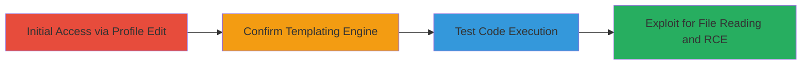

---
tags:
  - ssti
  - smarty
  - rce
  - php-execution
type: attack_chain
tools: []
tactics:
  - '[[Initial Access]]'
  - '[[Execution]]'
  - '[[Discovery]]'
commands:
  - '[[commands/smarty-ssti-test-math]]'
  - '[[commands/smarty-version-check]]'
  - '[[commands/smarty-php-hello-test]]'
  - '[[commands/smarty-php-file-get-contents]]'
platforms:
  - Web
  - Linux
complexity: medium
procedures:
  - '[[procedures/Initial-SSTI-Test-via-Profile-Fields]]'
  - '[[procedures/Confirm-Smarty-Version]]'
  - '[[procedures/Test-PHP-Code-Execution-in-Smarty]]'
  - '[[procedures/Exploit-SSTI-for-Sensitive-File-Reading]]'
step_count: 4
techniques:
  - '[[Exploit Public-Facing Application]]'
  - '[[Command-Line Interface]]'
description: >-
  Multi-stage attack exploiting SSTI in Smarty templating engine via user
  profile fields to achieve arbitrary PHP code execution and read sensitive
  files.
skill_level: intermediate
impact_level: high
id: df370b8d-e7da-41ad-910c-c4da416c5531
created_at: '2025-12-13T09:01:17.039Z'
updated_at: '2025-12-13T09:01:17.039Z'
verified: false
validated: true
submitted: true
mitre_tactics:
  - '[[Initial Access]]'
  - '[[Execution]]'
  - '[[Discovery]]'
mitre_techniques:
  - '[[Exploit Public-Facing Application]]'
  - '[[Command-Line Interface]]'
---
# Server-Side Template Injection in Smarty via User Profile for RCE

Multi-stage attack chain demonstrating a complete attack workflow exploiting a Server-Side Template Injection (SSTI) vulnerability in the Smarty templating engine used on the backend. This allows arbitrary PHP code execution by injecting payloads into user profile fields, which are rendered in invitation emails, leading to reading sensitive server files and potential full remote code execution.

## Chain Metrics Dashboard

| Metric | Value |
|--------|-------|
| Chain Status | Unverified |
| Total Steps | 4 |
| Execution Time | ~10 minutes |
| Skill Level | Intermediate |
| Complexity | Medium |
| Impact Level | High |

## Attack Flow Visualization



## Prerequisites & Requirements

### Required Tools

- None (manual web interactions via browser)

### Target Environment

- Web application using PHP and Smarty templating engine
- Linux server
- Access to user profile editing and invitation functionality

### Initial Access Requirements

- Valid user account on the target application
- Ability to edit profile fields (firstname, lastname, nickname)
- Ability to send invitation emails to another controlled email address

## Detailed Attack Procedures

### Step 1: Initial SSTI Test
procedure: [[procedures/Initial-SSTI-Test-via-Profile-Fields]]

**Objective**: Test for Server-Side Template Injection by injecting a simple mathematical expression into profile fields and observing the email template rendering.

**Instructions**: Edit the user profile to set firstname, lastname, and nickname to the test payload using [[commands/smarty-ssti-test-math]]:

```bash
{7*7}
```

Then, invite a friend using another email address to trigger the email. Check the received email for a template error indicating injection.

**Expected Output**: Template error or evaluation result (e.g., 49) in the email.

**Success Indicators**:
- Template error observed in invitation email
- Confirmation of SSTI vulnerability

### Step 2: Confirm Smarty Version
procedure: [[procedures/Confirm-Smarty-Version]]

**Objective**: Verify the version of the Smarty templating engine to confirm exploitability.

**Instructions**: Update the profile fields with the version check payload using [[commands/smarty-version-check]]:

```bash
{$smarty.version}
```

Invite a user and observe the Smarty version in the received email.

**Expected Output**: Smarty version string in the email.

**Success Indicators**:
- Smarty version confirmed
- Proceed to code execution testing

### Step 3: Test PHP Code Execution
procedure: [[procedures/Test-PHP-Code-Execution-in-Smarty]]

**Objective**: Validate arbitrary PHP code execution using Smarty's PHP tags.

**Instructions**: Set the profile fields to the PHP test payload using [[commands/smarty-php-hello-test]]:

```bash
{php}print "Hello"{/php}
```

Invite a user and check for the output in the email.

**Expected Output**: 'Hello' string in the email.

**Success Indicators**:
- Successful PHP code execution confirmed
- Ready for advanced exploitation

### Step 4: Exploit for File Reading
procedure: [[procedures/Exploit-SSTI-for-Sensitive-File-Reading]]

**Objective**: Read sensitive server files using file_get_contents to demonstrate impact and potential RCE.

**Instructions**: Inject the file reading payload into profile fields using [[commands/smarty-php-file-get-contents]]:

```bash
{php}$s = file_get_contents('/etc/passwd',NULL, NULL, 0, 100); var_dump($s);{/php}
```

Invite a user and observe the partial file content in the email.

**Expected Output**: Partial content of /etc/passwd dumped in the email.

**Success Indicators**:
- Sensitive file content exfiltrated
- Potential for full RCE achieved

## Attack Chain Summary

### Key Achievements

1. Confirmed SSTI in Smarty via profile fields
2. Verified templating engine version
3. Achieved arbitrary PHP code execution
4. Read sensitive server files, enabling further RCE

## Technique & Tactic Coverage

### MITRE ATT&CK Techniques

- [[Exploit Public-Facing Application]]
- [[Command-Line Interface]]

### MITRE ATT&CK Tactics

- [[Initial Access]]
- [[Execution]]
- [[Discovery]]

*Last updated: [TIMESTAMP]*
