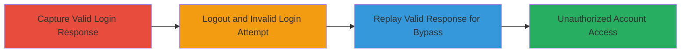

# Session Replay Attack Bypassing WakaTime Authentication and Rate Limits

Multi-stage attack chain demonstrating a complete attack workflow exploiting session replay in WakaTime's login mechanism to achieve unauthorized access without invalidating tokens on logout or failed attempts.

## Chain Metrics Dashboard

| Metric | Value |
|--------|-------|
| Chain Status | Unverified |
| Total Steps | 3 |
| Execution Time | ~5 minutes |
| Skill Level | Intermediate |
| Complexity | Medium |
| Impact Level | High |

## Attack Flow Visualization

## Prerequisites & Requirements

### Required Tools

- [[tools/Burp-Suite]]

### Target Environment

- Web application (WakaTime login endpoint, likely POST /login)
- Required services/ports: HTTP/HTTPS on standard ports (80/443)
- Network access requirements: Direct internet access to WakaTime domain

### Initial Access Requirements

- Valid credentials for initial legitimate login (email and password)
- Network position: External attacker with ability to proxy traffic
- Prior access needed: None, but valid account for capture

## Detailed Attack Procedures

### Step 1: Capture Valid Login Session
procedure: [[procedures/Capture-Valid-Login-Session-with-Burp-Suite]]

**Objective**: Obtain legitimate session cookies and tokens from a successful login to enable later replay.

**Instructions**: Configure Burp Suite as a proxy to intercept traffic. Navigate to the WakaTime login page and submit a valid login request with correct email and password. Capture the full HTTP response, including the 302 redirect to /dashboard and associated Set-Cookie headers for session data.

**Expected Output**: HTTP response with status 302 Found, Location: /dashboard, and valid session cookies/tokens in headers.

**Success Indicators**:
- Valid login succeeds and redirects to dashboard
- Session cookies and tokens are captured without errors

### Step 2: Initiate Invalid Login After Logout
procedure: [[procedures/Initiate-Invalid-Login-After-Logout]]

**Objective**: Trigger a failed login attempt post-logout to create an interceptable invalid response, setting up for replay while hitting the 429 rate limit normally.

**Instructions**: First, log out the legitimate session via the application's logout endpoint. Then, submit a new login request using incorrect credentials (e.g., wrong password), which should return a 400 Bad Request or 429 Too Many Requests due to rate limiting.

**Expected Output**: Interceptable response with error status (400 or 429) confirming failed authentication.

**Success Indicators**:
- Logout completes successfully
- Invalid login request is intercepted before response is sent to browser
- Rate limit would normally apply but is bypassed in next step

### Step 3: Replay Valid Session Response to Bypass Auth
procedure: [[procedures/Replay-Valid-Session-Response-to-Bypass-Auth]]

**Objective**: Replace the invalid response with the captured valid one to hijack the session and gain unauthorized access, bypassing both auth and rate limits.

**Instructions**: In Burp Suite, intercept the invalid login response and modify it by pasting the entire captured valid response body, headers (including Set-Cookie for session tokens), and status code (302). Forward the modified response, then continue with subsequent requests using the replayed session to access /dashboard and account features.

**Expected Output**: Browser redirects to /dashboard with active valid session, allowing full account interaction.

**Success Indicators**:
- Unauthorized access to account dashboard
- Persistence of session for ongoing actions (e.g., viewing coding activity, API keys)
- No 429 rate limit triggered despite failed attempt

## Attack Chain Summary

### Key Achievements

1. Captured and replayed session data to bypass login validation
2. Evaded 429 rate limiting on failed logins
3. Achieved persistent unauthorized access to sensitive user data like coding activity and API keys

## Technique & Tactic Coverage

### MITRE ATT&CK Techniques

- [[Valid Accounts]]
- [[Exploit Public-Facing Application]]

### MITRE ATT&CK Tactics

- [[Initial Access]]

---
*Last updated: 2024-01-01T00:00:00Z*
