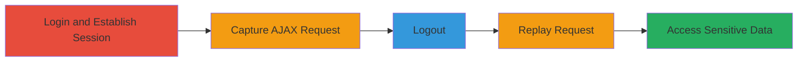

# Session Replay Attack on WordPress.com Due to Broken Authentication and Session Management

Multi-stage attack chain demonstrating exploitation of Broken Authentication and Session Management (OWASP A2) in WordPress.com, where sessions persist after logout, enabling unauthorized access to account settings via replayed requests.

## Chain Metrics Dashboard

| Metric | Value |
|--------|-------|
| Chain Status | Unverified |
| Total Steps | 7 |
| Execution Time | ~5 minutes |
| Skill Level | Intermediate |
| Complexity | Medium |
| Impact Level | High |

## Attack Flow Visualization

## Prerequisites & Requirements

### Required Tools

- [[tools/Burp-Suite]]

### Target Environment

- Web platform (WordPress.com)
- Services: HTTP/HTTPS on standard ports (80/443)
- Tech stack: PHP, WordPress, nginx

### Initial Access Requirements

- Valid user credentials for WordPress.com account
- Local network access to proxy traffic through Burp Suite
- No prior elevated access needed; assumes legitimate login

## Detailed Attack Procedures

### Step 1: Login to the Website
procedure: [[procedures/Capture-and-Replay-WordPress-Session-After-Logout]]

**Objective**: Establish an authenticated session on WordPress.com.

**Instructions**: Navigate to WordPress.com and log in using valid credentials. This sets session cookies for subsequent authenticated requests.

**Expected Output**: Successful login, redirect to dashboard or account page with active session.

**Success Indicators**:
- Session cookies (e.g., wordpress_logged_in_*) are set in browser.
- Access to authenticated areas like account settings.

### Step 2: Go to Account Settings
procedure: [[procedures/Capture-and-Replay-WordPress-Session-After-Logout]]

**Objective**: Trigger an AJAX request to load account settings, preparing for capture.

**Instructions**: From the dashboard, navigate to the account settings page. This initiates an AJAX GET request to load the settings template.

**Expected Output**: Account settings page loads with sensitive forms (e.g., password change).

**Success Indicators**:
- AJAX request observed in network traffic.
- Settings page displays user-specific data.

### Step 3: Capture the Request While Opening Account Settings with Burp Suite Proxy
procedure: [[procedures/Capture-and-Replay-WordPress-Session-After-Logout]]

**Objective**: Intercept the AJAX request using a proxy to enable later replay.

**Instructions**: Configure browser to proxy through Burp Suite. Reload or access account settings to capture the HTTP GET request to `/wp-admin/admin-ajax.php?action=wpcom_load_template&template=settings.php&tcpg=&_=1404092392503`.

**Expected Output**: Request intercepted in Burp's Proxy tab, showing session cookies and parameters.

**Success Indicators**:
- Full request details captured, including headers and cookies.
- No errors in proxy interception.

### Step 4: Send the Request to Repeater
procedure: [[procedures/Capture-and-Replay-WordPress-Session-After-Logout]]

**Objective**: Prepare the captured request for manual replay.

**Instructions**: In Burp Suite Proxy, right-click the intercepted request and select "Send to Repeater".

**Expected Output**: Request appears in Burp's Repeater tab, ready for modification or replay.

**Success Indicators**:
- Request loaded in Repeater without alterations.
- All original headers, including session cookies, preserved.

### Step 5: Logout from the Website
procedure: [[procedures/Capture-and-Replay-WordPress-Session-After-Logout]]

**Objective**: Attempt to invalidate the session via logout, testing for proper session management.

**Instructions**: Perform the logout action from the WordPress.com account menu. In a secure system, this should destroy the session.

**Expected Output**: User is logged out, but session cookies may persist in the browser.

**Success Indicators**:
- UI shows logged-out state.
- Direct browser access to authenticated pages fails, but replay will test backend.

### Step 6: Click on GO Button to Repeat the Request from Repeater Tab
procedure: [[procedures/Capture-and-Replay-WordPress-Session-After-Logout]]

**Objective**: Replay the original request post-logout to check session validity.

**Instructions**: In Burp Repeater, click the "Go" button to send the captured request, including original session cookies, to the server.

**Expected Output**: Server processes the request as authenticated.

**Success Indicators**:
- Request sent successfully from Repeater.
- No immediate errors in response.

### Step 7: Request is Approved and Validated Because the Old Session is Still Valid Server-Side
procedure: [[procedures/Capture-and-Replay-WordPress-Session-After-Logout]]

**Objective**: Confirm unauthorized access to sensitive data via persistent session.

**Instructions**: Observe the response from the replayed request.

**Expected Output**: 200 OK response with account settings HTML, including password change form and other sensitive elements.

**Success Indicators**:
- Access to post-logout authenticated content.
- Vulnerability confirmed: sessions not invalidated on logout.

## Attack Chain Summary

### Key Achievements

1. Established and captured an authenticated AJAX session request.
2. Demonstrated session persistence after logout via replay.
3. Gained unauthorized access to account settings and password change functionality.

## Technique & Tactic Coverage

### MITRE ATT&CK Techniques

- [[Valid Accounts]]

### MITRE ATT&CK Tactics

- [[Initial Access]]

---

*Last updated: 2023-10-01T12:00:00Z*
